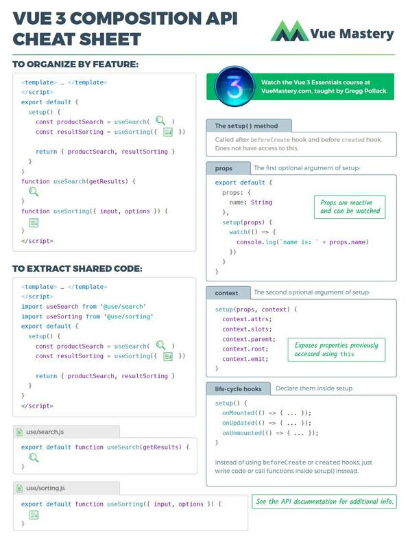
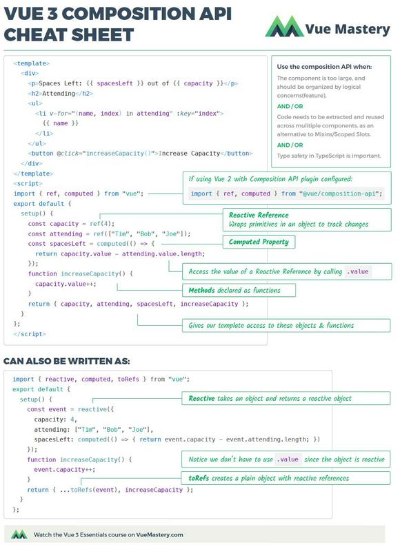

  

  

  
  
  
  

# Vue3+ & Vue-CLI3+ 开发生态圈资讯

<!-- 
// 0️⃣ 1️⃣ 2️⃣ 3️⃣ 4️⃣ 5️⃣ 6️⃣ 7️⃣ 8️⃣ 9️⃣
-->

🚀 欢迎`Star`，后续会不断更新。  
🇨🇳 最后更新日期：2️⃣0️⃣2️⃣0️⃣`/`0️⃣9️⃣`/`1️⃣6️⃣ 

【2020】 ≡≡≡≡≡≡≡≡≡≡≡≡≡≡≡≡≡≡≡≡≡--------------- 【2021】

Twitter vue3: **vue 3 will be available by the end of Q2.**

除了单独 Vue3 资讯，欢迎查看更多 vue.js 资讯：【[【🔥Vue.js 资讯 📚】目前 web 前端开发非常火爆的框架；定时更新，欢迎 Star 一下。](https://github.com/itemsets/vue2)】

## 目录

- [下半年撸vue3的霸气姿势](#-下半年撸-vue3-的姿势-)  
- [Vue 3 Cheat Sheet](#Vue3-CheatSheet)
- [再谈 vue3](#再谈vue3)
- [尤大推出`vue3 beta`之后](#尤大推出vue3-beta之后)
- [迎接 Vue3.0 系列](#迎接Vue3.0系列)
- [最新资讯-继续前进 ╰(_°▽°_)╯](#最新资讯-继续前进)
- [英文资料](#英文资料)
- [2019 年中旬](#2019年中旬)
- [2019 年上旬](#2019年上旬)
- [2018 年预告](#2018年预告)

**🐣 关于旧版本**

Vue CLI 的包名称由 vue-cli 改成了 @vue/cli。 如果你已经全局安装了旧版本的 vue-cli (1.x 或 2.x)，你需要先通过 npm uninstall vue-cli -g 或 yarn global remove vue-cli 卸载它。

**🐥Node 版本要求**

Vue CLI 需要 Node.js 8.9 或更高版本 (推荐 8.11.0+)。你可以使用 nvm 或 nvm-windows 在同一台电脑中管理多个 Node 版本。

**🐓Vue 3.0 源代码**

当大多数国人还在庆祝国庆节的时候，尤雨溪大大在昨天凌晨发布了 Vue 3.0 源代码，源码地址：https://github.com/vuejs/vue-next 。虽然目前还 处于 Pre-Alpha 版本，但是可以预见后面的 Alpha、Beta 等版本应该不会太遥远。  
之前，就有预言，除了性能优化、脚手架和新功能外，TypeScript 绝对是一个重点，因此，在 Vue 3.0 源代码版本中，98%代码由 Typescript 编写，相信后面会是 100%。  
通过本次发布的源代码可以了解到针对 Vue 3 计划并已实现的主要架构改进和新功能。  
Vue 3 中最主要的新特性：组合式 API，已经可以借助 https://github.com/vuejs/composition-api （在 Vue 2 项目中作为插件使用）体验到。

 yyx990803

进入了rc版本阶段：  

**3.0.0-rc.12 (2020-09-16)**  
...  
**3.0.0-rc.1 (2020-07-17)**  

-- Alpha(α)：预览版，或者叫内部测试版；一般不向外部发布，会有很多Bug；一般只有测试人员使用。  
-- Beta(β)：测试版，或者叫公开测试版；这个阶段的版本会一直加入新的功能；在 Alpha版之后推出。  
-- RC(Release Candidate)：最终测试版本；可能成为最终产品的候选版本，如果未出现问题则可发布成为正式版本。    

多数开源软件会推出两个RC版本，最后的 RC2 则成为正式版本。  
我们的vue3就不一样，慢慢来，好东西，就要慢慢品！  

**3.0.0-beta.20 (2020-07-08)**  
@ github-actions released this 5 days ago · 37 commits to master since this release
Please refer to [CHANGELOG.md](https://github.com/vuejs/vue-next/blob/master/CHANGELOG.md) for details.

...

**v3.0.0-beta.2**  
released this 6 days ago · 29 commits to master since this release  
release: v3.0.0-beta.2

**v3.0.0-beta.1**  
released this 7 days ago · 40 commits to master since this release  
release: v3.0.0-beta.1

**🔥🐔2020 前端面试秘籍**

[【吐血整理清单一】前端面试全攻略，为您保驾护航，金三银四](https://github.com/vue3/vue3-News/issues/9?content_source_url=https://github.com/vue3/vue3-News)  
[【吐血整理清单二】前端面试全攻略，为您保驾护航，金三银四](https://github.com/vue3/vue3-News/issues/10?content_source_url=https://github.com/vue3/vue3-News)  
[【吐血整理清单三】前端面试全攻略，为您保驾护航，金三银四](https://github.com/vue3/vue3-News/issues/11?content_source_url=https://github.com/vue3/vue3-News)

秘籍在手，天下我有； 只要你想进，那么世界就是你的。

**🐔 前端整理之道**

[【整理】前端优化得有个好手段，比如看这个清单 🍑🍒🍓🍆🌽](https://github.com/vue3/vue3-News/issues/8?content_source_url=https://github.com/vue3/vue3-News)  
[【整理】前端学习笔记总结清单，应有尽有 🍇🍈🍉🍊🍋](https://github.com/vue3/vue3-News/issues/7?content_source_url=https://github.com/vue3/vue3-News)

**🦃 关于 TypeScript**

[【2020-Q1-News】TypeScript 新鲜一波流，自己品尝？](https://github.com/vue3/vue3-News/issues/6?content_source_url=https://github.com/vue3/vue3-News)  
[【最新】TypeScript 梳理知识点列表，可否一战？](https://github.com/vue3/vue3-News/issues/4?content_source_url=https://github.com/vue3/vue3-News)  
[【必会】都已经 9102 年底了，你必须会 TypeScript。](https://github.com/vue3/vue3-News/issues/3?content_source_url=https://github.com/vue3/vue3-News)

为什么要学习它？  
因为：

- 按需输出 JavaScript 版本
- 代码标准化利于团队开发
- 主流框架及最新特性的支持
- 便于重构和主流 IDE 支持
- 更多友好特性和检测  
  ...

哈哈哈，并不是，是因为都已经 2020 了，大公司和你们都在用。

## Vue3-CheatSheet

由 Vue Mastery 网站归纳的 Vue 3 Cheat Sheet， 直观地概况了其主要特性。

| Vue3 Cheat Sheet                    | Vue3 Cheat Sheet                    |
| ----------------------------------- | ----------------------------------- |
|  |  |

## vueuse

[antfu/vueuse](https://github.com/antfu/vueuse?content_source_url=https://github.com/vue3/vue3-News)

like React hooks.  
Collection of essential Vue Composition API utils works for Vue 2.x and 3.x https://vueuse.js.org/

Collection of essential Vue Composition API (inspired by react-use)

**🚀 Features**

- ⚡ 0 dependencies: No worry about your bundle size
- 🌴 Fully tree shakable: Only take what you want
- 🦋 Type Strong: Written in Typescript
- 🕶 Seamless migration: Works for both Vue 3 and 2
- 🌎 Browser compatible: Use it though CDN
- 🎪 Interactive docs & demos: Check out the Storybook!
- 🔌 Optional Add-ons: Firebase, vue-i18n, etc

## 💃🏻 下半年撸 vue3 的姿势 💃🏻

🐯 🦁 🐮 🐷 🐹 🦊

霸气姿势观望 `vue3` 核心技术 ing

- Proxy：不只是解决了 defineProperty 的局限性。
- Performance：性能更比 Vue 2.0 强。
- Tree shaking support：可以将无用模块“剪辑”，仅打包需要的。
- Composition API：组合 API。
- Fragment, Teleport, Suspense：“碎片”，Teleport 即 Protal 传送门，“悬念”。
- Better TypeScript support：更优秀的 Ts 支持。
- Custom Renderer API：暴露了自定义渲染 API。

TODOLIST：

- 1 Docs & Migration Guides
- 2 Router
- 3 Vuex
- 4 CLI
- 5 新工具：vite（法语 “快”）
- 6 vue-test-utils
- 7 DevTools
- 8 IDE Support (Vetur)
- 9 Nuxt

介绍 Vue.js 以及 Vue-next 源码分析文章，希望通过学习Vue.js源码获得更好的知识和收获。  
[【这是入口】你要找的 vue 源码 全宇宙的都在这！](https://github.com/vue3/vue3-News/issues/16?content_source_url=https://github.com/vue3/vue3-News)  

**vue => Q3 2020**  

3.0: Release Management

- Regression testing for 3.0   
- Automated nightly release  
- Formalize release lifecycle  
- setup CLA process  

3.0: IE11 compat build  
3.0 Official Release

2.7

- Backport compatible 3.x features to 2.x  
- Deprecation warnings for 3.x changes  
- This will be the last minor release for 2.x and be offered as LTS (long-term support) for 18 months. It will continue to receive critical security updates even after the LTS period.

[Vue 3 Deep Dive with Evan You 【中英字幕】- Vue Mastery](https://www.bilibili.com/video/BV1rC4y187Vw?content_source_url=https://github.com/vue3/vue3-News)  
课程中提到的预备课程是[《Vue3 响应式原理》](https://www.bilibili.com/video/BV1SZ4y1x7a9?content_source_url=https://github.com/vue3/vue3-News) 

- [Vue之父尤雨溪深度解读Vue3.0的开发思路（上）](https://www.bilibili.com/video/BV1qC4y18721?content_source_url=https://github.com/vue3/vue3-News)  
- [Vue之父尤雨溪深度解读Vue3.0的开发思路（中）](https://www.bilibili.com/video/BV1yK4y1s7Xh?content_source_url=https://github.com/vue3/vue3-News)  
- [Vue之父尤雨溪深度解读Vue3.0的开发思路（下）](https://www.bilibili.com/video/BV1ai4y137pg?content_source_url=https://github.com/vue3/vue3-News)  

里面评论区和弹幕有在调侃尤大大的：

=》尤雨溪就是个写前端的，懂什么vue！  
=》你一点都不懂vue  
=》他懂个锤子的vue  
=》他根本不懂vue  

兄弟姐妹们，你们的饿了么升级为vue3了，在紧急构建中，很多大佬都在。 
🎉 A Vue.js 3.0 UI Library  
element-plus.org/  
https://github.com/element-plus/element-plus/  

🚧🚧🚧🚧🚧🚧   + 522 contributors   
(WIP)fork from ElemeFE/element ,A Vue.js 3.0 UI Toolkit for Web.      
[A Vue.js 3.0 UI Toolkit for Web.（WIP）](https://github.com/kkbjs/element3)

* [vue 3 组件库（基于 element-ui 修改）](https://my.oschina.net/u/4326664/blog/4557649)  
* [blacksonic/awesome-vue-3](https://github.com/blacksonic/awesome-vue-3)  
* [Vue 3.0 初学入门使用](https://github.com/komavideo/LearnVue3)  
* [Vue3 源码入门，实现简易版reactivity](https://segmentfault.com/a/1190000024479742)  
* [Vue3.x API config](https://blog.csdn.net/guoqiankunmiss/article/details/108537593)  
* [vue3最美餐厅点餐系统APP](https://www.bilibili.com/video/av499614417)  
* [Vue3 设计背后的思考](https://juejin.im/post/6870627817009184776)  
* [用 Vue3 写一个 swipe-cell](https://juejin.im/post/6871669209445695495)  
* [尝鲜vue3.0-tyepscript开发组件(3)](https://juejin.im/post/6872235455824265229)  
* [首个 Vue 3 组件库发布](https://juejin.im/post/6867515263672123399?content_source_url=https://github.com/vue3/vue3-News) 
* [Learn the fundamentals of Vue 3 in this course that starts with the very basics.](https://www.vuemastery.com/courses-path/vue3?content_source_url=https://github.com/vue3/vue3-News)   
* [Creates Universal Library for Vue 2 & 3](https://github.com/antfu/vue-demi?content_source_url=https://github.com/vue3/vue3-News)  
* [Vue 3 Playground packed with all the new features](https://github.com/blacksonic/vue-3-playground?content_source_url=https://github.com/vue3/vue3-News)  
* [A curated list of awesome things related to Vue 3](https://github.com/blacksonic/awesome-vue-3?content_source_url=https://github.com/vue3/vue3-News)  
* [vue3项目--让我们更快开发vue（一）](https://juejin.im/post/6865842981618843656?content_source_url=https://github.com/vue3/vue3-News)  
* [vue3项目--让我们更快开发vue（二）](https://juejin.im/post/6867125503007375373?content_source_url=https://github.com/vue3/vue3-News)  
* [Vue3 面向对象编程](https://zhuanlan.zhihu.com/p/212210282?content_source_url=https://github.com/vue3/vue3-News)  
* [Vue3 reactivity 这个地方是不是循环引用了？](https://www.zhihu.com/question/418076382?content_source_url=https://github.com/vue3/vue3-News)  
* [Vue3 Compiler 优化细节，如何手写高性能渲染函数](https://zhuanlan.zhihu.com/p/150732926?content_source_url=https://github.com/vue3/vue3-News)  
* [vue3 列表渲染](https://www.jianshu.com/p/781e5c49bf23?content_source_url=https://github.com/vue3/vue3-News)  
* [vue3 Event 事件处理](https://www.jianshu.com/p/054c4d2e699b?content_source_url=https://github.com/vue3/vue3-News)  
* [vite+vue3.x](https://www.jianshu.com/p/c68d65a8f973?content_source_url=https://github.com/vue3/vue3-News)  
* [期待已久的鹅厂面试题来咯，Vue3实现递归菜单组件](https://www.jianshu.com/p/2ee1ae40cc1b?content_source_url=https://github.com/vue3/vue3-News)  
* [快速了解vue 3.x](https://www.cnblogs.com/angel648/p/13582226.html?content_source_url=https://github.com/vue3/vue3-News)  
* [基于Vue3+ElementUI-BootStrap4_前端实战](https://www.cnblogs.com/origin-zy/p/13584519.html?content_source_url=https://github.com/vue3/vue3-News)  
* [vue3项目打包app](https://www.cnblogs.com/dudududadada/p/13608208.html?content_source_url=https://github.com/vue3/vue3-News)  
* [vue3-reactive(响应式对象)和toRefs](https://www.cnblogs.com/lxz-blogs/p/13595094.html?content_source_url=https://github.com/vue3/vue3-News)  
* [[译] Vue 3 迁移策略 —— 过滤器（移除）](https://juejin.im/post/6865863765863677960?content_source_url=https://github.com/vue3/vue3-News)  
* [Vue3.0全家桶最全入门指南 - 快速搭建 (1/4)](https://juejin.im/post/6867114456762679309?content_source_url=https://github.com/vue3/vue3-News)  
* [Vue3.0全家桶最全入门指南 - vue3.0新特性 (2/4)](https://juejin.im/post/6867123074148335624?content_source_url=https://github.com/vue3/vue3-News)  
* [Vue3.0全家桶最全入门指南 - vue-router@4.x和vuex@4.x (3/4)](https://juejin.im/post/6867114456762679309?content_source_url=https://github.com/vue3/vue3-News)  
* [Vue3.0全家桶最全入门指南 - 3.x跟2.x的其他差异 (4/4)](https://juejin.im/post/6867123749565497358?content_source_url=https://github.com/vue3/vue3-News)  

__从Vue 2到Vue 3的迁移指南__

* [从Vue 2到Vue 3的迁移指南之破坏性特性（一、全局API）](https://juejin.im/post/6859427370080665613?content_source_url=https://github.com/vue3/vue3-News)  
* [从Vue 2到Vue 3的迁移指南之破坏性特性（二、全局API的tree-shaking）](https://juejin.im/post/6860178370928312328?content_source_url=https://github.com/vue3/vue3-News)  
* [从Vue 2到Vue 3的迁移指南之破坏性特性（三、v-model）](https://juejin.im/post/6860522009881739271?content_source_url=https://github.com/vue3/vue3-News)  
* [从Vue 2到Vue 3的迁移指南之破坏性特性（四、渲染函数API）](https://juejin.im/post/6861104265419571207?content_source_url=https://github.com/vue3/vue3-News)  
🐬🐘🦒🐏🦥🦍  
[翻译官网文档列表如下: ](https://juejin.im/user/1195873128420968?content_source_url=https://github.com/vue3/vue3-News)  
- vue3指南—01安装  
- vue3指南—02介绍  
- vue3指南-03应用实例  
- vue3指南-04 Template Syntax template语法  
- vue3指南—05 Computed属性(property)和侦听器  
- vue3指南-06 Class and Style Bindings 类名和样式值绑定  
- vue3指南-07 Conditional Rendering 条件渲染  
- vue3指南-08 List Rendering 列表渲染  

[Vue 组合式 API](https://vue3js.cn/vue-composition/)  

* [Be prepared to migrate your Vue app to Vue 3](https://dev.to/chenxeed/be-prepared-to-migrate-your-vue-app-to-vue-3-eom?content_source_url=https://github.com/vue3/vue3-News)  
* [How to test your library for Vue 2.x and Vue 3.0](https://dev.to/pikax/how-to-test-your-library-for-vue-2-and-vue-next-42ao?content_source_url=https://github.com/vue3/vue3-News)  
* [GitHub - blacksonic/awesome-vue-3](https://github.com/blacksonic/awesome-vue-3?content_source_url=https://github.com/vue3/vue3-News)  
* [GitHub - nkoehring/vue3-typescript-app-starter](https://github.com/nkoehring/vue3-typescript-app-starter?content_source_url=https://github.com/vue3/vue3-News)  
* [Vue 3 UX Wins with Async Components & Suspense](https://vuejsdevelopers.com/2020/07/13/vue-async-components-suspense/?content_source_url=https://github.com/vue3/vue3-News)  
* [Handling Asynchrony in Vue 3 / Composition API — Part 1: Managing Async state](https://medium.com/@martinmalinda/handling-asynchrony-in-vue-3-composition-api-part-1-managing-async-state-e993842ebf8f?content_source_url=https://github.com/vue3/vue3-News)  
* [Build better higher-order components with Vue 3](https://blog.logrocket.com/build-better-higher-order-components-with-vue-3/?content_source_url=https://github.com/vue3/vue3-News)  
* [Vue3.0中的性能优化](https://blog.csdn.net/summer_zhh/article/details/108080930?content_source_url=https://github.com/vue3/vue3-News)  
* [Vue3 + Element ui 后台管理系统](https://www.cnblogs.com/maqingyuan/p/13523757.html?content_source_url=https://github.com/vue3/vue3-News)  
* [Vue3.0数据响应式原理详解](https://www.yisu.com/zixun/159186.html?content_source_url=https://github.com/vue3/vue3-News)  
* [学习Vue3.0，你需要先了解一下Proxy](https://www.w3cschool.cn/article/87ff96bda80956?content_source_url=https://github.com/vue3/vue3-News)  
* [学习Vue3.0，先从搭建环境开始](https://www.w3cschool.cn/article/9bcaca84c6ee7f?content_source_url=https://github.com/vue3/vue3-News)  
* [vue3 源码全面解读](https://github.com/hkc452/slamdunk-the-vue3?content_source_url=https://github.com/vue3/vue3-News)  
* [浅谈Vue3的watchEffect用途](https://www.codenong.com/s1190000023669309/?content_source_url=https://github.com/vue3/vue3-News)  
* [vuetify 正在开发的 v3 分支，ts + vue3](https://github.com/vuetifyjs/vuetify/tree/next?content_source_url=https://github.com/vue3/vue3-News)  
* [vue3源码学习——computed](https://blog.csdn.net/qq_31126175/article/details/108106717?content_source_url=https://github.com/vue3/vue3-News)  
* [vue3源码学习——响应式reactive](https://blog.csdn.net/qq_31126175/article/details/108007446?content_source_url=https://github.com/vue3/vue3-News)  
* [Vue 3.x 组件式 API](https://github.com/one-pupil/study/tree/master/vue_3.x?content_source_url=https://github.com/vue3/vue3-News)  
* [Vue3.0 + Vite 使用 Bootstrap](https://segmentfault.com/a/1190000023586788?content_source_url=https://github.com/vue3/vue3-News)  
* [Vue3 模板编译原理](https://segmentfault.com/a/1190000023594560?content_source_url=https://github.com/vue3/vue3-News)  
* [VUE3来了，你用了NestJS了吗?（一）](https://segmentfault.com/a/1190000023589518?content_source_url=https://github.com/vue3/vue3-News)  
* [程序员为什么要学习源码 | Vue3源码系列开篇词](https://segmentfault.com/a/1190000023699377?content_source_url=https://github.com/vue3/vue3-News)  
* [Vue3 + TS + Egg重构自己的小项目[总结]](https://juejin.im/post/6862582779419459598?content_source_url=https://github.com/vue3/vue3-News)  
* [vue3+Ts可视化开发的研究，实战拖拽基础，组件动态生成，远程加载组件](https://juejin.im/post/6860290630435012621?content_source_url=https://github.com/vue3/vue3-News)  
* [Vue3.0变动简介](https://juejin.im/post/6859541760797442062?content_source_url=https://github.com/vue3/vue3-News)  
* [使用Vue3构建更好的高阶组件[译]](https://juejin.im/post/6859571758362525704?content_source_url=https://github.com/vue3/vue3-News)  
* [Vue3响应式原理剖析](https://juejin.im/post/6864396298394189832?content_source_url=https://github.com/vue3/vue3-News)  
* [进阶高级前端，这9种Vue技术你掌握了吗？](https://juejin.im/post/6862560722531352583?content_source_url=https://github.com/vue3/vue3-News)  
* [Vue3教程，抢先学习](https://www.e-learn.cn/topic/3777376?content_source_url=https://github.com/vue3/vue3-News)  
* [Vue3 composition-api 有哪些劣势？](https://www.zhihu.com/question/416652570?content_source_url=https://github.com/vue3/vue3-News)  
* [Vue3文档【Vue2迁移Vue3】](https://juejin.im/post/6858558735695937544?content_source_url=https://github.com/vue3/vue3-News)  
* [vue3.x reactive、effect、computed、watch依赖关系及实现原理](https://juejin.im/post/6859271079764951047?content_source_url=https://github.com/vue3/vue3-News)  
* [Vue最全知识点（基础到进阶，覆盖vue3.0，欢迎补充讨论）](https://zhuanlan.zhihu.com/p/168589606?content_source_url=https://github.com/vue3/vue3-News)  
* [Vue3.0浪潮下，没有一个平庸的程序员是无辜的，此刻，你需要把握这些?](https://zhuanlan.zhihu.com/p/170573874?content_source_url=https://github.com/vue3/vue3-News)  
* [vue3 + router + tsx + vite 试用报告](https://zhuanlan.zhihu.com/p/170623237?content_source_url=https://github.com/vue3/vue3-News)  
* [学习vue3系列watch](https://wuqiang.blog.csdn.net/article/details/107871795?content_source_url=https://github.com/vue3/vue3-News)  
* [使用Vue3构建更好的高阶组件译](https://blog.csdn.net/gufudhn/article/details/107938423?content_source_url=https://github.com/vue3/vue3-News)  
* [紧跟尤大的脚步提前体验Vue3新特性，你不会还没了解过Vue3吧](https://blog.csdn.net/l_ppp/article/details/107820234?content_source_url=https://github.com/vue3/vue3-News)  
* [使用 Vue 3.0，你可能不再需要Vuex了](https://mp.weixin.qq.com/s/NES_8rV5DM5eqHROxJUmpA?content_source_url=https://github.com/vue3/vue3-News)  
* [使用vite搭建Vue3项目](https://blog.csdn.net/weixin_42281031/article/details/107824088?content_source_url=https://github.com/vue3/vue3-News)  
* [Vue3相对于2系列的升级（一）](https://blog.csdn.net/wangjikuen/article/details/107789109?content_source_url=https://github.com/vue3/vue3-News)  
* [vue3为何放弃defineProperty，使用Proxy](https://blog.csdn.net/qq_40340478/article/details/107902452?content_source_url=https://github.com/vue3/vue3-News)  
* [Go async in Vue 3 with Suspense](https://dev.to/viniciuskneves/go-async-in-vue-3-with-suspense-4860?content_source_url=https://github.com/vue3/vue3-News)  
* [How to test your library for vue 2 and vue-next](https://dev.to/pikax/how-to-test-your-library-for-vue-2-and-vue-next-42ao?content_source_url=https://github.com/vue3/vue3-News)  
* [A Month with Vue 3](https://dev.to/shawnwildermuth/a-month-with-vue-3-51p6?content_source_url=https://github.com/vue3/vue3-News)  
* [Shared State Management with Vue Composition Api](https://dev.to/nonso/shared-state-management-with-vue-composition-api-2938?content_source_url=https://github.com/vue3/vue3-News)  
* [A store implementation from scratch using Vue3's composition API](https://dev.to/koehr/a-store-implementation-from-scratch-using-vue3-s-composition-api-3p16?content_source_url=https://github.com/vue3/vue3-News)  
* [Headless Testing with Vite + Vue-Test-Utils](https://dev.to/aelbore/headless-testing-with-vite-vue-test-utils-3jd1?content_source_url=https://github.com/vue3/vue3-News)  
* [VueJS Quick Tip: Vue-router-next in the Composition API](https://dev.to/vuetraining/vuejs-quick-tip-vue-router-next-in-the-composition-api-1i0l?content_source_url=https://github.com/vue3/vue3-News)  
* [Be prepared to migrate your Vue app to Vue 3](https://dev.to/chenxeed/be-prepared-to-migrate-your-vue-app-to-vue-3-eom?content_source_url=https://github.com/vue3/vue3-News)  
* [Do Vue 3 refs admit a monad instance?](https://dev.to/jfet97/do-vue-3-refs-admit-a-monad-instance-5fan?content_source_url=https://github.com/vue3/vue3-News)  
* [Vite - No Bundle Setup for Vuejs, React and Preact](https://dev.to/vuelancer/vite-no-bundle-setup-for-vuejs-react-and-preact-3bo3?content_source_url=https://github.com/vue3/vue3-News)  
* [vue3.0 搭建教程(ui界面创建项目，帮你快速搭建所需模块，非常nice)](https://www.cnblogs.com/wangwei0514/articles/vue_create.html?content_source_url=https://github.com/vue3/vue3-News)  
* [大前端：前端全栈加强版！前端全栈+全周期+多端(升级Vue3.0) 完整版](https://www.cnblogs.com/sorrowrain/p/13443641.html?content_source_url=https://github.com/vue3/vue3-News)  
* [官方给出的Vue3性能优化数据，其实很保守？](https://www.ershicimi.com/p/a0f8308d8b0fb2783dbdceea9e9a46d4?content_source_url=https://github.com/vue3/vue3-News)  
* [A babel plugin that provides jsx syntax for vue3 ](https://github.com/HcySunYang/vue-next-jsx?content_source_url=https://github.com/vue3/vue3-News)  
* [高级前端开发成长路线总结-进阶指南](https://github.com/hugheschoi/web-/blob/f4a1afbde36b94937b4871309e903b7f7b857abc/%E8%BF%9B%E9%98%B6%E6%8C%87%E5%8D%97.md?content_source_url=https://github.com/vue3/vue3-News)  
* [sl1673495 前端技术博客，不定时更新](https://github.com/sl1673495/blogs?content_source_url=https://github.com/vue3/vue3-News)  
* [Taro 中实现 Vue 3 的支持](https://github.com/NervJS/taro-rfcs/blob/35b0709660f08000fd18083ab44bc0c947e412f0/rfcs/0001-vue-3-support.md?content_source_url=https://github.com/vue3/vue3-News)  
* [vue3-think 记录学习思考 vue3 的所有](https://github.com/cuixiaorui/vue3-think?content_source_url=https://github.com/vue3/vue3-News)  
* [Vue3 Demo: Roll the dice](https://github.com/roberto-butti/vue3-demo-rollthedice?content_source_url=https://github.com/vue3/vue3-News)  
* [vue3.0实战喵喵电影](https://github.com/gangking/PersonalBlog/tree/b03cfe85cf034068074e3ccb0cce590f1b091b71/docs/vue?content_source_url=https://github.com/vue3/vue3-News)  
* [vue-design 渲染器 - 江山父老能容我 不使人间造孽钱](http://hcysun.me/vue-design/zh/?content_source_url=https://github.com/vue3/vue3-News)  
* [vue3 Roadmap](https://github.com/vuejs/vue/projects/6?content_source_url=https://github.com/vue3/vue3-News)  
* [Vue3响应式原理 + 手写reactive](https://segmentfault.com/a/1190000023465134?content_source_url=https://github.com/vue3/vue3-News)  
* [Vue 3 到底有什么不同：v-model 升级了](https://segmentfault.com/a/1190000023462922?content_source_url=https://github.com/vue3/vue3-News)  
* [Vue 3 到底有什么不同：全局 API](https://segmentfault.com/a/1190000023462887?content_source_url=https://github.com/vue3/vue3-News)  
* [Vue2.x与Vue3响应式实现核心代码对比](https://juejin.im/post/6855129007412346888?content_source_url=https://github.com/vue3/vue3-News)  
* [深入 TypeScript 中的子类型、逆变、协变，进阶 Vue3 源码前必须搞懂的。](https://juejin.im/post/6855517117778198542?content_source_url=https://github.com/vue3/vue3-News)  
* [【译】为什么不需要在Vue3中使用Vuex](https://juejin.im/post/6856718746694713352?content_source_url=https://github.com/vue3/vue3-News)  
* [Vue3.0源码解析之组件渲染，vnode 到真实 DOM](https://juejin.im/post/6856950924502532104?content_source_url=https://github.com/vue3/vue3-News)  
* [一文看懂 Vue 3 到底有什么不同](https://juejin.im/post/6856011196224126989?content_source_url=https://github.com/vue3/vue3-News)  
* [Vue3响应式原理](https://juejin.im/post/6856661502053744654?content_source_url=https://github.com/vue3/vue3-News)  

🚴🏻 🚴🏻‍♂️ 🚴🏻‍♀️ 🚵🏻 🚵🏻‍♂️ 🚵🏻‍♀️  

__[vue3.0 Composition API 入门教程](https://github.com/RBL3/vue3-demo)__

vue3.0 Composition API 上手初体验 构建基本项目开发环境  
vue3.0 Composition API 上手初体验 构建 vue 基础代码  
vue3.0 Composition API 上手初体验 使用 vue-router 构建多页面应用  
vue3.0 Composition API 上手初体验 神奇的 setup 函数 (一) 响应数据的绑定  
vue3.0 Composition API 上手初体验 神奇的 setup 函数 (二) 响应对象数据的绑定  
vue3.0 Composition API 上手初体验 神奇的 setup 函数 (三) 生命周期函数  
vue3.0 Composition API 上手初体验 神奇的 setup 函数 (四) 计算属性 computed  
vue3.0 Composition API 上手初体验 普通组件的开发与使用  
vue3.0 Composition API 上手初体验 vue组件的具名插槽 slot 的变化  
vue3.0 Composition API 上手初体验 函数组件的开发与使用  
vue3.0 Composition API 上手初体验 用路由循环，做个导航菜单  

__[李金文 / vue-next学习](https://gitee.com/kennana/vue_next_learning/tree/master?content_source_url=https://github.com/vue3/vue3-News)__

vue-next 贡献指南（谷歌翻译版）  
《Vue3.0抢先学》系列之：网友们都惊呆了！  
《Vue3.0抢先学》系列之：一个简单的例子  
《Vue3.0抢先学》系列之：使用Composition API  
《Vue3.0抢先学》系列之：响应式之Ref vs. Reactive  
《Vue3.0抢先学》系列之：使用render函数  
《Vue3.0抢先学》vue-next 学习总结   
《Vue3.0抢先学》系列之：组件属性Props  
《Vue3.0抢先学》系列之：组件生命周期  
《Vue3.0抢先学》系列之：更多响应式API示例（watch,computed的变种）    

  
* [如果 ElementUI 不维护了，也不再支持 Vue 3了我们该怎么办呢？](https://www.zhihu.com/question/407326156/answer/1342974146?content_source_url=https://github.com/vue3/vue3-News)  
* [Vue3.x 深入浅出系列（连载三）](https://juejin.im/post/5f18f5ebf265da22e27a9a87?content_source_url=https://github.com/vue3/vue3-News)  
* [基于Vue3.0开发知乎日报实战](https://juejin.im/post/5f1941cb5188252e685d492f?content_source_url=https://github.com/vue3/vue3-News)  
* [Vue3全家桶 + Vite + TS + TSX尝鲜，先人一步!](https://zhuanlan.zhihu.com/p/161308974?content_source_url=https://github.com/vue3/vue3-News)  
* [也许是最清楚的Vue3.x Reactive响应式原理讲解](https://juejin.im/post/5f1969705188257109551d8a?content_source_url=https://github.com/vue3/vue3-News)  
* [Vue 3.0初步使用和原理](https://juejin.im/post/5f1805e55188252e974f0be9?content_source_url=https://github.com/vue3/vue3-News)  
* [千字文看Vue3.0 变化](https://juejin.im/post/5f16d75de51d4534c14dc768?content_source_url=https://github.com/vue3/vue3-News)  
* [vue3响应式数据最全最细致解析，vue3源码解析持续更新中](https://juejin.im/post/5f166297f265da23020a9ca5?content_source_url=https://github.com/vue3/vue3-News)  
* [除了composition API，vue3.0文档又带来了什么新东西？](https://juejin.im/post/5f16540de51d4534c6543c35?content_source_url=https://github.com/vue3/vue3-News)  
* [从Vue源码中学到的28个编程好习惯](https://juejin.im/post/5f1650ae5188252e884e8ed0?content_source_url=https://github.com/vue3/vue3-News)  
* [Vue3 Composition API教程及示例](https://cloud.tencent.com/developer/article/1603056?content_source_url=https://github.com/vue3/vue3-News)  
* [基于vue3.0.1 beta搭建仿京东淘宝的电商商城项目！](https://www.javascriptcn.com/read-e-commerce-mall-project-imitating-jingdong-taobao-based-on-vue3-0.1-beta.html?content_source_url=https://github.com/vue3/vue3-News)  
* [细致分析，尤雨溪直播中提到 vue3.0 diff 算法优化细节](https://www.javascriptcn.com/read-detailed-analysis-of-optimization-details-of-vue3-diff-algorithm-in-live-broadcast.html?content_source_url=https://github.com/vue3/vue3-News)  
* [顺藤摸瓜：用单元测试读懂 Vue 3 watch 函数](https://mp.weixin.qq.com/s/e1IVKZ5FF80yGTN8yecfBg?content_source_url=https://github.com/vue3/vue3-News)  
* [electron-vue开发笔记（3）多窗口多页面入口配置](https://juejin.im/post/5ef8acb4f265da23004b0a8e?content_source_url=https://github.com/vue3/vue3-News)  
* [基于项目实战阐述vue3.0新型状态管理和逻辑复用方式](https://juejin.im/post/5efc419af265da22fa615dff?content_source_url=https://github.com/vue3/vue3-News)  
* [Vue3 源码逐行解析](https://segmentfault.com/a/1190000023074260?content_source_url=https://github.com/vue3/vue3-News)  
* [Vue3生态技术内幕](https://www.yuque.com/woniuppp/vue3/reactivity?content_source_url=https://github.com/vue3/vue3-News)  
* [Vue响应式系统技术原理和Vue3响应式系统的优点](https://www.yuque.com/wuhaosky/vue3/vue-reactivity#galNADP9?content_source_url=https://github.com/vue3/vue3-News)  
* [Vue3之——和Vite不得不说的事](https://segmentfault.com/a/1190000023009604?content_source_url=https://github.com/vue3/vue3-News)  
* [Vue3 的 Proxy 能做到哪些精确的拦截操作？原理揭秘](https://zhuanlan.zhihu.com/p/148937064?content_source_url=https://github.com/vue3/vue3-News)  
* [顺藤摸瓜：用单元测试读懂 vue3 watch 函数](https://juejin.im/post/5ee9847ce51d45789f23fdb0?content_source_url=https://github.com/vue3/vue3-News)  
* [学习一波Vue3新特性](https://juejin.im/post/5ef6ed175188252e8272bbbf?content_source_url=https://github.com/vue3/vue3-News)  
* [用 Vue.js 3 Composition API 创建 i18n 插件](https://juejin.im/post/5ef6c527e51d45347c1b66c3?content_source_url=https://github.com/vue3/vue3-News)  
* [Vue 3.0 初探 – 组合式 API](https://juejin.im/post/5ee7705cf265da771169beba?content_source_url=https://github.com/vue3/vue3-News)  
* [Vue技巧 | 在Vue3中使元素在滚动视图时淡入](https://mp.weixin.qq.com/s?__biz=MzI0MDIwNTQ1Mg==&mid=2676493889&idx=1&sn=bf85d210efffb7952d0753bd9cd4d6e8?content_source_url=https://github.com/vue3/vue3-News)  
* [Vue1.x 2.x 3.x 的响应式实现](https://juejin.im/post/5eec7f416fb9a0585663f9a5?content_source_url=https://github.com/vue3/vue3-News)  
* [深入理解 Vue3 Reactivity](https://zhuanlan.zhihu.com/p/146097763?content_source_url=https://github.com/vue3/vue3-News)  
* [Vue 3.x 项目环境搭建](https://juejin.im/post/5eecdd8a6fb9a058b51e63d4?content_source_url=https://github.com/vue3/vue3-News)  
* [好消息，Vue3官方文档出中文版的啦](https://juejin.im/post/5eedd9776fb9a058b10aa8af?content_source_url=https://github.com/vue3/vue3-News)   
* [深入理解 Vue3 Reactivity API](https://mp.weixin.qq.com/s/mnsI8MxBmhomttV0UXWSyg?content_source_url=https://github.com/vue3/vue3-News)  
* [vue 3.x 如何高效学成？本文详解](https://www.maiyewang.com/archives/97732?content_source_url=https://github.com/vue3/vue3-News)
* [[vue 源码 03] watch 侦听属性 – 初始化和更新](https://juejin.im/post/5ee11db86fb9a047f338cf48?content_source_url=https://github.com/vue3/vue3-News)
* [Vue 技巧 | 在 Vue3 中使元素在滚动视图时淡入](https://mp.weixin.qq.com/s?__biz=MzI0MDIwNTQ1Mg==&mid=2676493889&idx=1&sn=bf85d210efffb7952d0753bd9cd4d6e8?content_source_url=https://github.com/vue3/vue3-News)
* [Vue3 Reactivity API 基础](https://zhuanlan.zhihu.com/p/146097763?content_source_url=https://github.com/vue3/vue3-News)
* [Vue 3 响应式原理及实现](https://segmentfault.com/a/1190000022871354?content_source_url=https://github.com/vue3/vue3-News)
* [vue3 响应式系统流程分析与实现](https://juejin.im/post/5edb93caf265da771526eeda?content_source_url=https://github.com/vue3/vue3-News)
* [The process: Making Vue 3](https://increment.com/frontend/making-vue-3/?content_source_url=https://github.com/vue3/vue3-News)
* [vue3.0 beta 已出，来快速实践一下吧](https://www.maiyewang.com/archives/96583?content_source_url=https://github.com/vue3/vue3-News)
* [尤雨溪：重头来过的 Vue 3 带来了什么？](https://blog.csdn.net/csdnsevenn/article/details/106512677?content_source_url=https://github.com/vue3/vue3-News)
* [vue3.0 创建项目及 API 讲解（一）](https://juejin.im/post/5ecce0f96fb9a047d1126978?content_source_url=https://github.com/vue3/vue3-News)
* [Vue 3 教程（适用于 Vue 2 用户）](https://mp.weixin.qq.com/s?__biz=MzI0MDIwNTQ1Mg==&mid=2676493487&idx=1&sn=039828f234eca95a689a12d03e0f4777?content_source_url=https://github.com/vue3/vue3-News)
* [循序渐进 VUE+Element 前端应用开发(4）— 获取后端数据及产品信息页面的处理](https://www.cnblogs.com/wuhuacong/p/12986166.html?content_source_url=https://github.com/vue3/vue3-News)
* [「中文翻译」Vue3 的诞生之路](https://segmentfault.com/a/1190000022781069?content_source_url=https://github.com/vue3/vue3-News)
* [1.1 万字从零解读 Vue3.0 源码响应式系统](https://mp.weixin.qq.com/s?__biz=MzI2NTk2NzUxNg==&mid=2247486033&idx=1&sn=383bb32d6162a7f794950dfc95c0b83e?content_source_url=https://github.com/vue3/vue3-News)
* [Vue Global Meetup, Tue, Apr 14, 2020 at 5:00 PM](https://www.eventbrite.com/e/vue-global-meetup-tickets-101090117262?content_source_url=https://github.com/vue3/vue3-News)
* [New Async Component API by yyx990803 · vuejs/rfcs · Vue 3.0](https://github.com/vuejs/rfcs/pull/148?content_source_url=https://github.com/vue3/vue3-News)
* [How the Vue Composition API Replaces Vue Mixins – Anthony Gore – CSS-Tricks](https://css-tricks.com/how-the-vue-composition-api-replaces-vue-mixins/?content_source_url=https://github.com/vue3/vue3-News)
* [Vue 3.0 Changes for @Component decorator and Vue base class · vuejs/vue-class-component](https://github.com/vuejs/vue-class-component/issues/406?content_source_url=https://github.com/vue3/vue3-News)
* [Release v0.5.0 · vuejs/composition-api · GitHub](https://github.com/vuejs/composition-api/releases/tag/v0.5.0?content_source_url=https://github.com/vue3/vue3-News)
* [VueConf US 2020 – Vue Mastery](https://www.vuemastery.com/conferences/vueconf-us-2020/?content_source_url=https://github.com/vue3/vue3-News)
* [Vue.js Amsterdam 2020 - YouTube](https://www.youtube.com/playlist?content_source_url=https://github.com/vue3/vue3-News)
* [Vue.js Headless Component - Frederik Dietz](https://dev.to/fdietz/vue-js-headless-component-10ag?content_source_url=https://github.com/vue3/vue3-News)
* [Vue.js Functional Components - Frederik Dietz ](https://dev.to/fdietz/vue-js-functional-components-2495?content_source_url=https://github.com/vue3/vue3-News)

[What you will love in Vue 3](https://vueschool.io/articles/news/what-you-will-love-in-vue-3-video/?content_source_url=https://github.com/vue3/vue3-News)  
Prepare yourself for what to expect in Vue 3 with Alex Kyriakidis' presentation from the Vue.js Amsterdam conference.

[GitHub - vuejs/vite: Make Web Dev Fast Again](https://github.com/vitejs/vite?content_source_url=https://github.com/vue3/vue3-News)  
Vite is an opinionated web dev build tool that serves your code via native ES Module imports during dev and bundles it with Rollup for production.

[Vue.js 3 Course - Composition API, TypeScript, Testing](https://vuejs-course.com/screencasts/vue-3-async-components-and-bundle-splitting?content_source_url=https://github.com/vue3/vue3-News)  
Vue.js 3 introduces some changes to the Async Component API - find out the changes, and how you can use Async Components with Webpack 5's bundle splitting to make your apps load faster than ever.

[The case for HOC vs The Composition API](https://logaretm.com/blog/the-case-for-hoc-vs-composition-api/?content_source_url=https://github.com/vue3/vue3-News)  
In this article Abdelrahman compares Higher-Order Components (using scoped-slots?content_source_url=https://github.com/vue3/vue3-News) with the upcoming Composition API. I especially enjoyed the Vee-Validate v4 comparison. Check it out!

[Vuetensils 0.6: Simpler Forms, Better Accessibility, & Useful Filters!](https://stegosource.com/vuetensils-0-6-simpler-forms-better-accessibility-useful-filters/?content_source_url=https://github.com/vue3/vue3-News)  
The latest version of Vuetensils has some really cool features: improvements to form authoring, accessibility updates, and new filters to make life easier.

[GitHub - vuejs/vitepress](https://github.com/vuejs/vitepress?content_source_url=https://github.com/vue3/vue3-News)  
[GitHub - Akryum/vue-mention](https://github.com/Akryum/vue-mention?content_source_url=https://github.com/vue3/vue3-News)  
[GitHub - alvarosaburido/vue-dynamic-forms](https://github.com/alvarosaburido/vue-dynamic-forms?content_source_url=https://github.com/vue3/vue3-News)

## 再谈 vue3

- [Vue 源码学习 3.9：深入 Props](https://juejin.im/post/5ebe92cee51d454dc6176ec7?content_source_url=https://github.com/vue3/vue3-News)
- [真·vue3.0 全家桶+ts 尝鲜、过坑](https://juejin.im/post/5ebfcc275188256d95626d22?content_source_url=https://github.com/vue3/vue3-News)
- [超级详细的 Vue-cli3 使用教程](https://segmentfault.com/a/1190000022684511?content_source_url=https://github.com/vue3/vue3-News)
- [15 分钟上手 vue3.0](https://juejin.im/post/5ec3675ee51d454dcf457d22?content_source_url=https://github.com/vue3/vue3-News)
- [Vue-cli3.0 读取外部化配置文件来修改公共路径](https://www.maiyewang.com/archives/95339?content_source_url=https://github.com/vue3/vue3-News)
- [vue3.x 结合 typescript 初体验](https://juejin.im/post/5ec78ec451882543345e7fb9?content_source_url=https://github.com/vue3/vue3-News)
- [几道我今年跳槽遇到的 Vue3.0 面试题](https://mp.weixin.qq.com/s?__biz=MzI1NDU3NzM5Mg==&mid=2247484668&idx=1&sn=29958c55e0df19d7920dae100f91697c?content_source_url=https://github.com/vue3/vue3-News)
- [Vue3 源码分析——数据侦测](https://juejin.im/post/5ec68bc8518825434980044e?content_source_url=https://github.com/vue3/vue3-News)
- [记一次 vue3.0 技术分享会](https://segmentfault.com/a/1190000022719461?content_source_url=https://github.com/vue3/vue3-News)
- [Vue3 源码解析——整体流程和组合式 API](https://juejin.im/post/5ec68c426fb9a047a96a684e?content_source_url=https://github.com/vue3/vue3-News)
- [Vue2.x To Vue3.0](https://juejin.im/post/5e9d81b851882573866ba89c?content_source_url=https://github.com/vue3/vue3-News)
- [搭建一个 vue-cli4+webpack 移动端框架（开箱即用）](https://juejin.im/post/5eb766296fb9a0432f0ff8c7?content_source_url=https://github.com/vue3/vue3-News)
- [vue3.0 实战从 0 到 1 实战电商管理系统（第三天）](https://juejin.im/post/5eb0d6dde51d454de20d7a80?content_source_url=https://github.com/vue3/vue3-News)
- [简明扼要聊聊 Vue3.0 的 Composition API 是啥东东](https://juejin.im/post/5eb17a0fe51d454dd60cfe0f?content_source_url=https://github.com/vue3/vue3-News)
- [Vue(2.x 和 3.0?content_source_url=https://github.com/vue3/vue3-News) 双向绑定原理及实现（Object.defineProperty 和 Proxy）以及常见错误区分](https://juejin.im/post/5eb28bfa5188256d83468092?content_source_url=https://github.com/vue3/vue3-News)
- [vue3.0 实战电商系统：高解耦式 mock 订单列表查询（第四天）](https://juejin.im/post/5eb2d7bdf265da7bb708be3d?content_source_url=https://github.com/vue3/vue3-News)
- [如何在 Vue 3 中使用生命周期函数](https://mp.weixin.qq.com/s/QHYOtxlpRkBJyzNQCXTiBA?content_source_url=https://github.com/vue3/vue3-News)
- [Vue3.0 中 Object.defineProperty 的代替方案 Proxy](https://juejin.im/post/5eb433175188256d976dfed4?content_source_url=https://github.com/vue3/vue3-News)
- [Vue 3 中的 Vue Router 初探](https://mp.weixin.qq.com/s/rWgo9elB0dAIKFfINj04RA?content_source_url=https://github.com/vue3/vue3-News)
- [搭建一个 vue-cli4+webpack 移动端框架（开箱即用）](https://juejin.im/post/5eb766296fb9a0432f0ff8c7?content_source_url=https://github.com/vue3/vue3-News)
- [通过 10 个实例小练习，快速入门熟练 Vue3.0 核心新特性](https://segmentfault.com/a/1190000022612964?content_source_url=https://github.com/vue3/vue3-News)
- [Vue3 究竟好在哪里？（和 React Hook 的详细对比）](https://segmentfault.com/a/1190000022616689?content_source_url=https://github.com/vue3/vue3-News)
- [使用 Vue3 composition-api 重写一个抽象可复用的增删改查页面](https://juejin.im/post/5eb6619c6fb9a043890a2e8f?content_source_url=https://github.com/vue3/vue3-News)
- [Vue 源码学习 3.8：组件更新&diff 算法](https://juejin.im/post/5eba7388f265da7bb21b4698?content_source_url=https://github.com/vue3/vue3-News)
- [一份关于 vue-cli3 项目常用项配置](https://segmentfault.com/a/1190000022512358?content_source_url=https://github.com/vue3/vue3-News)
- [vue-cli4 从零开始搭建 Vue 项目](https://juejin.im/post/5eaa878d5188256d473f3209?content_source_url=https://github.com/vue3/vue3-News)
- [手拉手带你开启 Vue3 世界的鬼斧神工](https://juejin.im/post/5ea97600f265da7b983b9e76?content_source_url=https://github.com/vue3/vue3-News)
- [vue3.0 从 0 到 1 实战电商管理系统（第一天）](https://juejin.im/post/5eae5d92e51d451b2e03255c?content_source_url=https://github.com/vue3/vue3-News)
- [vue3.0 实战从 0 到 1 实战电商管理系统（第三天）](https://juejin.im/post/5eb0d6dde51d454de20d7a80?content_source_url=https://github.com/vue3/vue3-News)
- [Vue CLI3 移动端适配 【px2rem 或 postcss-plugin-px2rem】](https://juejin.im/post/5ea550e66fb9a03c692042f4?content_source_url=https://github.com/vue3/vue3-News)
- [告别无聊的 undefined 判断, 让老 vue-cli3 支持 🚀"可选链"等"ES2020"特性](https://juejin.im/post/5ea7d10ff265da7bfa190262?content_source_url=https://github.com/vue3/vue3-News)
- [Vue 的'奇技淫巧'](https://juejin.im/post/5ea63864f265da47bf17d94f?content_source_url=https://github.com/vue3/vue3-News)
- [基于 vue3.0+TypeScript 的简易日历](https://juejin.im/post/5ea8399c5188256d3f2b7eac?content_source_url=https://github.com/vue3/vue3-News)
- [vue3.0 尝鲜，写一个 win10 日历](https://juejin.im/post/5ea99e135188256d9b085784?content_source_url=https://github.com/vue3/vue3-News)
- [手拉手带你开启 Vue3 世界的鬼斧神工](https://juejin.im/post/5ea97600f265da7b983b9e76?content_source_url=https://github.com/vue3/vue3-News)
- [Vue3.0 直播虚拟 Dom 总结(和 React 对比?content_source_url=https://github.com/vue3/vue3-News)](https://juejin.im/post/5e9faa8fe51d4546fe263eda?content_source_url=https://github.com/vue3/vue3-News)
- [Vue3.0 Beta 笔记（侧重 Performance 提升原因和 Composition API）](https://juejin.im/post/5e9fb4ece51d4547170aafe4?content_source_url=https://github.com/vue3/vue3-News)
- [Vue Cli 3 打包配置–自动忽略 console.log 语句](https://segmentfault.com/a/1190000022434893?content_source_url=https://github.com/vue3/vue3-News)
- [尤雨溪在 vue3.0 bate 上推荐的 no webpack 小工具 vite](https://juejin.im/post/5e9fc11051882573b436203f?content_source_url=https://github.com/vue3/vue3-News)
- [尤雨溪谈 Vue3.0 新特性直播后的个人理解](https://juejin.im/post/5e9ffe6fe51d4528521588d3?content_source_url=https://github.com/vue3/vue3-News)
- [Vue3 使用学习](https://iiong.com/vue3-use-notes/?content_source_url=https://github.com/vue3/vue3-News)
- [Vue3.0 Beta–有牛优刘尤老师上课笔记](https://juejin.im/post/5ea1c1cae51d4546ff700c80?content_source_url=https://github.com/vue3/vue3-News)
- [Vue 3.0 bate 版尝鲜](https://juejin.im/post/5ea10905e51d4546e716ee7c?content_source_url=https://github.com/vue3/vue3-News)
- [Vue3 中对 VDOM 的改进](https://segmentfault.com/a/1190000022442171?content_source_url=https://github.com/vue3/vue3-News)
- [一份 vue3-beta.3 相关文集前来报告，请您收下](https://segmentfault.com/a/1190000022451034?content_source_url=https://github.com/vue3/vue3-News)
- [如何在 Vue2 与 Vue3 中构建相同的组件](https://juejin.im/post/5ea27779e51d4546f940d77d?content_source_url=https://github.com/vue3/vue3-News)
- [Vue 3-beta 相关文集](https://segmentfault.com/a/1190000022451034?content_source_url=https://github.com/vue3/vue3-News)
- [Vue CLI3 移动端适配 【px2rem 或 postcss-plugin-px2rem】](https://juejin.im/post/5ea550e66fb9a03c692042f4?content_source_url=https://github.com/vue3/vue3-News)
- [迎接 Vue 3.0：在 Vue 2 与 Vue 3 中构建相同的组件](https://mp.weixin.qq.com/s/KEnDabcOFaEh3Foasxncbw?content_source_url=https://github.com/vue3/vue3-News)

## 尤大推出`vue3 beta`之后

🍁 🍄 🌾 💐 🌷 🌹 🥀 🌺 🌸 🌼 🌻  
各位亲(づ￣ 3 ￣)づ ╭❤ ～，悠着点、悠着点。  
🍁 🍄 🌾 💐 🌷 🌹 🥀 🌺 🌸 🌼 🌻

vue 官方提供的尝鲜库：https://github.com/vuejs/composition-api

- [抄笔记：尤雨溪在 Vue3.0 Beta 直播里聊到了这些…](https://juejin.im/post/5e9f6b3251882573a855cd52)
- [尤大 Vue3.0 直播虚拟 Dom 总结(和 React 对比)](https://juejin.im/post/5e9faa8fe51d4546fe263eda)
- [Vue 3.0 这个迷人的小妖精，到底好在哪里？（更新原理对比）](https://juejin.im/post/5e9ce011f265da47b8450c11)
- [技术周刊 2020-04-21：Vue 3.0 Beta 来啦！](https://zhuanlan.zhihu.com/p/134177889)
- [抄笔记：尤雨溪在 Vue3.0 Beta 直播里聊到了这些…](https://juejin.im/post/5e9f6b3251882573a855cd52)
- [vue3.0 Beta 发布了](https://juejin.im/post/5e9c2508e51d4546cd2ff33b)
- [好消息，vue 3 进入 beta 阶段！](https://juejin.im/post/5e99681f6fb9a03c69203278)
- [今日凌晨 Vue3 beta 版震撼发布，竟然公开支持脚手架项目！](https://juejin.im/post/5e99206c6fb9a03c576cbe57)
- [vue cli3 适配所有端方案](https://segmentfault.com/a/1190000022345673)
- [Vue 3.0 Beta 版本发布，你还学的动么？](https://segmentfault.com/a/1190000022402496)
- [Vue 3.0-beta.1 发布](https://segmentfault.com/a/1190000022409256)
- [好消息，vue 3 进入 beta 阶段](https://juejin.im/post/5e99681f6fb9a03c69203278)
- [vue3 reactive 思路引导](https://juejin.im/post/5e9b1d056fb9a03c8966e908)
- [Vue3 的响应式和以前有什么区别，Proxy 无敌？](https://juejin.im/post/5e92d863f265da47e57fe065)
- [Vue3 跟着尤雨溪学 TypeScript 之 Ref 类型从零实现](https://juejin.im/post/5e94595c6fb9a03c341daa75)
- [vue2.0 与 3.0 对比以及 vue3.0 API 入门](https://juejin.im/post/5e9ab44bf265da47b27d9ceb)
- [Vue 3.0 全家桶抢先体验](https://juejin.im/post/5e99c21b6fb9a03c590dfea8)
- [解析 Vue2.0 和 3.0 的响应式原理和异同(带源码)](https://juejin.im/post/5e80c1f0e51d4546d961e575)
- [VUE 3.0 学习探索入门系列 - Vue3.x 生命周期 和 Composition API 核心语法理解（6）](https://juejin.im/post/5e8010e26fb9a03c947cb98d)
- [VUE 3.0 学习探索入门系列 - Vue3.x 令人期待的新特性（7）](https://juejin.im/post/5e8842aa5188257367220f6f)
- [Vue3.0(Vue-cli4)项目打包性能优化实践](https://juejin.im/post/5e54aeb76fb9a07ce31ee70b)
- [Vue.js CLI4 Vue.config.js 标准配置 （最全注释）](https://juejin.im/post/5e944010f265da47aa3f68db)

## 迎接 Vue3.0 系列

👹 👺 💀 👻 👽 🤖

- [迎接 Vue3.0 系列 | Vue3 Composition API 中的提取和重用逻辑](https://www.toutiao.com/a6817358466407989772/)
- [迎接 Vue3.0 系列 | Vue Composition API 如何替换 Vue Mixins](https://www.toutiao.com/i6817269208544444936)
- [准备迎接 Vue3，使用 Vue Composition API 生成干净可扩展的表单](https://www.toutiao.com/i6810618652442755592)
- [迎接 Vue3.0 系列 | 如何在 Vue3 中使用生命周期钩子函数](https://www.toutiao.com/i6817006554387055112)
- [迎接 Vue3.0 系列 | 如何在 Vue2 与 Vue3 中构建相同的组件](https://www.toutiao.com/i6816710905481396748)
- [迎接 Vue3.0 系列 | Vue3 中的 Vue 路由器初探](https://www.toutiao.com/i6817067452875145731)

## 最新资讯-继续前进 ╰(_°▽°_)╯

- [重拳出击：打造 Vue3.0 + Typescript + TSX 开(乞)发(丐)模式](https://juejin.im/post/5e32502ae51d450268661152)
- [10 个 Vue 开发技巧助力成为更好的工程师](https://juejin.im/post/5e8a9b1ae51d45470720bdfa)
- [2020 年的 12 个 Vue.js 开发技巧和窍门](https://juejin.im/post/5e9024f46fb9a03c64230a74)
- [高级前端开发者必会的 34 道 Vue 面试题解析（三）](https://juejin.im/post/5e8064c551882573a13777e2)
- [（4.2 万字 🔥🔥🔥 重启 2020）“从零到部署”Vue 全栈电商应用系列教程---正式完结](https://juejin.im/post/5e7577816fb9a07c83350011)
- [Vue 进阶必学之高阶组件 HOC（保姆式教学，冲击 20k 必备）](https://juejin.im/post/5e8b5fa6f265da47ff7cc139)
- [VUE CLI3 结合 cross-env 配置环境变量（含环境变量源码解析）](https://juejin.im/post/5e81b7e5e51d4546bf26fb87)
- [4k+ 字分析 Vue 3.0 响应式原理（依赖收集和派发更新）](https://segmentfault.com/a/1190000022198316)
- [解析 Vue2.0 和 3.0 的响应式原理和异同(带源码)](https://segmentfault.com/a/1190000022229159)
- [vue 刷新页面出现 404 错误](https://juejin.im/post/5e83caab6fb9a03c6675b367)
- [【你不知道的 React】当 React Hooks 遇见 Vue3 Composition API](https://juejin.im/post/5e8593d26fb9a03c37302dc1)
- [VUE 3.0 学习探索入门系列 – Vue3.x 令人期待的新特性（7）](https://juejin.im/post/5e8842aa5188257367220f6f)
- [Vue3.0 的 reactive API 定义和源码实现](https://segmentfault.com/a/1190000022271723)
- [基于 vue-cli3 搭建一个后台管理系统框架](https://juejin.im/post/5e8fdba06fb9a03c48577620)
- [Vue 3.0 diff 算法及原理](https://juejin.im/post/5e7de415e51d4546ca3098c1)
- [基于 vue-cli3/cli4 解决前端使用 axios 跨域问题](https://juejin.im/post/5e69ed1af265da573d61baaf)
- [使用 vue-cli3 搭建 Vue+TypeScript 项目](https://juejin.im/post/5e69de93f265da570c75453e)
- [简单通俗的理解 Vue3.0 中的 Proxy](https://segmentfault.com/a/1190000021991591)
- [vue 源码分析-14-dom 异步更新机制(nextTick)](https://juejin.im/post/5e6c96a0f265da5716712164)
- [谈谈 vue3.0 要更新的内容相关笔记](https://juejin.im/post/5e71d5f751882549003d3900)
- [Vue3.0 尝试](https://juejin.im/post/5e1bc92bf265da3e0640b6b7)
- [vue3.0 源码速读](https://juejin.im/post/5e4eb264f265da575c16bc14)
- [记一次 vue-cli3 webpack 简单性能优化](https://juejin.im/post/5e54c9d06fb9a07cd614d2a0)
- [手摸手带你使用 Vue-Cli3 搭建前端开发环境](https://segmentfault.com/a/1190000021709647)
- [vue2.x+vue-cli3.0 地图 demo 踩过的坑](https://juejin.im/post/5e3f722ee51d4527223e4550)
- [用 Vue3(Vue-Composition API) 写一个疫情查询小工具](https://juejin.im/post/5e427febe51d45270d530227)
- [TypeScript 从零实现基于 Proxy 的响应式库，带你彻底搞懂 Vue3 的响应式原理](https://juejin.im/post/5e21196fe51d454d523be084)
- [带你彻底搞懂 Vue3 的 Proxy 响应式原理基于函数劫持实现 Map 和 Set 的响应式](https://juejin.im/post/5e23b20f51882510073eb571)
- [深度解析：Vue3 如何巧妙的实现强大的 computed](https://juejin.im/post/5e2fdf29e51d45026866107d)
- [重拳出击：打造 Vue3.0 + Typescript + TSX 开(乞)发(丐)模式](https://juejin.im/post/5e32502ae51d450268661152)
- [在 React 中引入 Vue3 的 reactivity 分包来实现最强大的状态管理](https://juejin.im/post/5e2d0d016fb9a02fc05da472)
- [A dashboard scaffolding based on vue.js created by vuejs/vue-cli 4.x.](https://github.com/zce/dashboard)
- [vue-cli4 全面配置(持续更新)](https://github.com/staven630/vue-cli4-config)
- [基于 vue-cli4 脚手架搭建的 cesium 所踩的坑](https://juejin.im/post/5dea0423f265da33c24fe18a)
- [Vue3 尝鲜](https://juejin.im/post/5e13ecbe6fb9a04846508ab2)
- [Vue3 体验卡～](https://juejin.im/post/5e1451385188253ab54142e9)
- [【思否编程公开课】限时免费 迎接 Vue 3.0](https://segmentfault.com/a/1190000021531553)
- [Vue3 之 Composition API 对比 Vue2.x 用法](https://juejin.im/post/5e16e800f265da3e1824b72c)
- [带你了解 vue-next（Vue 3.0）之 炉火纯青](https://juejin.im/post/5e1d28d1f265da3e4412b052)
- [Vue 3.0 实践：使用 Vue 3.0 做 JSX(TSX)风格的组件开发](https://github.com/hujiulong/blog/issues/11)
- [带你了解 vue-next（Vue 3.0）之 小试牛刀](https://juejin.im/post/5e1d28b96fb9a02fbf37a7cc)
- [带你了解 vue-next（Vue 3.0）之 初入茅庐](https://juejin.im/post/5e1d289c5188254dfd43d0c8)
- [Vue3 Composition-Api + TypeScript + 新型状态管理模式探索](https://juejin.im/post/5e0da5606fb9a048483ecf64)
- [Vue3 源码之响应系统 Reactive 模块解读(干货满满,不容错过~)](https://juejin.im/post/5e0af74be51d4541035450c7)
- [从 vuecli3 学习 webpack 记录（零）整体流程](https://www.daozhao.com/8809.html)
- [Vue3 中不止 composition-api，其他的提案(RFC)也很精彩](https://juejin.im/post/5e12a2e95188253ab321aa8d)
- [Evan You - What's Coming in Vue.js 3.0 | Full Stack Radio](http://www.fullstackradio.com/129)
- [Top ways to learn Vue 3 – Dan Vega](https://www.vuemastery.com/blog/top-ways-to-learn-Vue-3/)
- [Portal - a new feature in Vue 3 - Filip Rakowski](https://vueschool.io/articles/vuejs-tutorials/portal-a-new-feature-in-vue-3/)
- [Access template refs in Composition API in Vue.js 3](https://vuedose.tips/tips/access-template-refs-in-composition-api-in-vuejs-3/)
- [Use old instance properties in Composition API in Vue.js 3](https://vuedose.tips/tips/)
- [Design Principles of Vue 3.0 – Evan You @VueConfTO 2019](https://vuetoronto.com/videos/design-principles-of-vue-3-evan-you/)
- [VUE 3.0 API 尝鲜体验](https://juejin.im/post/5dfcc030f265da33d039dda5)
- [Vue 3.x 响应式原理——ref 源码分析](https://zhuanlan.zhihu.com/p/95010735)
- [Vue 3.x 响应式原理——effect 源码分析](https://zhuanlan.zhihu.com/p/95012874)
- [Vue3 源码学习(问题总结)](https://juejin.im/post/5de75a476fb9a01658358720)
- [Vue CLI3 搭建组件库并实现按需引入实战操作](https://juejin.im/post/5dd234635188254a1f44646a)
- [vue 3.0 pre-alpha](https://juejin.im/post/5dca71f8f265da4cef191581)
- [为 Vue3 学点 TypeScript, 什么是声明文件(declare)? [全局声明篇]](https://juejin.im/post/5dcbc9e2e51d451bcb39f123)
- [Vue 3.0 响应式方法解析](https://juejin.im/post/5dccf61a51882510cc093207)
- [从 Object.defineProperty 到 Proxy 深入理解 Vue 3.0 响应系统](https://segmentfault.com/a/1190000021003414)
- [Vue3.0 响应式系统二三事](http://www.tuicool.com/articles/hit/RVruAbU)
- [Vue 3.x 源码初探——reactive 原理](https://zhuanlan.zhihu.com/p/89940326)
- [Vue2.X 和 Vue3.0 数据响应原理变化](https://juejin.im/post/5dc27287e51d4561f259811b)
- [Vue 3 对 Web 应用性能的改进](https://segmentfault.com/a/1190000020922487)
- [Vue 3 中令人兴奋的新功能](https://segmentfault.com/a/1190000020933028)
- [Vue.js 3.x 源码解析先导](https://juejin.im/post/5dafe42451882576534d3858)
- [Vue 3 Cheat Sheet 下载（中文版）](https://mp.weixin.qq.com/s/yExhLfBAivNbTbI5oX0h-A)
- [vue3 响应式源码解析-Effect 篇](https://zhuanlan.zhihu.com/p/88385908)
- [Vue 3.0 —— Watch 与 Reactivity 代码走读](https://juejin.im/post/5db551ed51882564477b1817)
- [Vue3.0 数据响应系统分析(主要针对于 reactive)](https://juejin.im/post/5db64128f265da4d23758b3c)
- [vue3 源码解读之 time slicing](https://zhuanlan.zhihu.com/p/88996118)
- [茶余饭后聊聊 Vue3.0 响应式数据那些事儿](https://www.zoo.team/article/vue3)
- [Vue3 都要上的 TypeScript 之工程实践](https://juejin.im/post/5dbd5fe36fb9a0208b12058f)
- [vue_cli3.x 跨域访问](https://learnku.com/articles/28813)
- [【译】Vue.js 3: 面向未来编程](https://juejin.im/post/5d4faef0e51d45621479acba)
- [全面改革：解读 Vue 3.0 的变化](https://zhuanlan.zhihu.com/p/46269528)
- [基于 vue3 function-based 构建 cnode 社区](https://github.com/xjh22222228/vue-cnode)
- [vue3.0 后台管理框架基于 typescript（支持 pc\手机,抖音 rank 数据分析、Tiktok 数据) ](https://github.com/calvin008/weimumu-admin-web)
- [从 WebPack 4.X 到 Vue-Cli 3.X 一篇就够](https://juejin.im/post/5dab320851882565f7660c5e)
- [从 vue2.0 响应数据到 vue3.0 响应数据](https://juejin.im/post/5dac69bf5188252b51183982)
- [Vue 3.0 源码逐行解析（一）：响应式模块（1）](https://juejin.im/post/5da91fcff265da5b852928e1)
- [Vue3 数据驱动源码解读](https://juejin.im/post/5da9049c518825502a445a53)
- [看 vue3 源码可以学到什么 : 一 、README](https://juejin.im/post/5dab12996fb9a04e247c9e8a)
- [你为什么看不懂源码之 Vue 3.0 囊中取物](https://juejin.im/post/5daa195de51d4524a131b359)
- [Vue 3 源码开放，今天你学习了吗？](https://segmentfault.com/a/1190000020598857)
- [Vue 3.0 源码开放，看看都有哪些新特性](https://zhuanlan.zhihu.com/p/85343099)
- [Vue 3.0 公开代码之后……](https://mp.weixin.qq.com/s/_9XaMyAv0NjJRvwKEEleuw)
- [Vue3.0 响应式系统完全讲解(逐行)](https://juejin.im/post/5da2f98c6fb9a04e127152f1)
- [Vue 3 原理剖析：数据响应系统](https://juejin.im/post/5d996e3e6fb9a04e3043cc5b)
- [Vue3.x 源码调试](https://juejin.im/post/5d99d9a0f265da5b8601264c)
- [为什么 Vue3.0 使用 Proxy 实现数据监听？defineProperty 表示不背这个锅](https://juejin.im/post/5da29a87518825094e37301c)
- [Vue 3 响应式系统源码解析（单测篇）](https://zhuanlan.zhihu.com/p/85678790)
- [浏览器中如何断点调试 Vue3 源码](https://juejin.im/post/5da442bb6fb9a04de42f76cf)
- [简析 vue 3 的数据响应系统](https://juejin.im/post/5da2e6ad518825200b2d4d59)
- [代理模式 Proxy 和 Vue3 数据响应系统](https://juejin.im/post/5da43211518825646c50f315)
- [Vue3.0 数据响应式原理](https://juejin.im/post/5d9c9891f265da5b6b630151)
- [Vue3 响应式系统源码解析(上)](https://juejin.im/post/5d9c9a135188252e097569bd)
- [一张图理清 Vue 3.0 的响应式系统](https://segmentfault.com/a/1190000020629159)
- [Vue3 响应式系统源码解析-Ref 篇](https://juejin.im/post/5d9eff686fb9a04de04d8367)
- [五分钟看懂 Vue3-数据绑定](https://juejin.im/post/5d9dc63451882571e202cd58)
- [浅析 Vue3 中的响应式原理](https://juejin.im/post/5d9ecf17f265da5bb065dba5)
- [vue3 的数据响应原理和实现](https://segmentfault.com/a/1190000020636103)
- [给 vue3 源码添加注释：数据响应式部分](https://juejin.im/post/5d9c41436fb9a04def4e5b1c)
- [浅析 Vue3 数据响应系统](http://jungahuang.com/2019/10/11/about-vue3-proxy/)
- [vue3 中 effect 与 computed 的亲密关系](https://juejin.im/post/5d9f5090e51d4578502c24b1)
- [Vue3.0 中的 monorepo 管理模式](https://juejin.im/post/5d9edb225188253e3377537c)
- [Vue3 watch 函数执行过程](https://juejin.im/post/5d99b5fb5188257377312c82)
- [Vue3.0 中的数据侦测](https://juejin.im/post/5d99be7c6fb9a04e1e7baa34)
- [使用 Proxy 实现 Vue.js 3 中的响应式思想](https://juejin.im/post/5d9ae2415188256eee1639e3)
- [Vue 3.0 最新进展：Composition API](https://juejin.im/post/5d836458f265da03d871f6e9)
- [公布了尚处于 Pre-Alpha 状态的 Vue 3 源码](https://www.oschina.net/news/110356/vuejs-v3-pre-alpha-released)

## 英文资料

- [What's New in vue-styleguidist 3.0](https://alligator.io/vuejs/vue-styleguidist-3/)
- [Hooks are coming to Vue.js version 3.0](https://blog.logrocket.com/hooks-are-coming-to-vue/)
- [what does vue 3 0 mean for web development](https://medium.com/@mattmaribojoc/what-does-vue-3-0-mean-for-web-development-851052fc0138)
- [A Vue.js app demonstarting various use cases for the new composition API](https://github.com/LinusBorg/composition-api-demos)
- [Why the Composition API - Vue 3 Essentials – Vue Mastery](https://www.vuemastery.com/courses/vue-3-essentials/why-the-composition-api/)
- [Vue 3 – A roundup of infos about the new version of Vue.js - Made with Vue.js](https://madewithvuejs.com/blog/vue-3-roundup)
- [GitHub - LinusBorg/composition-api-demos: A Vue.js app demonstarting various use cases for the new composition API](https://github.com/LinusBorg/composition-api-demos)
- [Thought on Vue 3 Composition API - `reactive()` considered harmful](https://dev.to/ycmjason/thought-on-vue-3-composition-api-reactive-considered-harmful-j8c)
- [Architecting HTTP clients in Vue.js applications for efficient network communication](https://dev.to/localeai/architecting-http-clients-in-vue-js-applications-for-effective-network-communication-1eec)
- [10 Free resources to kickoff your career as a Vue Developer](https://dev.to/simonholdorf/10-free-resources-to-kickoff-your-career-as-a-vue-developer-4mg2)
- [10 Vue Directives that make your dev lives easier!](https://dev.to/simonholdorf/10-vue-directives-that-make-your-dev-lives-easier-5dm7)
- [10 Tips & Tricks to make you a better VueJS Developer](https://dev.to/simonholdorf/10-tips-tricks-to-make-you-a-better-vuejs-developer-4n4d)
- [9 Projects you can do to become a Frontend Master in 2020](https://dev.to/simonholdorf/9-projects-you-can-do-to-become-a-frontend-master-in-2020-n2h)

## 2019 年中旬

天王盖地虎, 宝塔镇河妖

| 文章列表标题                                                                                      | 介绍                                                                                                                                                                                                                                                                                                                                                      |
| ------------------------------------------------------------------------------------------------- | --------------------------------------------------------------------------------------------------------------------------------------------------------------------------------------------------------------------------------------------------------------------------------------------------------------------------------------------------------- |
| I_am_a_placeholder_placeholder_placeholder                                                        | nothing                                                                                                                                                                                                                                                                                                                                                   |
| [为 vue3 学点 typescript, 解读高级类型](https://segmentfault.com/a/1190000019925865)              | 第一课, 体验 typescript; 第二课, 基础类型和入门高级类型; 第三课, 泛型; 第四课, 解读高级类型; 第五课, 什么是命名空间(namespace);                                                                                                                                                                                                               |
| [Vue 3.0：更快、更小、让开发者更轻松](https://juejin.im/post/5d70d03751882554841c4357)            | 在 11 月 14 日-16 日于多伦多举办的 VueConf TO 2018 大会上，尤雨溪发表了名为 “ Vue 3.0 Updates ” 的主题演讲，对 Vue 3.0 的更新计划、方向进行了详细阐述。                                                                                                                                                                                                   |
| [Vue 3.0 前瞻，体验 Vue Function API](https://segmentfault.com/a/1190000020038527)                | 最近 Vue 官方公布了 Vue 3.0 最重要的 RFC：Function-based component API，并发布了兼容 Vue 2.0 版本的 plugin：vue-function-api，可用于提前体验 Vue 3.0 版本的 Function-based component API。笔者出于学习的目的，提前在项目中尝试了 vue-function-api。                                                                                                       |
| [Vue 3.0 之前你必须知道的 TypeScript 实战技巧](https://mp.weixin.qq.com/s/7a7PjKmpMDObGkP_XBEi-Q) | 很多人对 TypeScript 的使用还停留在基本操作上,其实 TypeScript 的特性非常强大,我们利用好这些特性可以有效地提高代码质量、加速开发效率，今天就介绍 9 个非常实用的 TypeScript 技巧或者特性.                                                                                                                                                                    |
| [Vue CLI 3.x 与 2.x 的区别](https://juejin.im/post/5d4d2fc3f265da03c23ec246)                      | cli3 新增模式概念，每个模式在项目中都有对应的配置文件，项目启动时，对应的文件就会加载，与环境变量不同，一个模式可以包括多个环境变量。                                                                                                                                                                                                                     |
| [Vue 3.0 RFC API 的实现](https://juejin.im/post/5d54eb45e51d4561c02a251f)                         | Vue3.0 的 RFC 已经发布了几个月了，Vue 底层几乎没有变动，还是沿用原来响应式的。所以一直在思考能不能使用现在的版本，实现 RFC 中的 API，直到看到了 Vue Function API 这个库，这个库让开发者提前尝鲜到了 RFC 中的 API，当然作为 RFC，所以最终 3.0 的 API 还是未知的，以及底层的实现也还未知。                                                                  |
| [Vue.js 3：面向未来编程（function-based API）](https://juejin.im/post/5d5623936fb9a06ac824417e)   | 如果你在使用 Vue.js，那么可能知道这个框架的第 3 版就要出来了（如果你是在本篇文章发布后的一段时间看到这段话的话，我希望我的说法还是中肯的 😉）。新版本目前正在积极开发中，所以可能要加入的特性都可以在官方的 RFC（request for comments）仓库中看到：github.com/vuejs/rfcs 。其中有一个特性 function-api，将会在很大程度上影响我们未来 Vue 项目的编写方式。 |
| [来自 Vue 3.0 的 Composition API 尝鲜](https://segmentfault.com/a/1190000020205747)               | 前段时间，Vue 官方释出了 Composition API RFC 的文档，我也在收到消息的第一时间上手尝鲜。虽然 Vue 3.0 尚未发布，但是其处于 RFC 阶段的 Composition API 已经可以通过插件 @vue/composition-api 进行体验了。接下来的内容我将以构建一个 TODO LIST 应用来体验 Composition API 的用法。                                                                            |
| [vue-cli 3.0 脚手架，从入门到放弃（二）](https://juejin.im/post/5d664e5f6fb9a06b317b731f)         | 想写好代码，和用好一个工具是离不开的， 一般我们使用的工具有 HuilderX,sublimetext3，vscode，webstorm 等，个人目前使用的是 hb，和 vscode，可以根据个人爱好各自选择，但一定要熟练。                                                                                                                                                                          |
| [vue-cli 3.0 脚手架，从入门到放弃（三）](https://juejin.im/post/5d67a791518825284734623c)         | 来总结下流程， 从我们 npm run serve 开始，打开 localhost:8080 端口，首先会加载 index.html。然后去 app.vue 里查找路由组件，这是会调动 router.js 里的配置，选择首先要打开哪个文件，找到我们的那个 path：'/'的页面，浏览器显示。完成。                                                                                                                       |

## 2019 年上旬

不要叫我达芬奇

2019.01-2019.07

- [尤雨溪大大在 6 月 4 日的 Vue3.0 的技术分享](https://segmentfault.com/a/1190000019391756)
- [你了解 vue3.0 响应式数据怎么实现吗？](https://juejin.im/post/5cf8b51ae51d45590a445b0d)
- [Vue 3.0 前的 TypeScript 最佳入门实践](https://mp.weixin.qq.com/s?__biz=MzI1NDU3NzM5Mg==&mid=2247483764&idx=1&sn=df7dbf5c4e910a6e1893a0b57b0dd727)
- [Vue 3.0 的重大改动暴露了哪些问题](https://juejin.im/post/5d03140a5188253d592e070e)
- [尤雨溪关于 VUE3.0 进展的重磅分享](https://mp.weixin.qq.com/s?__biz=Mzg2NDAzMjE5NQ==&mid=2247484394&idx=1&sn=9d929ffcc9172a102f1718926e721123)
- [提前使用 Vue 3.0 新特性，vue-function-api 尝鲜](https://juejin.im/post/5d1705e65188255ca21e607e)
- [为 vue3 学点 typescript(1), 体验 typescript](https://segmentfault.com/a/1190000019631849)
- [精读《Vue3.0 Function API》](https://segmentfault.com/a/1190000019625934)
- [为 vue3 学点 typescript, 基础类型和入门高级类型](https://segmentfault.com/a/11900000196)
- [揭秘 Vue 3.0 最具潜力的 API](https://mp.weixin.qq.com/s/TwUubgCH0c0tue12CBNTzg)
- [面向未来编程，如何在 Vue2 中使用 Vue3 的语法[实践篇]](https://juejin.im/post/5d25b6dde51d45775c73dd70)
- [Vue CLI 3 项目构建基础](http://blog.poetries.top/2019/06/01/vue-cli3/)
- [你了解 vue3.0 响应式数据怎么实现吗？](https://juejin.im/post/5cf8b51ae51d45590a445b0d)
- [模拟 vue3.0 rfcs `createComponent` api 中的`props`类型推导](https://segmentfault.com/a/1190000019457171)
- [Vue-cli 3.5.1 + Webstorm 使用手机访问演示页面](https://segmentfault.com/a/1190000018531202)
- [用 vue3 公开的思路从 0 实现最简化的 vue](https://juejin.im/post/5cbc7a06f265da03587bfad0)
- [在 WebStorm 中，配置能够识别 Vue CLI 3 创建的项目的别名 alias @](https://juejin.im/post/5c9477ad6fb9a070ce31b050)
- [配置一个 vue3.0 项目](https://juejin.im/post/5cc18abdf265da039e1ff5fb)
- [快速上手最新的 Vue CLI 3](https://segmentfault.com/a/1190000018989241)
- [Vue-CLI 3.x 自动部署项目至服务器](https://segmentfault.com/a/1190000018729701)
- [Vue-Cli 3.0 从 0 开始搭建项目（篇 1）](https://juejin.im/post/5ccd4580f265da038932a461)
- [入手 vue-cli 3.x](https://segmentfault.com/a/1190000018833999)
- [Vue-cli 3.5.1 + Webstorm 使用手机访问演示页面](https://segmentfault.com/a/1190000018531202)
- [关于 vue-cli 3 配置打包优化要点](https://juejin.im/post/5cbc40ea6fb9a068b65e2aa6)

## 2018 年预告

天寒之时必封初冬

### 1、[Vue CLI 3 搭建 vue+vuex 最全分析](https://yq.aliyun.com/articles/646152)

> 介绍 Vue CLI 是一个基于 Vue.js 进行快速开发的完整系统。有三个组件： CLI：@vue/cli 全局安装的 npm 包，提供了终端里的 vue 命令（如：vue create 、vue serve 、vue ui 等命令） CLI 服务：@vue/cli-service 是一个开发环境依赖。

### 2、[Vue.js 2 vs Vue.js 3 的实现](https://www.cnblogs.com/wwhhq/p/8196251.html)

> vue.js 核心团队已经讨论过将在 Vue3 实现的变化。虽然 API 不会改变，但是数据响应机制（译者注：对数据改变的监听和通知）发生了变化。这意味着什么呢，同时它对你意味着什么呢？

### 3、[vue3.0 快速创建项目](https://blog.csdn.net/xuqipeter/article/details/80452271)

> vue3.0 使用了 cli3 快捷搭建的技巧和配搭

### 4、[Vue.js 3.0 PPT（附部分中文翻译）](https://juejin.im/post/5bed9c31e51d4516f64d528a)

> Evan You 刚刚发布了最新的 Vue 3 和他在 Vue Toronto 的演讲内容：

### 5、[vue3.0 初体验有哪些实用新功能](https://www.jianshu.com/p/0d78ff9fe6ed)

> 关于项目创建，除了命令创建 3.x 还增加了图形化界面创建以及管理 vue 项目
> 在创建新项目时还可以混合选用多种集成

### 6、[Vue 3.0 的生命周期](https://www.cnblogs.com/weihengblog/p/9241136.html)

> ue 3.0 的生命周期多了哪些东西和其中又改变了什么

### 7、[Vue-cli 3.0 初体验](http://www.imooc.com/article/79631)

> 如今上 Vue 官网一看，脚手架都早已出 3.0 版了。唉，果然干这行一天不学习都感觉要落伍……

### 8、[重磅！Vue CLI 3.0 正式发布，带来多项重大更新](https://baijiahao.baidu.com/s?id=1608931885589870861)

> 近日，Vue 的作者尤雨溪在 Medium 上宣布正式发布 Vue CLI 3.0，它也将为很多开发者带来期待已久的新特性。

### 9、[译文：Vue.js 3.0 开发计划](https://www.toutiao.com/a6611073486846689795/)

> 在上周的 Vue.js 伦敦会议上我简短地透露了下个版本的 Vue 的新特性。这篇文章讲深入地阐述

### 10、[Vue 下个版本的计划。Vue CLI 2&3 下的项目优化实践：CDN + Gzip + Prerender](https://www.toutiao.com/a6613157936636101127/)

> 这些优化方案适用于 Vue CLI 2 和 Vue CLI 3 , 文章主要基于 Vue CLI 2 进行介绍，关于如何在 Vue CLI 3 中进行相关的 webpack 调整，我已经放在了 vue-cli3-optimization 这个仓库下，并配有详细的注释，且额外添加方便 Sass 使用的 loader，使用 Sass 时无需再在每个需要引入变量和 mixin 的地方，每次都很麻烦的 @import。下面将详细介绍这些优化方案的实践方式和效果。

### 11、[Vue CLI 3 发布：精简配置，增加图形界面，还有这些新功能](https://www.toutiao.com/a6589191783790412301/)

> 不同的项目往往有不同的需求，所以 webpack 这种高可配的打包工具才会火起来，但同时也被骂太复杂了。所以很多人就想简化或者封装配置，例如 facebook/create-react-app 将所有的配置脚本封装为 NPM 软件包。

### 12、[专访 Vue 作者尤雨溪：Vue CLI 3.0 重构的原因](https://www.toutiao.com/a6598367147800396295/)

> 上个月，Vue CLI 3.0 正式发布，为很多开发者带来期待已久的新特性，尤雨溪也说 Vue CLI 3.0 经历了重构，旨在尽可能减少现代前端工具在配置上的烦恼，并尽可能在工具链中加入最佳实践，让其成为 Vue 应用程序的默认实践。为了获取更多细节，InfoQ 采访了尤雨溪，以下是对采访内容的整理。

### 13、[重磅！尤雨溪发布 Vue 3.0 开发路线](https://www.toutiao.com/a6607650510172324365/)

> 在上周的 Vue.js 伦敦大会上，尤雨溪简要介绍了 Vue 下一个主要版本要发布的内容，9 月 30 日，尤雨溪在 medium 个人博客上发布了 Vue 3.0 的开发路线，全文如下

## 卖艺不卖身

博学之，审问之，慎思之，明辨之，笃行之。

作者：[蓝少 (@bluezhan)](https://github.com/bluezhan)
版权声明：自由转载-非商用-非衍生-保持署名（[创意共享 3.0 许可证](http://creativecommons.org/licenses/by/4.0/)）

## License

Released under the MIT License.
