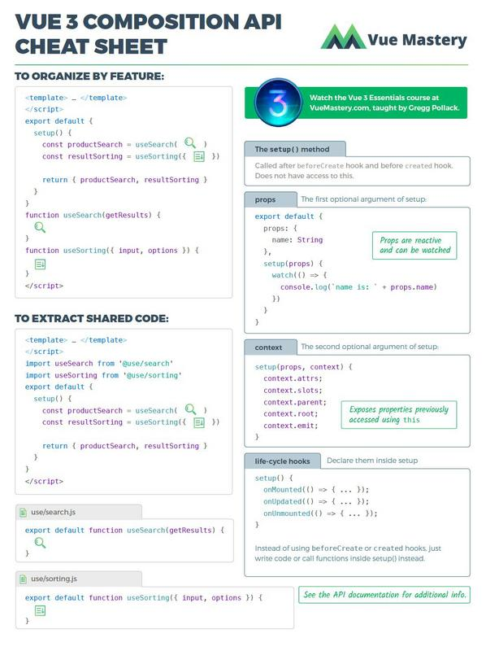
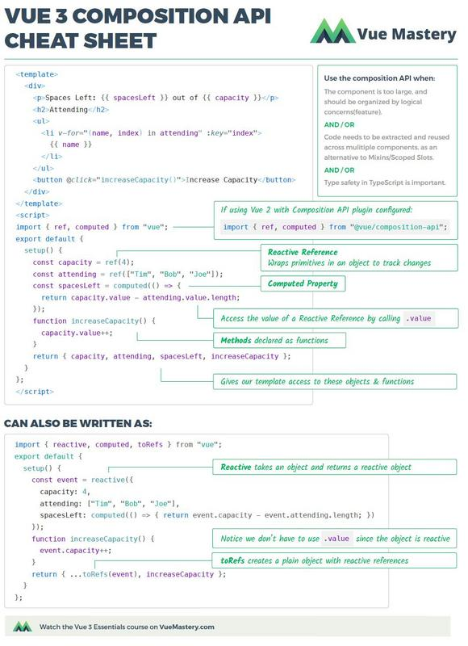

  

  

  
  
  
  
  

# Vue3+ & Vue-CLI3+ 开发生态圈资讯

<!--
// 0️⃣ 1️⃣ 2️⃣ 3️⃣ 4️⃣ 5️⃣ 6️⃣ 7️⃣ 8️⃣ 9️⃣
-->

🚀 欢迎`Star`，后续会不断更新。  
🇨🇳 最后更新日期：2️⃣0️⃣2️⃣6️⃣-0️⃣6️⃣-2️⃣8️⃣  
🇨🇳🇨🇳🇨🇳🇨🇳🇨🇳🇨🇳🇨🇳🇨🇳🇨🇳🇨🇳🇨🇳🇨🇳🇨🇳🇨🇳🇨🇳

2025 年您好，(_´▽ ｀)ノノ_)，继续前行！  
【2025】 ≡≡≡≡≡≡≡≡-------------------------- 【2026】

## 2025–2026 Vue 3 资料专区

为了更方便地跟踪 Vue 3 在 2025–2026 年的演进方向，仓库新增了一组专题文档，覆盖“趋势分析、升级策略、兼容风险、特性采纳、内容规划”五个核心维度，适合用于项目升级、技术调研和内容输出。

### 文档说明

- [2026/Vue3_2025-2026_Overview.md](2026/Vue3_2025-2026_Overview.md)：整体概览，介绍 2025–2026 Vue 3 的核心趋势、版本节奏与重点方向。
- [2026/Vue3_2025-2026_Analysis.md](2026/Vue3_2025-2026_Analysis.md)：从宏观视角分析 Vue 3 的演进逻辑、生态变化与技术结论。
- [2026/Vue3_2025-2026_UpgradeStrategy.md](2026/Vue3_2025-2026_UpgradeStrategy.md)：面向实际项目的升级策略与实践路径，帮助选择稳定版本与预研版本。
- [2026/Vue3_2025-2026_FeatureAdoption.md](2026/Vue3_2025-2026_FeatureAdoption.md)：介绍核心特性如何落地到项目中，适合做技术选型与迁移参考。
- [2026/Vue3_2025-2026_RiskCompatibility.md](2026/Vue3_2025-2026_RiskCompatibility.md)：汇总兼容风险、破坏性变更、测试与回退策略。
- [2026/Vue3_2025-2026_ContentPlaybook.md](2026/Vue3_2025-2026_ContentPlaybook.md)：面向内容创作与社区运营，提供文章结构与发布建议。
- [2026/Vue3_2025-2026_Recommendations.md](2026/Vue3_2025-2026_Recommendations.md)：总结优先建议与行动清单，便于快速决策。
- [2026/Vue3_2025-2026_ReadingList.md](2026/Vue3_2025-2026_ReadingList.md)：汇总官方文档、深度文章与阅读指引。

### 推荐阅读顺序

1. 先阅读总览，建立整体认知。
2. 再查看升级策略与兼容风险，判断项目适配方向。
3. 最后结合特性采纳与内容方案，落实到实际开发或内容输出中。

2024 年再见ヾ(￣ ▽ ￣)Bye~Bye~，感谢自己！  
【2020】 ≡≡≡≡≡≡≡≡≡≡≡≡≡≡≡≡≡≡≡≡≡≡≡≡≡≡≡≡≡≡≡≡≡≡ 【2024】

Twitter vue3: **vue 3 will be available by the end of Q2.**(done)

第四届 Vue.js 开发者大会由 Vue.js 官方举办，于 2021 年 05 月 22 日在杭州正式开启。本次大会将主要采用在线直播方式与大家呈现，线下会有听少量听众席位！[w3ctech](https://vue.w3ctech.com/)  
**[VueConf 2021 PPT & Video](https://www.yuque.com/vueconf/mkwv0c)**

2020 年 9 月 18 日星期五，Vue 的作者尤雨溪发表主题演讲，正式发布 Vue3.0 并回应一些大家关切的问题。表示不建议大家立刻升级到 Vue3.0 版本，之前项目中某些依赖项可能还不支持新版，等社区完善后再进行迁移也不迟。

Vue3.0 正式发布，尤雨溪在线全球发布会：【[戳这里](https://mp.weixin.qq.com/s/ZECNJYe1_zNwdX9tUWnMFA?content_source_url=https://github.com/vue3/vue3-News)】

The offical blog for the Vue.js project, [The Vue Point](https://blog.vuejs.org/).

想了解更多有关 Vue 3.0 的信息，请大胆访问：[v3.vuejs.org](https://v3.vuejs.org/?content_source_url=https://github.com/vue3/vue3-News)

除了单独 Vue3 资讯，欢迎查看更多 vue.js 资讯：【[【🔥Vue.js 资讯 📚】目前 web 前端开发非常火爆的框架；定时更新，欢迎 Star 一下。](https://github.com/itemsets/vue2)】

欢迎 ━(_｀ ∀´_)ノ亻!  
各位大佬们前来玩耍！！！

## 目录

- [vue3 更上一层楼](#vue3-更上一层楼)
- [Announcing Vue 3.3](#我是要成为海贼王的男人)
- [2021 => 我最棒(๑•̀ㅂ•́)و✧](#我是要成为海贼王的男人)
- [新年新气象](#新年新气象)
- [撸 vue3 的霸气姿势](#-撸-vue3-的姿势-)
- [Vue 3 Cheat Sheet](#Vue3-CheatSheet)
- [再谈 vue3](#再谈vue3)
- [尤大推出`vue3 beta`之后](#尤大推出vue3-beta之后)
- [迎接 Vue3.0 系列](#迎接Vue3.0系列)
- [最新资讯-继续前进 ╰(_°▽°_)╯](#最新资讯-继续前进)
- [英文资料](#英文资料)
- [2019 年中旬](#2019年中旬)
- [2019 年上旬](#2019年上旬)
- [2018 年预告](#2018年预告)

**🐣 关于旧版本**

Vue CLI 的包名称由 vue-cli 改成了 @vue/cli。 如果你已经全局安装了旧版本的 vue-cli (1.x 或 2.x)，你需要先通过 npm uninstall vue-cli -g 或 yarn global remove vue-cli 卸载它。

**🐥Node 版本要求**

Vue CLI 需要 Node.js 8.9 或更高版本 (推荐 8.11.0+)。你可以使用 nvm 或 nvm-windows 在同一台电脑中管理多个 Node 版本。

**🐓Vue 3.0 源代码**

当大多数国人还在庆祝国庆节的时候，尤雨溪大大在昨天凌晨发布了 Vue 3.0 源代码，源码地址：https://github.com/vuejs/vue-next 。虽然目前还 处于 Pre-Alpha 版本，但是可以预见后面的 Alpha、Beta 等版本应该不会太遥远。  
之前，就有预言，除了性能优化、脚手架和新功能外，TypeScript 绝对是一个重点，因此，在 Vue 3.0 源代码版本中，98%代码由 Typescript 编写，相信后面会是 100%。  
通过本次发布的源代码可以了解到针对 Vue 3 计划并已实现的主要架构改进和新功能。  
Vue 3 中最主要的新特性：组合式 API，已经可以借助 https://github.com/vuejs/composition-api （在 Vue 2 项目中作为插件使用）体验到。

 yyx990803

## [3.5.13](https://github.com/vuejs/core/compare/v3.5.12...v3.5.13) (2024-11-15)

### Bug Fixes

- **compiler-core:** handle v-memo + v-for with functional key ([#12014](https://github.com/vuejs/core/issues/12014)) ([99009ee](https://github.com/vuejs/core/commit/99009eee0efc238392daba93792d478525b21afa)), closes [#12013](https://github.com/vuejs/core/issues/12013)
- **compiler-dom:** properly stringify template string style ([#12392](https://github.com/vuejs/core/issues/12392)) ([2d78539](https://github.com/vuejs/core/commit/2d78539da35322aea5f821b3cf9b02d006abac72)), closes [#12391](https://github.com/vuejs/core/issues/12391)
- **custom-element:** avoid triggering mutationObserver when relecting props ([352bc88](https://github.com/vuejs/core/commit/352bc88c1bd2fda09c61ab17ea1a5967ffcd7bc0)), closes [#12214](https://github.com/vuejs/core/issues/12214) [#12215](https://github.com/vuejs/core/issues/12215)
- **deps:** update dependency postcss to ^8.4.48 ([#12356](https://github.com/vuejs/core/issues/12356)) ([b5ff930](https://github.com/vuejs/core/commit/b5ff930089985a58c3553977ef999cec2a6708a4))
- **hydration:** the component vnode's el should be updated when a mismatch occurs. ([#12255](https://github.com/vuejs/core/issues/12255)) ([a20a4cb](https://github.com/vuejs/core/commit/a20a4cb36a3e717d1f8f259d0d59f133f508ff0a)), closes [#12253](https://github.com/vuejs/core/issues/12253)
- **reactiivty:** avoid unnecessary watcher effect removal from inactive scope ([2193284](https://github.com/vuejs/core/commit/21932840eae72ffcd357a62ec596aaecc7ec224a)), closes [#5783](https://github.com/vuejs/core/issues/5783) [#5806](https://github.com/vuejs/core/issues/5806)
- **reactivity:** release nested effects/scopes on effect scope stop ([#12373](https://github.com/vuejs/core/issues/12373)) ([bee2f5e](https://github.com/vuejs/core/commit/bee2f5ee62dc0cd04123b737779550726374dd0a)), closes [#12370](https://github.com/vuejs/core/issues/12370)
- **runtime-dom:** set css vars before user onMounted hooks ([2d5c5e2](https://github.com/vuejs/core/commit/2d5c5e25e9b7a56e883674fb434135ac514429b5)), closes [#11533](https://github.com/vuejs/core/issues/11533)
- **runtime-dom:** set css vars on update to handle child forcing reflow in onMount ([#11561](https://github.com/vuejs/core/issues/11561)) ([c4312f9](https://github.com/vuejs/core/commit/c4312f9c715c131a09e552ba46e9beb4b36d55e6))
- **ssr:** avoid updating subtree of async component if it is resolved ([#12363](https://github.com/vuejs/core/issues/12363)) ([da7ad5e](https://github.com/vuejs/core/commit/da7ad5e3d24f3e108401188d909d27a4910da095)), closes [#12362](https://github.com/vuejs/core/issues/12362)
- **ssr:** ensure v-text updates correctly with custom directives in SSR output ([#12311](https://github.com/vuejs/core/issues/12311)) ([1f75d4e](https://github.com/vuejs/core/commit/1f75d4e6dfe18121ebe443cd3e8105d54f727893)), closes [#12309](https://github.com/vuejs/core/issues/12309)
- **ssr:** handle initial selected state for select with v-model + v-for option ([#12399](https://github.com/vuejs/core/issues/12399)) ([4f8d807](https://github.com/vuejs/core/commit/4f8d8078221ee52deed266677a227ad2a6d8dd22)), closes [#12395](https://github.com/vuejs/core/issues/12395)
- **teleport:** handle deferred teleport update before mounted ([#12168](https://github.com/vuejs/core/issues/12168)) ([8bff142](https://github.com/vuejs/core/commit/8bff142f99b646e9dd15897ec75368fbf34f1534)), closes [#12161](https://github.com/vuejs/core/issues/12161)
- **templateRef:** set ref on cached async component which wrapped in KeepAlive ([#12290](https://github.com/vuejs/core/issues/12290)) ([983eb50](https://github.com/vuejs/core/commit/983eb50a17eac76f1bba4394ad0316c62b72191d)), closes [#4999](https://github.com/vuejs/core/issues/4999) [#5004](https://github.com/vuejs/core/issues/5004)
- **test:** update snapshot ([#12169](https://github.com/vuejs/core/issues/12169)) ([828d4a4](https://github.com/vuejs/core/commit/828d4a443919fa2aa4e2e92fbd03a5f04b258eea))
- **Transition:** fix transition memory leak edge case ([#12182](https://github.com/vuejs/core/issues/12182)) ([660132d](https://github.com/vuejs/core/commit/660132df6c6a8c14bf75e593dc47d2fdada30322)), closes [#12181](https://github.com/vuejs/core/issues/12181)
- **transition:** reflow before leave-active class after leave-from ([#12288](https://github.com/vuejs/core/issues/12288)) ([4b479db](https://github.com/vuejs/core/commit/4b479db61d233b054561402ae94ef08550073ea1)), closes [#2593](https://github.com/vuejs/core/issues/2593)
- **types:** defineEmits w/ interface declaration ([#12343](https://github.com/vuejs/core/issues/12343)) ([1022eab](https://github.com/vuejs/core/commit/1022eabaa1aaf8436876f5ec5573cb1e4b3959a6)), closes [#8457](https://github.com/vuejs/core/issues/8457)
- **v-once:** setting hasOnce to current block only when in v-once ([#12374](https://github.com/vuejs/core/issues/12374)) ([37300fc](https://github.com/vuejs/core/commit/37300fc26190a7299efddbf98800ffd96d5cad96)), closes [#12371](https://github.com/vuejs/core/issues/12371)

### Performance Improvements

- **reactivity:** do not track inner key `\_\_v_skip`` ([#11690](https://github.com/vuejs/core/issues/11690)) ([d637bd6](https://github.com/vuejs/core/commit/d637bd6c0164c2883e6eabd3c2f1f8c258dedfb1))
- **runtime-core:** use feature flag for call to resolveMergedOptions ([#12163](https://github.com/vuejs/core/issues/12163)) ([1755ac0](https://github.com/vuejs/core/commit/1755ac0a108ba3486bd8397e56d3bdcd69196594))

...

**v3.0.0 One Piece**

Today we are proud to announce the official release of Vue.js 3.0 "One Piece". This new major version of the framework provides improved performance, smaller bundle sizes, better TypeScript integration, new APIs for tackling large scale use cases, and a solid foundation for long-term future iterations of the framework.

[One Piece. Vuejs 3.0 正式版发布！代号：海贼王](https://github.com/vue3/vue3-News/issues/21)

**🔥🐔2020 前端面试秘籍**

[【吐血整理清单一】前端面试全攻略，为您保驾护航，金三银四](https://github.com/vue3/vue3-News/issues/9?content_source_url=https://github.com/vue3/vue3-News)  
[【吐血整理清单二】前端面试全攻略，为您保驾护航，金三银四](https://github.com/vue3/vue3-News/issues/10?content_source_url=https://github.com/vue3/vue3-News)  
[【吐血整理清单三】前端面试全攻略，为您保驾护航，金三银四](https://github.com/vue3/vue3-News/issues/11?content_source_url=https://github.com/vue3/vue3-News)

秘籍在手，天下我有； 只要你想进，那么世界就是你的。

**🐔 前端整理之道**

[【整理】前端优化得有个好手段，比如看这个清单 🍑🍒🍓🍆🌽](https://github.com/vue3/vue3-News/issues/8?content_source_url=https://github.com/vue3/vue3-News)  
[【整理】前端学习笔记总结清单，应有尽有 🍇🍈🍉🍊🍋](https://github.com/vue3/vue3-News/issues/7?content_source_url=https://github.com/vue3/vue3-News)

**🦃 关于 TypeScript**

[【2020-Q1-News】TypeScript 新鲜一波流，自己品尝？](https://github.com/vue3/vue3-News/issues/6?content_source_url=https://github.com/vue3/vue3-News)  
[【最新】TypeScript 梳理知识点列表，可否一战？](https://github.com/vue3/vue3-News/issues/4?content_source_url=https://github.com/vue3/vue3-News)  
[【必会】都已经 9102 年底了，你必须会 TypeScript。](https://github.com/vue3/vue3-News/issues/3?content_source_url=https://github.com/vue3/vue3-News)

为什么要学习它？  
因为：

- 按需输出 JavaScript 版本
- 代码标准化利于团队开发
- 主流框架及最新特性的支持
- 便于重构和主流 IDE 支持
- 更多友好特性和检测  
  ...

哈哈哈，并不是，是因为都已经 2020 了，大公司和你们都在用。

## Vue3-CheatSheet

由 Vue Mastery 网站归纳的 Vue 3 Cheat Sheet， 直观地概况了其主要特性。

| Vue3 Cheat Sheet                    | Vue3 Cheat Sheet                    |
| ----------------------------------- | ----------------------------------- |
|  |  |

## Votar

⚡ Explore high-performance tooling for Vue

**Vue Language Features**  
Vue language support extension for VSCode  
**TypeScript Vue Plugin**  
VSCode extension to support Vue in TS server  
**vue-tsc**  
Type-check and dts build command line tool

Discord: https://discord.gg/5bnSSSSBbK

https://github.com/johnsoncodehk/volar

## vueuse

[antfu/vueuse](https://github.com/antfu/vueuse?content_source_url=https://github.com/vue3/vue3-News)

like React hooks.  
Collection of essential Vue Composition API utils works for Vue 2.x and 3.x https://vueuse.js.org/

Collection of essential Vue Composition API (inspired by react-use)

**🚀 Features**

- ⚡ 0 dependencies: No worry about your bundle size
- 🌴 Fully tree shakable: Only take what you want
- 🦋 Type Strong: Written in Typescript
- 🕶 Seamless migration: Works for both Vue 3 and 2
- 🌎 Browser compatible: Use it though CDN
- 🎪 Interactive docs & demos: Check out the Storybook!
- 🔌 Optional Add-ons: Firebase, vue-i18n, etc

## 新年新气象

新的一年，继续前行；希望各位顺顺利利，心想事成。

## 💃🏻 撸 vue3 的姿势 💃🏻

🐯 🦁 🐮 🐷 🐹 🦊

霸气姿势观望 `vue3` 核心技术 ing

- Proxy：不只是解决了 defineProperty 的局限性。
- Performance：性能更比 Vue 2.0 强。
- Tree shaking support：可以将无用模块“剪辑”，仅打包需要的。
- Composition API：组合 API。
- Fragment, Teleport, Suspense：“碎片”，Teleport 即 Protal 传送门，“悬念”。
- Better TypeScript support：更优秀的 Ts 支持。
- Custom Renderer API：暴露了自定义渲染 API。

TODOLIST：

- 1 Docs & Migration Guides
- 2 Router
- 3 Vuex
- 4 CLI
- 5 新工具：vite（法语 “快”）
- 6 vue-test-utils
- 7 DevTools
- 8 IDE Support (Vetur)
- 9 Nuxt

介绍 Vue.js 以及 Vue-next 源码分析文章，希望通过学习 Vue.js 源码获得更好的知识和收获。  
[【这是入口】你要找的 vue 源码 全宇宙的都在这！](https://github.com/vue3/vue3-News/issues/16?content_source_url=https://github.com/vue3/vue3-News)

## Vue3.5/3.6+ 生态

**《Vue3.6 性能暴增与开发体验升级》**  
深度解析 Vue3.6 新特性，包括 Alien Signals 响应式系统升级和 Vapor 模式渲染优化，通过懒加载 Props 和精简 DOM 操作实现 100 毫秒内挂载 10 万组件的性能突破。  
**《Vue CLI 3+ & Vite 最新技术动态》**  
GitHub 官方仓库持续更新 Vue3、Vue CLI 3+ 和 Vite 的生态进展，涵盖 2024/2025 年度重大更新内容，推荐开发者关注长期维护版本迁移指南。  
**《2025 年 Vue3 组件库推荐》**  
对比 Element Plus、Vuetify 等主流组件库的 Vue3 适配进展，重点分析 Vapor 模式下的组件性能优化策略，以及 TypeScript 类型系统的最新实践。  
**《Vue Amazing UI 技术解析》**  
Vue3.5+ 生态下的高灵活组件库，支持 Tree-shaking 和单文件组件风格，整合 64 个 UI 组件与 16 个工具函数，适配高频更新场景。  
**《GitHub Copilot 指标可视化》**  
通过 Vue3 实现开发者工具链的智能化监控，包含代码贡献度分析、AI 辅助效率评估等前沿方向，项目单月新增 5,831 星标。  
**《Vue3 企业级项目迁移实录》**  
TypeScript 全量替换方案与 Monorepo 架构优化案例，对比 Vue2 的 Options API 和 Vue3 的 Composition API 在大型项目中的协作效率差异。

- [Vue3.6 从响应式突破到 Rolldown 未来蓝图，全新体验来袭！](https://blog.csdn.net/fjiex/article/details/145721183?content_source_url=https://github.com/vue3/vue3-News)
- [Vue Amazing UI](https://juejin.cn/post/7465259435352916004?content_source_url=https://github.com/vue3/vue3-News)
- [尤雨溪剧透 Vue 3.6：性能暴增、开发体验再升级，这些新特性值得熬夜等！](https://juejin.cn/post/7478576823612047396?content_source_url=https://github.com/vue3/vue3-News)
- [Vue 源码学习 3.6：计算属性 computed](https://juejin.cn/post/6844904152901025800?content_source_url=https://github.com/vue3/vue3-News)
- [vue3.6 外星信号具体使用教程](https://juejin.cn/post/7472559467406721043?content_source_url=https://github.com/vue3/vue3-News)
- [尤雨溪：从 Vue1 到 Vue3.6](https://juejin.cn/post/7469365599132680242?content_source_url=https://github.com/vue3/vue3-News)
- [Vue 3.6 预览，Vapor Mode 性能炸裂！并涵盖大量全新概念](https://juejin.cn/post/7471246544843702308?content_source_url=https://github.com/vue3/vue3-News)
- [2025 Vue 技术风暴】Vue 3.6 性能革命：Vapor 模式+Alien Signals，如何颠覆前端开发？实战代码解析！](https://juejin.cn/post/7485998798654767114?content_source_url=https://github.com/vue3/vue3-News)
- [【2025 Vue 小白速成】从零到项目实战：3 天搞定 Vue 3.6 + AI 代码助手，保姆级教程](https://juejin.cn/post/7485965177097814066?content_source_url=https://github.com/vue3/vue3-News)
- [Vue 3.5 版本发布：响应式系统优化，性能飞升与内存锐减 56%](https://blog.csdn.net/qq_65243376/article/details/145548659?content_source_url=https://github.com/vue3/vue3-News)
- [应该是全网最详细的 Vue3.5 版本解读](https://blog.csdn.net/qq_16242613/article/details/144436461?content_source_url=https://github.com/vue3/vue3-News)
- [Vue 3.5 响应式系统的详细分析](https://zhuanlan.zhihu.com/p/27718577881?content_source_url=https://github.com/vue3/vue3-News)

**‌Vue Mastery 系列课程**  
聚焦 Vue3.6 新特性，如 Alien Signals 响应式升级与异步组件懒加载方案 ‌18。  
**‌Vue.js Core Weekly‌**  
跟踪 GitHub 仓库更新动态，包括 Vite 插件生态进展与 TypeScript 类型系统最佳实践 ‌16。

## vue3 更上一层楼

- [Announcing Vue 3.5](https://blog.vuejs.org/posts/vue-3-5?content_source_url=https://github.com/vue3/vue3-News)
- [Vue3+AI 打造智能聊天应用：从零到部署的全栈秘籍](https://zhuanlan.zhihu.com/p/29876985312?content_source_url=https://github.com/vue3/vue3-News)
- [Vue3.5 正式上线，父传子 props 用法更丝滑简洁](https://zhuanlan.zhihu.com/p/3751577616?content_source_url=https://github.com/vue3/vue3-News)
- [2024 前端开发 - 2/3 进阶篇 - 核心框架学习](https://blog.csdn.net/Cat0926/article/details/135856405?content_source_url=https://github.com/vue3/vue3-News)
- [使用 vue3 调用 DeepSeek，实现自己的本地 GPT 页面](https://juejin.cn/post/7457929052609069071?content_source_url=https://github.com/vue3/vue3-News)
- [Vue 首屏优化终极指南：10 大黑科技让加载速度飙升 300%（附实战代码）](https://juejin.cn/post/7482265923919822875?content_source_url=https://github.com/vue3/vue3-News)
- [Vue3 性能优化十大技巧：打造高性能应用的终极指南](https://blog.csdn.net/Pro_er/article/details/145808172?content_source_url=https://github.com/vue3/vue3-News)
- [Vue3 性能优化必杀技：useDebounce+useThrottle+useLazyLoad 深度剖析](https://article.juejin.cn/post/7473808296316076059?content_source_url=https://github.com/vue3/vue3-News)
- [2024 年前端性能优化：Vue3 与 Vite 项目全方位攻略](https://zhuanlan.zhihu.com/p/15109717831?content_source_url=https://github.com/vue3/vue3-News)
- [Vue3 项目性能优化神器，懒加载轻松搞定](https://haokan.baidu.com/v?pd=wisenatural&vid=6339094676488370893?content_source_url=https://github.com/vue3/vue3-News)
- [【Vue3】保姆级毫无废话的进阶到实战教程 - 01](https://zhuanlan.zhihu.com/p/688204023?content_source_url=https://github.com/vue3/vue3-News)
- [【Vue 面试专题】Vue3 性能提升提现在哪些方面？](https://www.bilibili.com/video/BV19d4y1o7tq/?vd_source=e2f5c3cfc007583984f5d1832a68f7f0?content_source_url=https://github.com/vue3/vue3-News)
- [轻松打造 Vue3 高性能虚拟列表组件](https://zhuanlan.zhihu.com/p/8849458542?content_source_url=https://github.com/vue3/vue3-News)
- [🚀 Vue3 性能优化实战：让你的应用快如闪电！⚡](https://juejin.cn/post/7471190669715537956?content_source_url=https://github.com/vue3/vue3-News)
- [Vue3 从入门到精通：全面掌握前端框架的进阶之路](https://blog.csdn.net/weixin_44171297/article/details/145629043?content_source_url=https://github.com/vue3/vue3-News)
- [Vue 3 性能提升与 TS 支持全解析](https://mbd.baidu.com/newspage/data/dtlandingsuper?nid=dt_4094710842961065610&sourceFrom=search_a?content_source_url=https://github.com/vue3/vue3-News)
- [Vue3 源码解析，打造自己的 Vue3 框架](https://zhuanlan.zhihu.com/p/16343594401?content_source_url=https://github.com/vue3/vue3-News)
- [AI 交互组件库 AI 界面解决方案-- Element Plus X 正式开源啦](https://zhuanlan.zhihu.com/p/1888274000427323435?content_source_url=https://github.com/vue3/vue3-News)
- [Vue3 组件通信全攻略：多种方式详解+实战场景，轻松玩转复杂数据流！](https://zhuanlan.zhihu.com/p/26970252966?content_source_url=https://github.com/vue3/vue3-News)
- [Vue3 设计思想及响应式源码剖析](https://zhuanlan.zhihu.com/p/13649505093?content_source_url=https://github.com/vue3/vue3-News)
- [Vue3 h5 项目性能优化](https://juejin.cn/post/7355096015584264192?content_source_url=https://github.com/vue3/vue3-News)
- [这 22 个 Vue3 的实用技巧，你可能还不知道！](https://zhuanlan.zhihu.com/p/460142729?content_source_url=https://github.com/vue3/vue3-News)
- [Vue 3 性能提升与 TS 支持全解析](https://mbd.baidu.com/newspage/data/dtlandingsuper?nid=dt_4094710842961065610?content_source_url=https://github.com/vue3/vue3-News)
- [2024 年前端性能优化：Vue3 与 Vite 项目全方位攻略](https://juejin.cn/post/7452518173184901160?content_source_url=https://github.com/vue3/vue3-News)
- [有没有比较好的 vue3+ts 的学习资源推荐一下?](https://www.zhihu.com/question/513772508/answer/3136740365?content_source_url=https://github.com/vue3/vue3-News)
- [2024 总结的 vue3 的面试题](https://zhuanlan.zhihu.com/p/689829638?content_source_url=https://github.com/vue3/vue3-News)
- [超详细！10 分钟开发一个 Vue3 的后台管理系统！](https://zhuanlan.zhihu.com/p/690498384?content_source_url=https://github.com/vue3/vue3-News)
- [《linwu 的算法笔记》，《现代 Javascrip 高级教程》，《现代 TypeScript 高级教程》，《深入浅出 Dart》等等精品课程](https://www.coding-time.cn/?content_source_url=https://github.com/vue3/vue3-News)
- [强烈推荐一款 Vue3 调试神器！](https://cloud.tencent.com/developer/article/2311847?content_source_url=https://github.com/vue3/vue3-News)
- [Vue3.0 官方调试工具 dev-tools 3.0 版本发布](https://wenku.csdn.net/doc/5hhay61k5r?content_source_url=https://github.com/vue3/vue3-News)

## Vue3 性能优化技巧

一、‌ 核心优化策略 ‌

- 路由级懒加载 ‌：通过 () => import() 动态导入组件，结合 `webpackChunkName` 分割代码块，减少首屏加载体积（首屏资源减少 30%+）‌。
- 异步组件优化 ‌：使用 `defineAsyncComponent` 加载非关键组件，并配置 `loadingComponent` 提升用户体验 ‌.
- 时间旅行调试 ‌：回溯应用状态快照，对比不同时间点的数据变化（支持 `Pinia/Vuex` 状态历史回滚）‌。
- 浅层响应式 ‌：对非深度监听的数据使用 `shallowRef/shallowReactive`，减少深层嵌套对象的性能开销 ‌.
- 冻结静态数据 ‌：通过 `Object.freeze()` 冻结无需变化的数据，避免无意义响应式追踪 ‌。
- 防抖与节流 ‌：使用 `useDebounce` 和 `useThrottle` 自定义 Hook 控制高频事件（如搜索输入），减少重复计算 ‌。

Vue DevTools‌

- 组件树与状态分析 ‌：可视化查看组件层级结构、实时编辑 `props/data`，支持 `Vuex/Pinia` 状态追踪与回溯调试 ‌。
- 性能分析 ‌：记录组件渲染耗时、计算属性执行时间，定位高耗时组件（如通过「`Performance`」标签页识别长任务）‌。
- 时间旅行调试 ‌：回溯应用状态快照，对比不同时间点的数据变化（支持 `Pinia/Vuex` 状态历史回滚）‌。

vite-plugin-vue-devtools‌

- 免浏览器扩展的调试插件，集成路由导航追踪、静态资源分析、时间线监控（性能/路由/Pinia 状态变更）‌。
- 支持动态路由参数调试与组件树快速导航，开发环境下直接通过 Vite 配置启用 ‌。

二、‌ 渲染与资源优化 ‌

- 列表渲染优化 ‌：为 v-for 设置唯一 key，大数据量场景使用虚拟滚动（如 `vue-virtual-scroller`）‌。
- 条件渲染策略 ‌：优先用 v-if 替代 v-show 减少常驻 DOM 节点，结合 v-memo 缓存静态组件片段（Vue 3.2+）‌。
- Tree Shaking 配置 ‌：通过 `Vite/Rollup` 剔除未使用代码，标记 sideEffects: false 优化第三方库（如 Element Plus 按需引入）‌。
- CDN 加速 ‌：将静态资源（如字体、图片）托管至 CDN，配合 HTTP 缓存策略提升加载速度 ‌。

三、‌ 工程化与工具链 ‌

- Vite 生态整合 ‌：使用 vite-plugin-html 实现多环境配置，通过 `@vitejs/plugin-legacy` 兼容旧浏览器 ‌。
- 第三方库压缩 ‌：对图标库（如 FontAwesome）按需引入，避免全量加载 ‌。
- Lighthouse 分析 ‌：生成性能报告，关注 FCP（首次内容渲染）和 LCP（最大内容渲染）指标 ‌。
- hrome Performance 面板 ‌：定位长任务（Long Tasks）和高耗时组件渲染 ‌。
- 服务端启用 `Brotli/Gzip` 压缩，减少网络传输体积，提升资源加载速度 ‌。

四、‌ 高阶实践 ‌

- 服务端优化 ‌：启用 `Brotli/Gzip` 压缩，配置 HTTP/2 多路复用减少网络延迟 ‌。
- 内存管理 ‌：及时解绑无用事件监听器，避免闭包导致的内存泄漏 ‌。
- 图片懒加载 ‌：结合 `Intersection Observer API` 实现视口外图片延迟加载 ‌。

`诊断瓶颈` ‌ → ‌ `按需加载组件` ‌‌ → ‌ `响应式数据精简` ‌‌ → ‌ `渲染策略调整` ‌‌。  
结合项目规模选择工具链，中小型项目优先优化代码分割和 `Tree Shaking`，大型项目需深入响应式与内存管理 ‌。  
大型项目需结合 `Web Workers` 处理密集型计算，避免阻塞主线程 ‌。

## 「我是要成为海贼王的男人」

Announcing Vue 3.3

Vue3.3 发布，版本代号为 “Rurouni Kenshin”  
主要改进了 DX（开发者体验）、新增一些语法糖和宏，以及 TypeScript 上的改善...

- [the release of Vue 3.3 "Rurouni Kenshin"!](https://blog.vuejs.org/posts/vue-3-3?content_source_url=https://github.com/vue3/vue3-News)
- [和 Vue 核心团队成员 sxzz 聊前端学习、参与开源和 Vue3.3](https://www.xiaoyuzhoufm.com/episode/646cd4901672628240ddda8e?content_source_url=https://github.com/vue3/vue3-News)
- [Vue 3.3 发布了，来看看有哪些更新](https://baijiahao.baidu.com/s?id=1765681831438941463&wfr=spider&for=pc?content_source_url=https://github.com/vue3/vue3-News)
- [通过实例了解 vue3.3 更新的特征](https://www.cnblogs.com/IwishIcould/p/17450015.html?content_source_url=https://github.com/vue3/vue3-News)
- [Vue3.3 的新功能的一些体验](https://www.jianshu.com/p/7e194af200f4?content_source_url=https://github.com/vue3/vue3-News)
- [Vue3.3 正式发布！](https://zhuanlan.zhihu.com/p/628670162?content_source_url=https://github.com/vue3/vue3-News)
- [Vue3.3 + TS4 ，自主打造媲美 ElementPlus 的组件库吾爱分享](https://zhuanlan.zhihu.com/p/646160646?content_source_url=https://github.com/vue3/vue3-News)
- [Vue 3.3 更新，代号“浪客剑心”](https://juejin.cn/post/7231940493256048700?content_source_url=https://github.com/vue3/vue3-News)
- [vue3：vue3.2 升级至 vue3.3/vue 升级版本](https://blog.csdn.net/snowball_li/article/details/124398732?content_source_url=https://github.com/vue3/vue3-News)
- [【Vue 核心团队成员】Vue 3.3 主要新特性详解](https://juejin.cn/post/7231940493256032316?content_source_url=https://github.com/vue3/vue3-News)
- [Vue 3.3 亮点解析：不容错过的新特性及其影响](https://juejin.cn/post/7233053557833056317?content_source_url=https://github.com/vue3/vue3-News)
- [vue3.3 最新发布 defineProps,generic,defineEmits,defineSlots 教程](https://blog.csdn.net/qq_41974199/article/details/130735175?content_source_url=https://github.com/vue3/vue3-News)
- [Vue3.3 + Vite4.3 + Element-Plus + TypeScript 从 0 到 1 搭建企业级后台管理系统（前后端开源）](https://juejin.cn/post/7228990409909108793?content_source_url=https://github.com/vue3/vue3-News)
- [Vue3.3 编译宏](https://juejin.cn/post/7253367284872708154?content_source_url=https://github.com/vue3/vue3-News)
- [Vue3.3+ 中 defineEmits 具名元组写法 eslint 报错](https://juejin.cn/post/7247810665242230839?content_source_url=https://github.com/vue3/vue3-News)
- [Vue3.3 的新功能的体验（下）：泛型组件（Generic Component) 与 defineSlots](https://juejin.cn/post/7234810590875107388?content_source_url=https://github.com/vue3/vue3-News)
- [【vue3.3】 新特性 - 初体验](https://juejin.cn/post/7241080533169520698?content_source_url=https://github.com/vue3/vue3-News)
- [Geeker-Admin 一款基于 Vue3.3、TypeScript、Vite4、Pinia、Element-Plus 开源的后台管理框架](https://gitee.com/HalseySpicy/Geeker-Admin?content_source_url=https://github.com/vue3/vue3-News)
- [vue3 父组件给子组件传递泛型（不用 JSX）](https://juejin.cn/post/7229661191073022011?content_source_url=https://github.com/vue3/vue3-News)
- [Vue3.3.1+TS 全新使用指南](https://juejin.cn/post/7233057834287710267?content_source_url=https://github.com/vue3/vue3-News)
- [一个 demo 体验 Vue3.3+TypeScript 所有新功能](https://juejin.cn/post/7243321262460731451?content_source_url=https://github.com/vue3/vue3-News)
- [全新升级 Vue3.3 基于 ElementPLUS 常用封装组件](https://www.bilibili.com/video/BV1or4y1o7jc/?vd_source=e2f5c3cfc007583984f5d1832a68f7f0?content_source_url=https://github.com/vue3/vue3-News)
- [能不能更快更好用？Vue3.3 正式发布，加速你的开发效率！](https://blog.csdn.net/hkw20/article/details/130641156?content_source_url=https://github.com/vue3/vue3-News)
- [Vue3.3：瀑布流组件封装](https://www.bilibili.com/video/BV14u4y117Vx?content_source_url=https://github.com/vue3/vue3-News)
- [Vue 3 notification library](https://github.com/kyvg/vue3-notification?content_source_url=https://github.com/vue3/vue3-News)
- [记一次 Vue3.3.3 p5-urgent 级 bug 修复过程](https://juejin.cn/post/7264609364672888888?content_source_url=https://github.com/vue3/vue3-News)
- [Vue 3.3 新特性前瞻和简单评价](https://juejin.cn/post/7226619773375152187?content_source_url=https://github.com/vue3/vue3-News)

2021 => 我最棒(๑•̀ㅂ•́)و✧

- [2021 前端会有什么新的变化？](https://www.zhihu.com/question/428128531?content_source_url=https://github.com/vue3/vue3-News)
- [2021 年前端工程师书单推荐](https://juejin.cn/post/6920428989181870094?content_source_url=https://github.com/vue3/vue3-News)
- [阿里巴巴淘系技术-2021 年前端会有什么新变化？](https://juejin.cn/post/6920487374543831053?content_source_url=https://github.com/vue3/vue3-News)
- [从 2020 看 2021 前端发展趋势](https://juejin.cn/post/6912435101452206088?content_source_url=https://github.com/vue3/vue3-News)
- [2021 前端学习路径书单—自我成长之路](https://juejin.cn/post/6930419481835470861?content_source_url=https://github.com/vue3/vue3-News)
- [2021 前端会有什么新变化？](https://juejin.cn/post/6918701032264433672?content_source_url=https://github.com/vue3/vue3-News)
- [2021 年毕业要不要学前端框架?](https://www.zhihu.com/question/355384140?content_source_url=https://github.com/vue3/vue3-News)
- [2021 前端发展方向](https://www.cnblogs.com/qianduanpiaoge/p/14300390.html?content_source_url=https://github.com/vue3/vue3-News)
- [2021 年前端开发的下一步发展预测 ](https://www.sohu.com/a/447955212_355140?content_source_url=https://github.com/vue3/vue3-News)
- [2021 年前端趋势预测](https://developer.aliyun.com/article/781216?content_source_url=https://github.com/vue3/vue3-News)
- [2021 年 Web 开发的主要趋势](https://zhuanlan.zhihu.com/p/324154627?content_source_url=https://github.com/vue3/vue3-News)
- [你确定不了解下 2021 年 Web 开发的趋势嘛](https://zhuanlan.zhihu.com/p/344451653?content_source_url=https://github.com/vue3/vue3-News)
- [前端规划：2021 前端技术战略](https://zhuanlan.zhihu.com/p/348509260?content_source_url=https://github.com/vue3/vue3-News)

🏆 🥇 🥈 🥉
迟序之数，非出神怪，有形可检，有数可推。——祖冲之
🏅 🎖 🏵

- [尤雨溪：Vue 3 将成为新的默认版本 ](https://www.sohu.com/a/518048813_115128?content_source_url=https://github.com/vue3/vue3-News)
- [Vue3 默认版本了！我准备学这五个东西了](https://segmentfault.com/a/1190000041324242?content_source_url=https://github.com/vue3/vue3-News)
- [基于 Vite 搭建开发体验超级丝滑的 Vue3 组件库开发框架](https://segmentfault.com/a/1190000041103446?content_source_url=https://github.com/vue3/vue3-News)
- [Vue3.0+TS+Element-plus 最全面后台管理系统！](https://juejin.cn/post/7034766239192842276?content_source_url=https://github.com/vue3/vue3-News)
- [Vite2 + Vue3 + TypeScript + Pinia 搭建一套企业级的开发脚手架【值得收藏】](https://juejin.cn/post/7036745610954801166?content_source_url=https://github.com/vue3/vue3-News)
- [Vue3 中有哪些值得深究的知识点？](https://juejin.cn/post/7038794364251799560?content_source_url=https://github.com/vue3/vue3-News)
- [Vue3 源码内参<一>手写 mini 前置准备](https://juejin.cn/post/7028471826627952671?content_source_url=https://github.com/vue3/vue3-News)
- [Vue3 新特性学习(三)计算属性 computed 和侦听器 watch](https://juejin.cn/post/7024792752940384292?content_source_url=https://github.com/vue3/vue3-News)
- [vue2 Vue3 v-model 原理](https://juejin.cn/post/7031839103914246181?content_source_url=https://github.com/vue3/vue3-News)
- [包含前端最新技术的 Vue 3 模板 vue3-compact-template](https://juejin.cn/post/7026284849786781726?content_source_url=https://github.com/vue3/vue3-News)
- [使用 vite2.0+vue3+element Plus+vue-router 搭建一个简单的项目](https://juejin.cn/post/7025899761198694431?content_source_url=https://github.com/vue3/vue3-News)
- [Vue3 + Vite 前端工程化-基础篇](https://juejin.cn/post/7028431949488193550?content_source_url=https://github.com/vue3/vue3-News)
- [【vue3+antd-design-vue 项目】-- 快速上手 vue3](https://juejin.cn/post/7026213106581766174?content_source_url=https://github.com/vue3/vue3-News)
- [聊一聊 Vue3 的 9 个知识点](https://juejin.cn/post/7026249448233631752?content_source_url=https://github.com/vue3/vue3-News)
- [不完全 Vue3 迁移指南](https://juejin.cn/post/7030729177972080670?content_source_url=https://github.com/vue3/vue3-News)
- [Webpack5 详细教程-入门篇，带你搭建 Vue3 项目](https://juejin.cn/post/7030709712920248357?content_source_url=https://github.com/vue3/vue3-News)
- [vue3 保姆级教程](https://juejin.cn/post/7030992475271495711?content_source_url=https://github.com/vue3/vue3-News)
- [手写简易版 vue3](https://juejin.cn/post/7031913919308365854?content_source_url=https://github.com/vue3/vue3-News)
- [助你上手 Vue3 全家桶之 Vue3 教程](https://www.jianshu.com/p/a2709fef0ef7?content_source_url=https://github.com/vue3/vue3-News)
- [从实际项目出发，告诉你 vue3 到底香不香](https://blog.csdn.net/zz_jesse/article/details/117490214?content_source_url=https://github.com/vue3/vue3-News)
- [一次弄懂 Vue2 和 Vue3 的 nextTick 实现原理](https://segmentfault.com/a/1190000040847068?content_source_url=https://github.com/vue3/vue3-News)
- [快速了解 vue3 生态发展现状和展望<尤雨溪>](https://zhuanlan.zhihu.com/p/425467159?content_source_url=https://github.com/vue3/vue3-News)
- [别人都在用 Vue3 了，你还在磕 Vue2 和 React？](https://baijiahao.baidu.com/s?id=1716182903504428181&wfr=spider&for=pc?content_source_url=https://github.com/vue3/vue3-News)
- [Vue 和 React 的使用场景和深度有何不同？](https://www.zhihu.com/question/31585377?content_source_url=https://github.com/vue3/vue3-News)
- [3 种 Vue3 添加公共方法并使用](https://baijiahao.baidu.com/s?id=1716140687281553733&wfr=spider&for=pc?content_source_url=https://github.com/vue3/vue3-News)
- [10 个 Vue3 精华知识点，你知道几个？](https://www.jianshu.com/p/e4664216b5cc?content_source_url=https://github.com/vue3/vue3-News)
- [2021, 九款值得推荐的 VUE3 UI 框架](https://zhuanlan.zhihu.com/p/428493241?content_source_url=https://github.com/vue3/vue3-News)
- [从 16 个方向逐步搭建基于 vue3 的前端架构](https://segmentfault.com/a/1190000040899589?content_source_url=https://github.com/vue3/vue3-News)
- [Vue3 源码分析——编译模块和编译器](https://segmentfault.com/a/1190000040887536?content_source_url=https://github.com/vue3/vue3-News)
- [低代码平台，JeecgBoot v3.0 版本发布—新里程牌开始，迎接 VUE3 版本到来](https://segmentfault.com/a/1190000040892226?content_source_url=https://github.com/vue3/vue3-News)
- [尤大都推荐的组件库是如何开发出来的？](https://juejin.cn/post/7021528826798669854?content_source_url=https://github.com/vue3/vue3-News)
- [Vue3 响应式原理原来是这样的](https://juejin.cn/post/7021870375751385096?content_source_url=https://github.com/vue3/vue3-News)
- [Vue3 + Typescript + pnpm + rollup/gulp 工程化搭建组件库（二）](https://juejin.cn/post/7021768729327304711?content_source_url=https://github.com/vue3/vue3-News)
- [升级 Vue3 成本大吗？](https://baijiahao.baidu.com/s?id=1714241000789292181?content_source_url=https://github.com/vue3/vue3-News)
- [花 60 秒给 Vue3 提的 PR，竟然被尤大亲自 Merge 了~](https://juejin.cn/post/7012449788255813669?content_source_url=https://github.com/vue3/vue3-News)
- [Vant 3 - 有赞出品的开源移动 UI 组件库，基于 Vue3 重构发布](https://blog.csdn.net/weixin_45583710/article/details/120036172?content_source_url=https://github.com/vue3/vue3-News)
- [【持续更新】梳理 Vue3 相比于 Vue2 的有哪些 “与众不同” ？](https://juejin.cn/post/7011372376969445413?content_source_url=https://github.com/vue3/vue3-News)
- [使用 Chrome 调试 Vue3 的 TypeScript 源码](https://juejin.cn/post/7012581204343914532?content_source_url=https://github.com/vue3/vue3-News)
- [最近风靡一时的 “No DomDiff”潮流是怎么回事？Virtual Dom 不香了？](https://juejin.cn/post/7009575427731636232?content_source_url=https://github.com/vue3/vue3-News)
- [vue + vue-print-nb 实现 pc 端打印功能，包含 vue2 和 vue3 两种引用方式](https://blog.csdn.net/qq_42386231/article/details/120061884?content_source_url=https://github.com/vue3/vue3-News)
- [如何阅读源码 —— 以 Vetur 为例](https://segmentfault.com/a/1190000040686256?content_source_url=https://github.com/vue3/vue3-News)
- [建立和维护大型 Vue.js 项目的 10 个最佳实践](https://segmentfault.com/a/1190000040712187?content_source_url=https://github.com/vue3/vue3-News)
- [[总结 🔥]学习 vue3 都需要会哪些 typescript 的知识点?中秋 🌕 回家 🚆 的路上学会 ts.](https://segmentfault.com/a/1190000040706798?content_source_url=https://github.com/vue3/vue3-News)
- [TypeScript 系列 🔥, 通过 vue3 实例说说 declare module 语法怎么用[🦕 模块声明篇]](https://segmentfault.com/a/1190000040699170?content_source_url=https://github.com/vue3/vue3-News)
- [【Vue3 更新】Vue 事件处理指南](https://segmentfault.com/a/1190000040597692?content_source_url=https://github.com/vue3/vue3-News)
- [新的 Vue 3 应用程序初始化代码的好处](https://segmentfault.com/a/1190000040583442?content_source_url=https://github.com/vue3/vue3-News)
- [Vue3 核心 Typescript 类解析](https://baijiahao.baidu.com/s?id=1710976906766128791&wfr=spider&for=pc?content_source_url=https://github.com/vue3/vue3-News)
- [vue3 实用工具 mini-vue ｜阮一峰推荐](https://zhuanlan.zhihu.com/p/404116228?content_source_url=https://github.com/vue3/vue3-News)
- [Vue3 + TS 最佳实践](https://juejin.cn/post/7001897686567747598?content_source_url=https://github.com/vue3/vue3-News)
- [我们团队在 Vue 3 Dev Tools 的帮助下，调试效率有了质的飞跃！](https://baijiahao.baidu.com/s?id=1710204002665953320&wfr=spider&for=pc?content_source_url=https://github.com/vue3/vue3-News)
- [【建议收藏】101 张脑图，从零开始学完 Vue3（包括 Vue3.2 最新语法）](https://juejin.cn/post/7007710727725121566?content_source_url=https://github.com/vue3/vue3-News)
- [Vue3.2 setup 语法糖、Composition API 归纳总结](https://juejin.cn/post/7006108454028836895?content_source_url=https://github.com/vue3/vue3-News)
- [Vue3.2 中 reactivity 的优化](https://juejin.cn/post/7005892927389958157?content_source_url=https://github.com/vue3/vue3-News)
- [vue3+typescript 实现一个中秋 RPG 游戏](https://juejin.cn/post/7007011750746783757?content_source_url=https://github.com/vue3/vue3-News)
- [还不会 Vue3？一篇笔记带你快速入门](https://juejin.cn/post/7006518993385160711?content_source_url=https://github.com/vue3/vue3-News)
- [Vue3 与 Vue2 的 Props、全局组件的异同点！](https://segmentfault.com/a/1190000040640951?content_source_url=https://github.com/vue3/vue3-News)
- [Vue3 Ref 语法糖，告别 .value 的写法](https://segmentfault.com/a/1190000040685876?content_source_url=https://github.com/vue3/vue3-News)
- [大概几集下饭剧时间就能懂的 VUE3 原理](https://segmentfault.com/a/1190000040611431?content_source_url=https://github.com/vue3/vue3-News)
- [Vue 更新到 3.2 版本了，你还学得动吗？](https://segmentfault.com/a/1190000040619654?content_source_url=https://github.com/vue3/vue3-News)
- [我们团队在 Vue 3 Dev Tools 的帮助下，调试效率有了质的飞跃！](https://developer.51cto.com/art/202108/679422.htm?content_source_url=https://github.com/vue3/vue3-News)
- [基于 Vue3 + Typescript + Vite2 打造一款网易云音乐播放器 (🍕Vue3 和 Vite2 你学了吗)](https://segmentfault.com/a/1190000040590559?content_source_url=https://github.com/vue3/vue3-News)
- [Vue 3.2 发布， ＜ script setup ＞ + TS + Volar = 真香](https://blog.csdn.net/mengyidan/article/details/119562143?content_source_url=https://github.com/vue3/vue3-News)
- [尤雨溪凌晨官宣：Vue 3.2 已发布！](https://segmentfault.com/a/1190000040491409?content_source_url=https://github.com/vue3/vue3-News)
- [Vue3.2 发布了，我激动了，实在学不动了！](https://juejin.cn/post/6995777059725246472?content_source_url=https://github.com/vue3/vue3-News)
- [Vue DevUI 又新添了 11 位新成员啦～ 🥳😋](https://juejin.cn/post/6996217326378942472?content_source_url=https://github.com/vue3/vue3-News)
- [细说 Vue.js 3.2 关于响应式部分的优化](https://juejin.cn/post/6995732683435278344?content_source_url=https://github.com/vue3/vue3-News)
- [2021 年最佳 VUE3 UI 框架推荐](https://juejin.cn/post/6995519561030172702?content_source_url=https://github.com/vue3/vue3-News)
- [初学者也能看懂的 Vue3 源码中那些实用的基础工具函数](https://juejin.cn/post/6994976281053888519?content_source_url=https://github.com/vue3/vue3-News)
- [使用 Vue3 开发 Dropdown 组件的几个核心要点](https://juejin.cn/post/6996396106372349983?content_source_url=https://github.com/vue3/vue3-News)
- [Vue 第二波 ref 语法提案来袭，这次会进入到标准吗？](https://juejin.cn/post/6997186627781001229?content_source_url=https://github.com/vue3/vue3-News)
- [vite + vue3 + ts 移动端实践](https://juejin.cn/post/6995808271034482696?content_source_url=https://github.com/vue3/vue3-News)
- [他来了，他来了，他带着 vue3 组件库向你走来了。](https://juejin.cn/post/6995159181967753224?content_source_url=https://github.com/vue3/vue3-News)
- [不要再用 Vue 2 的思维写 Vue 3 了](https://blog.csdn.net/itcodexy/article/details/117576348?content_source_url=https://github.com/vue3/vue3-News)

♾ 💲 💱 ™️ ©️ ®️ 〰️ ➰ ➿  
春天不是读书天, 夏日炎炎正好眠, 秋有蚊虫冬怕冷, 整理书包待明年.  
🔚 🔙 🔛 🔝 🔜

- [【建议收藏】8 张脑图快速了解 Vue 组件](https://juejin.cn/post/6991289524915535908?content_source_url=https://github.com/vue3/vue3-News)
- [Vue DevUI 已经有 10 个组件成员啦～ 🥳😋](https://juejin.cn/post/6992233443585163300?content_source_url=https://github.com/vue3/vue3-News)
- [尤雨溪国外教程：亲手带你写个简易版的 Vue！](https://juejin.cn/post/6992018709439053837?content_source_url=https://github.com/vue3/vue3-News)
- [【解决方案】如何在 Vue2 的工程中书写 Vue3 语法？ ](https://juejin.cn/post/6991631875043229733?content_source_url=https://github.com/vue3/vue3-News)
- [使用 Vite2+Vue3 实现网站国际化](https://juejin.cn/post/6991566044674392078?content_source_url=https://github.com/vue3/vue3-News)
- [使用 Vite2+Vue3 渲染 Markdown 文档](https://juejin.cn/post/6991945706017652744?content_source_url=https://github.com/vue3/vue3-News)
- [6 张脑图带你了解 Vue3 中的过渡和动画 | 附高清原图](https://juejin.cn/post/6992134610310135838?content_source_url=https://github.com/vue3/vue3-News)
- [带你看 Vue3 源码: Vue.createApp 究竟做了什么](https://juejin.cn/post/6991461000033599495?content_source_url=https://github.com/vue3/vue3-News)
- [总结 Vite2.x + Vue3.x 有哪些常用的基操](https://juejin.cn/post/6991441703979171871?content_source_url=https://github.com/vue3/vue3-News)
- [Comparing generated code size of Vue and Svelte components](https://github.com/yyx990803/vue-svelte-size-analysis?content_source_url=https://github.com/vue3/vue3-News)
- [基于 vue3 + webpack 5 + sass+ vw 适配方案+axios 封装，从 0 构建手机端模板脚手架](https://segmentfault.com/a/1190000040419967?content_source_url=https://github.com/vue3/vue3-News)
- [vue3.0-ts-Element 集成的后台管理模板（新接触 3.0 强力推荐）](https://segmentfault.com/a/1190000040407636?content_source_url=https://github.com/vue3/vue3-News)
- [Vue3.x 推荐使用 mitt.js](https://juejin.cn/post/6973106775755063333?content_source_url=https://github.com/vue3/vue3-News)
- [【实战技巧】Vue3+Vite 工程常用工具的接入方法](https://juejin.cn/post/6982476410279460878?content_source_url=https://github.com/vue3/vue3-News)
- [Vue3+Vite+TS+Eslint（Airbnb 规则）搭建生产项目，踩坑详记（四）：引入 vuex、vuex 源码类型声明推导](https://juejin.cn/post/6984687414618898445?content_source_url=https://github.com/vue3/vue3-News)
- [10 张脑图带你快速入门 Vue3 | 附高清原图](https://juejin.cn/post/6983867993805553671?content_source_url=https://github.com/vue3/vue3-News)
- [vue3 + setup sugar + TS 经验分享](https://juejin.cn/post/6990682369992704007?content_source_url=https://github.com/vue3/vue3-News)
- [【初学笔记】整理的一些 Vue3 知识点](https://juejin.cn/post/6977004323742220319?content_source_url=https://github.com/vue3/vue3-News)
- [上手后才知道 ，Vue3 的 script setup 语法糖是真的爽](https://juejin.cn/post/6983626263327932429?content_source_url=https://github.com/vue3/vue3-News)
- [Vue3 源码解毒 & PK React17](https://juejin.cn/post/6990028188080406558?content_source_url=https://github.com/vue3/vue3-News)
- [手敲一个前后端分离项目！ Day01（Vite+Vue3+Naive UI）](https://www.136.la/jingpin/show-173499.html?content_source_url=https://github.com/vue3/vue3-News)
- [阿里妈妈又做了新工具，帮你把 Vue2 代码改成 Vue3 的](https://zhuanlan.zhihu.com/p/383628295?content_source_url=https://github.com/vue3/vue3-News)
- [Vue2 代码转换为 Vue3 原理剖析—— eventHub 篇](https://segmentfault.com/a/1190000040257521?content_source_url=https://github.com/vue3/vue3-News)
- [Vue 3 的 SFC Style CSS Variable Injection 提案实现的背后](https://segmentfault.com/a/1190000040151406?content_source_url=https://github.com/vue3/vue3-News)
- [和面试官聊聊 Diff\_\_\_Vue3](https://segmentfault.com/a/1190000040175786?content_source_url=https://github.com/vue3/vue3-News)
- [Vue3 优雅的模态框封装方案 - 实践](https://segmentfault.com/a/1190000040200295?content_source_url=https://github.com/vue3/vue3-News)
- [Vue3 优雅的模态框封装方案 - 初探](https://segmentfault.com/a/1190000040200285?content_source_url=https://github.com/vue3/vue3-News)
- [用 vue3 开发一款翻译插件](https://segmentfault.com/a/1190000040200908?content_source_url=https://github.com/vue3/vue3-News)
- [vue3 配置 jest 测试环境踩坑](https://segmentfault.com/a/1190000040202502?content_source_url=https://github.com/vue3/vue3-News)
- [记录几个 vue3 demo 项目开发的问题](https://segmentfault.com/a/1190000040266862?content_source_url=https://github.com/vue3/vue3-News)
- [Vite2.0+Vue3.0 中使用 eslint+prettier 的正确姿势](https://juejin.cn/post/6977611901232480286?content_source_url=https://github.com/vue3/vue3-News)
- [Vue3.0--生命周期、获取 dom 和 nextTick](https://juejin.cn/post/6978069303438344205?content_source_url=https://github.com/vue3/vue3-News)
- [Vue 3.0 到底怎么变快？🚀](https://juejin.cn/post/6979039113689169957?content_source_url=https://github.com/vue3/vue3-News)
- [还在迟疑是否上 ts？先上车再说！vue3+ts 开发初体验](https://juejin.cn/post/6979034498352545829?content_source_url=https://github.com/vue3/vue3-News)
- [[项目篇]vue3+ts canvas 实现贝塞尔曲线波浪特效 - 第四天](https://juejin.cn/post/6979282880690126885?content_source_url=https://github.com/vue3/vue3-News)
- [[项目篇]vue3+ts 封装 request 请求，storage 缓存，config 请求信息抽离 - 第二天](https://juejin.cn/post/6978609399682039839?content_source_url=https://github.com/vue3/vue3-News)
- [模块化妙用！用 vue3 实现一个鼠标追踪器和异步加载组件](https://juejin.cn/post/6977516415758630926?content_source_url=https://github.com/vue3/vue3-News)
- [vue3 生命周期详解](https://www.bilibili.com/video/BV1UL411p74P?content_source_url=https://github.com/vue3/vue3-News)
- [Ionic5+Vue3+Capacitor 打造跨平台的 app 视频教程](https://www.bilibili.com/video/BV1C54y1J76H?content_source_url=https://github.com/vue3/vue3-News)
- [最新前端 Vue3.0 从 0 到 1 手把手撸码搭建管理后台系统完整版](https://www.bilibili.com/video/BV1sf4y1b7W1?content_source_url=https://github.com/vue3/vue3-News)
- [2021-web 前端-Vue3.0 源码剖析](https://www.bilibili.com/video/BV1ag411u7zG?content_source_url=https://github.com/vue3/vue3-News)
- [vue3.0 项目的搭建+3.0 变化+实战(附赠 vue3.0 学习文档）](https://www.bilibili.com/video/BV1D44y1B7hT?content_source_url=https://github.com/vue3/vue3-News)
- [Vue3.0 源码剖析+前端发展漫谈](https://www.bilibili.com/video/BV1i54y1H75V?content_source_url=https://github.com/vue3/vue3-News)
- [vue3 从入门到精通(附实战项目)](https://ke.qq.com/course/3385383?content_source_url=https://github.com/vue3/vue3-News)

🌺 🌸 🌼 🌻 🌞 🌝  
四季如春的小城, 似乎没有什么最好的季节, 如果一定要选, 我觉得有一些小雨的夏末最是温柔清 ...

- [Vite 整合 Electron 总结](https://juejin.cn/post/6965792592663412743?content_source_url=https://github.com/vue3/vue3-News)
- [「PPT」尤雨溪谈 Vue3 生态进展和计划](https://baijiahao.baidu.com/s?id=1701017525409475609&wfr=spider&for=pc?content_source_url=https://github.com/vue3/vue3-News)
- [「视频」尤雨溪谈 Vue3 生态进展和计划](https://baijiahao.baidu.com/s?id=1701415517962408770&wfr=spider&for=pc?content_source_url=https://github.com/vue3/vue3-News)
- [Electron+Vue3 MAC 版日历 开发记录(2)——功能清单](https://juejin.cn/post/6968972252389851172?content_source_url=https://github.com/vue3/vue3-News)
- [Electron+Vue3 MAC 版日历开发记录(1)](https://juejin.cn/post/6968670953836380196?content_source_url=https://github.com/vue3/vue3-News)
- [Vue3 源码解析（五）：Patch 算法](https://juejin.cn/post/6968585717924495368?content_source_url=https://github.com/vue3/vue3-News)
- [Vue3.0 七大亮点是什么？？](https://juejin.cn/post/6968261755063500831?content_source_url=https://github.com/vue3/vue3-News)
- [vue3 组合式 api](https://segmentfault.com/a/1190000040109375?content_source_url=https://github.com/vue3/vue3-News)
- [vue3 jest 单元测试环境搭建](https://zhuanlan.zhihu.com/p/377566681?content_source_url=https://github.com/vue3/vue3-News)
- [Vue3 能用到生产环境了吗？](https://zhuanlan.zhihu.com/p/372766813?content_source_url=https://github.com/vue3/vue3-News)
- [webpack5（Module Federation）+vue3.0 实现微前端](https://juejin.cn/post/6962052554859642916?content_source_url=https://github.com/vue3/vue3-News)
- [手写简化版的 vue3 diff 算法](https://juejin.cn/post/6962783046009356295?content_source_url=https://github.com/vue3/vue3-News)
- [vite2+vue3+vue-router 搭建 vue-ssr](https://juejin.cn/post/6961751475219496997?content_source_url=https://github.com/vue3/vue3-News)
- [Vite2 + vue3 + TS + ElementPlus 从零搭建后台管理系统（五）](https://juejin.cn/post/6961604058704511007?content_source_url=https://github.com/vue3/vue3-News)
- [vue3 组合式 API（setup）的新特性是否会使得业务逻辑集中在一起而臃肿难以维护？](https://www.zhihu.com/question/458362474/answers/updated?content_source_url=https://github.com/vue3/vue3-News)
- [Vue 3 深入响应式原理 - 聊一聊响应式构建的那些经历](https://zhuanlan.zhihu.com/p/373316653?content_source_url=https://github.com/vue3/vue3-News)
- [Vue3 源码分析-从 createApp 开始的首次渲染](https://zhuanlan.zhihu.com/p/372644149?content_source_url=https://github.com/vue3/vue3-News)
- [为什么感觉 svelte 其实才是 vue3？](https://www.zhihu.com/question/459281340/answers/updated?content_source_url=https://github.com/vue3/vue3-News)
- [Vue3 教程：一个基于 Vue 3 + Vant 3 的商城项目开源啦！](https://www.bilibili.com/read/cv11270335/?content_source_url=https://github.com/vue3/vue3-News)
- [昨晚尤大的连麦直播，我学到了很多！！！](https://zhuanlan.zhihu.com/p/370984647?content_source_url=https://github.com/vue3/vue3-News)
- [Vue 3.1.0 的 beta 版发布](https://zhuanlan.zhihu.com/p/370976641?content_source_url=https://github.com/vue3/vue3-News)
- [Vite2 + vue3 + TS + ElementPlus 从零搭建后台管理系统 ( 一 )](https://juejin.cn/post/6959388179380043784?content_source_url=https://github.com/vue3/vue3-News)
- [Vue3 源码解析（二）：AST 解析器](https://juejin.cn/post/6959421748416774180?content_source_url=https://github.com/vue3/vue3-News)
- [Vue3 与 Vue2 的 Props、全局组件的异同点！](https://juejin.cn/post/6959334406582435877?content_source_url=https://github.com/vue3/vue3-News)
- [Vue3 探索总结](https://juejin.cn/post/6959194261879275533?content_source_url=https://github.com/vue3/vue3-News)
- [Vue3: 如何以 Vite 创建，以 Vue Router, Vuex, Ant Design 开始应用](https://cloud.tencent.com/developer/article/1820507?content_source_url=https://github.com/vue3/vue3-News)
- [Vue3 全家桶 + TS+ Vite2 + element-plus 搭建简洁时尚的博客网站实战及踩坑记](https://segmentfault.com/a/1190000039954905?content_source_url=https://github.com/vue3/vue3-News)
- [《图解 Vue3》- 第 1 节 Vue 初识](https://www.jianshu.com/p/202cc0a08d34?content_source_url=https://github.com/vue3/vue3-News)
- [升级 Vue3 大幅提升开发运行效率](https://cloud.tencent.com/developer/article/1818746?content_source_url=https://github.com/vue3/vue3-News)
- [基于 Vue3 + ECharts5 的数据可视化项目（介绍）](https://www.cnblogs.com/allenxt/p/14701185.html?content_source_url=https://github.com/vue3/vue3-News)
- [进击中的 Vue 3——“电动车电池范围计算器”开源项目](https://segmentfault.com/a/1190000039928518?content_source_url=https://github.com/vue3/vue3-News)
- [Vue 3 迁移策略笔记](https://blog.csdn.net/weixin_44869002/category_10771155.html?content_source_url=https://github.com/vue3/vue3-News)
- [vue3 从入门到精通(附实战项目)](https://ke.qq.com/course/3385383?content_source_url=https://github.com/vue3/vue3-News)
- [[译]尤雨溪：Vue3 将不会支持 IE11 精力会投入到 Vue2.7](https://segmentfault.com/a/1190000039770521?content_source_url=https://github.com/vue3/vue3-News)
- [基于 vue3 直播/小视频实例|Vue3.x 仿抖音界面](https://juejin.cn/post/6924609446060490760?content_source_url=https://github.com/vue3/vue3-News)
- [从 0 开始手把手带你搭建一套规范的 Vue3.x 项目工程环境](https://juejin.cn/post/6951649464637636622?content_source_url=https://github.com/vue3/vue3-News)
- [Vue3 + TypeScript 复盘总结](https://juejin.cn/post/6950487211368251399?content_source_url=https://github.com/vue3/vue3-News)
- [TypeScript + Vue3 快速上手 【下】](https://juejin.cn/post/6953467114707501093?content_source_url=https://github.com/vue3/vue3-News)
- [Vue3 教程：Vue 3 + Element Plus + Vite 2 的后台管理系统开源啦](https://www.cnblogs.com/han-1034683568/p/14616032.html?content_source_url=https://github.com/vue3/vue3-News)
- [使用 Vite+Vue3+Jsx 从零开始搭建后台管理系统《一》](https://zhuanlan.zhihu.com/p/368034850?content_source_url=https://github.com/vue3/vue3-News)
- [Vue3 开发企业级音乐 Web App](https://www.bilibili.com/read/cv10798034/?content_source_url=https://github.com/vue3/vue3-News)
- [Vue3 发布半年我不学，摸鱼爽歪歪，哎~就是玩儿](https://zhuanlan.zhihu.com/p/365557887?content_source_url=https://github.com/vue3/vue3-News)
- [升级 Vue3 大幅提升开发运行效率](https://www.163.com/dy/article/G8HJN0DU0518R7MO.html?content_source_url=https://github.com/vue3/vue3-News)
- [Vue 3 最值得期待的五项重大更新](https://zhuanlan.zhihu.com/p/88862221?content_source_url=https://github.com/vue3/vue3-News)
- [为什么我感觉 Vue 3 TypeScript 还是不行？-尤大大回答](https://www.zhihu.com/question/453332049?content_source_url=https://github.com/vue3/vue3-News)
- [直接学 Vue 3 吧 —— 对话 Vue.js 作者尤雨溪](https://blog.csdn.net/csdnnews/article/details/115743886?content_source_url=https://github.com/vue3/vue3-News)
- [vite2+electron12 短视频+直播应用|electron+swiper 仿制抖音桌面版](https://juejin.cn/post/6944281961871441928?content_source_url=https://github.com/vue3/vue3-News)
- [京东 vue3 组件库震撼升级，如约而至！](https://juejin.cn/post/6945601440064733198?content_source_url=https://github.com/vue3/vue3-News)
- [vue2 和 vue3 使用区别](https://juejin.cn/post/6946123143119388686?content_source_url=https://github.com/vue3/vue3-News)
- [Vue3+TS+Vite2+Element Plus 两天写个抽奖小系统（前端篇）](https://juejin.cn/post/6944985371943895077?content_source_url=https://github.com/vue3/vue3-News)
- [vue3 正式版开发体验心得！](https://juejin.cn/post/6944912171742543879?content_source_url=https://github.com/vue3/vue3-News)
- [Vue3 生成图片验证码组件](https://juejin.cn/post/6944266783423627300?content_source_url=https://github.com/vue3/vue3-News)
- [Vue3 源码中的位运算，又一个面试考点](https://juejin.cn/post/6946032418520301605?content_source_url=https://github.com/vue3/vue3-News)
- [一个很酷的 Vue3 的请求库](https://juejin.cn/post/6946015305248292900?content_source_url=https://github.com/vue3/vue3-News)
- [【vite2 + vue3】从 0 搭建体验（一）](https://juejin.cn/post/6943844995572957191?content_source_url=https://github.com/vue3/vue3-News)
- [vue3+ts(1)：vue3 项目从 0 到 1 搭建](https://juejin.cn/post/6944873503522816030?content_source_url=https://github.com/vue3/vue3-News)
- [vite2+vue3+vant3 h5 配置](https://juejin.cn/post/6945625911555260429?content_source_url=https://github.com/vue3/vue3-News)

**❤ 新年新心情 ❤**

- [手把手学习 Vue3.0：Vue3.0 跟 Vuex、Router、Axios 等组件的版本对照大全](https://juejin.cn/post/6945369292032458783?content_source_url=https://github.com/vue3/vue3-News)
- [手把手学习 Vue3.0：Vue3.0 正确使用 Bus 总线 mitt 实现组件间通信和传参](https://juejin.cn/post/6945369322206265380?content_source_url=https://github.com/vue3/vue3-News)
- [21 天学会写个仿 Vue3 的轮子：（四）升级响应式模块 --（上）](https://juejin.cn/post/6944972392963768328?content_source_url=https://github.com/vue3/vue3-News)
- [手把手学习 Vue3.0：Vue3.0 正确引入 Element UI 组件的正确姿势](https://juejin.cn/post/6945369332427784223?content_source_url=https://github.com/vue3/vue3-News)
- [Vite 会成为 2021 年最受欢迎的前端工具吗？](https://juejin.cn/post/6928043092142456839?content_source_url=https://github.com/vue3/vue3-News)
- [在 Vue3 项目中集成 VSCode - 实现 Vite + Vue3 + MonacoEdit](https://juejin.cn/post/6933463466111926286?content_source_url=https://github.com/vue3/vue3-News)
- [Vite2.0 正式发布，凭什么吊打 webpack ？](https://juejin.cn/post/6931618997251080200?content_source_url=https://github.com/vue3/vue3-News)
- [小鲜肉 Vite 会取代 OG Vue CLI 吗？](https://juejin.cn/post/6933486507680497671?content_source_url=https://github.com/vue3/vue3-News)
- [Vite 2 + React 实践](https://juejin.cn/post/6933562433264943111?content_source_url=https://github.com/vue3/vue3-News)
- [浅谈 Vite 2.0 原理，依赖预编译，插件机制是如何兼容 Rollup 的？](https://juejin.cn/post/6932367804108800007?content_source_url=https://github.com/vue3/vue3-News)
- [Vite 2.0 发布了](https://zhuanlan.zhihu.com/p/351147547?content_source_url=https://github.com/vue3/vue3-News)
- [vite2.0+CompistionAPI+ts 入门到精通教程](https://zhuanlan.zhihu.com/p/352176851?content_source_url=https://github.com/vue3/vue3-News)
- [拥抱 Vite2.0 系列（一）](https://zhuanlan.zhihu.com/p/351848276?content_source_url=https://github.com/vue3/vue3-News)
- [拥抱 Vite2.0 系列（二）](https://zhuanlan.zhihu.com/p/351852362?content_source_url=https://github.com/vue3/vue3-News)
- [拥抱 Vite2.0 系列（三）](https://zhuanlan.zhihu.com/p/351857081?content_source_url=https://github.com/vue3/vue3-News)
- [拥抱 Vite2.0 系列（四）静态资源处理](https://zhuanlan.zhihu.com/p/351860990?content_source_url=https://github.com/vue3/vue3-News)
- [拥抱 Vite2.0 系列（五）打包生产](https://zhuanlan.zhihu.com/p/351864141?content_source_url=https://github.com/vue3/vue3-News)
- [拥抱 Vite2.0 系列（六）环境变量模式](https://zhuanlan.zhihu.com/p/351864308?content_source_url=https://github.com/vue3/vue3-News)
- [拥抱 Vite2.0 系列（服务端渲染）](https://zhuanlan.zhihu.com/p/352160361?content_source_url=https://github.com/vue3/vue3-News)
- [拥抱 Vite2.0 系列（后端集成）](https://zhuanlan.zhihu.com/p/352161635?content_source_url=https://github.com/vue3/vue3-News)
- [如何看待 Web 开发构建工具 Vite？](https://www.zhihu.com/question/394062839?content_source_url=https://github.com/vue3/vue3-News)
- [重构于 Vite](https://zhuanlan.zhihu.com/p/352216610?content_source_url=https://github.com/vue3/vue3-News)
- [简单梳理下 Vue3 的新特性](https://zhuanlan.zhihu.com/p/352494596?content_source_url=https://github.com/vue3/vue3-News)
- [Vue3 时代，你应该全面拥抱依赖注入](https://zhuanlan.zhihu.com/p/351519484?content_source_url=https://github.com/vue3/vue3-News)
- [vite2.0 搭建 vue3 移动端项目](https://zhuanlan.zhihu.com/p/351888882?content_source_url=https://github.com/vue3/vue3-News)
- [Vue3 + Vite + TypeScript 项目实战 -----（二）Vue3 生命周期](https://juejin.cn/post/6929040071962132488?content_source_url=https://github.com/vue3/vue3-News)
- [[vue3 vs vue2] slot 用法详解](https://juejin.cn/post/6931286420040450061?content_source_url=https://github.com/vue3/vue3-News)
- [【Vue3 源码】Vue 到底发生了肾摸变化？](https://juejin.cn/post/6927205175862132749?content_source_url=https://github.com/vue3/vue3-News)
- [初探 vue3 ｜牛气冲天新年征文](https://juejin.cn/post/6929110367314706440?content_source_url=https://github.com/vue3/vue3-News)
- [Vue3 + Vite + TypeScript 项目实战 -----（一）搭建项目](https://juejin.cn/post/6928379876797841415?content_source_url=https://github.com/vue3/vue3-News)
- [一文搞懂 Vue2 和 Vue3 的 Proxy](https://juejin.cn/post/6930539560476606478?content_source_url=https://github.com/vue3/vue3-News)
- [【阮一峰推荐】学习 vue3 源码的利器](https://juejin.cn/post/6925668019884523534?content_source_url=https://github.com/vue3/vue3-News)
- [Vue3 组件（九）Vue3+element+json 实现一个动态渲染的表单控件](https://juejin.cn/post/6931913871275851784?content_source_url=https://github.com/vue3/vue3-News)
- [【Vue3 组件化源码】树形组件 ElTree 的内部原理](https://juejin.cn/post/6926144123669839880?content_source_url=https://github.com/vue3/vue3-News)
- [Vue3 组件（五）封装一个更好用的 url 组件](https://juejin.cn/post/6930378495587516423?content_source_url=https://github.com/vue3/vue3-News)
- [[译] Vue3 Composition API](https://juejin.cn/post/6932815738562592775?content_source_url=https://github.com/vue3/vue3-News)
- [[vue3 vs vue2] Async Components](https://juejin.cn/post/6930963373978812430?content_source_url=https://github.com/vue3/vue3-News)
- [Vue3 源码解读之 runtime（上）](https://juejin.cn/post/6931255350565961736?content_source_url=https://github.com/vue3/vue3-News)
- [Vue3 组件库工程化实战 --Element3](https://juejin.cn/post/6930879590554402830?content_source_url=https://github.com/vue3/vue3-News)
- [Vue3 疑问系列(2) — 在 component vnode 上绑定指令,指令是如何工作的？](https://juejin.cn/post/6932695758664073223?content_source_url=https://github.com/vue3/vue3-News)
- [在 vue3+vite 项目中使用 svg](https://juejin.cn/post/6932037172178616334?content_source_url=https://github.com/vue3/vue3-News)
- [TS 加持的 Vue 3，如何帮你轻松构建企业级前端应用](https://juejin.cn/post/6933005298198118413?content_source_url=https://github.com/vue3/vue3-News)
- [微前端-vue3.0 实践](https://juejin.cn/post/6932301613298089992?content_source_url=https://github.com/vue3/vue3-News)
- [Vue 3 Webpack Boilerplate (Vue 3, Vue Router 4, Vuex 4, Typescript)](https://github.com/starkovsky/vue3-webpack-boilerplate?content_source_url=https://github.com/vue3/vue3-News)
- [vue3 新特性示例: 响应式 API、组合式 API、TodoMVC](https://github.com/benyasin/vue3-demo?content_source_url=https://github.com/vue3/vue3-News)
- [一个基于 vue3+typescript+ant-design-vue 搭建的基础代码库,有完善的类型系统，帮助快速搭建 vue3 的基础代码架构。](https://github.com/ibwei/vue3-ts-base?content_source_url=https://github.com/vue3/vue3-News)
- [vu-query: 目前 vue3 最好用的请求缓存库](https://segmentfault.com/a/1190000039236400?content_source_url=https://github.com/vue3/vue3-News)
- [Vue3 丨进一步了解这 20 个响应式 API，写码如有神](https://segmentfault.com/a/1190000039194351?content_source_url=https://github.com/vue3/vue3-News)
- [解决 WebStorm 无法正确识别 Vue3 组合式 API 的问题](https://segmentfault.com/a/1190000039217685?content_source_url=https://github.com/vue3/vue3-News)
- [Vue3 手册译稿-介绍](https://www.cnblogs.com/zhouyu629/p/14451623.html?content_source_url=https://github.com/vue3/vue3-News)
- [VUE 3.0 Proxy 浅谈](https://www.cnblogs.com/tommymarc/p/14445347.html?content_source_url=https://github.com/vue3/vue3-News)
- [vue3.0+vite 实战(一)](https://www.cnblogs.com/moran1992/p/14423124.html?content_source_url=https://github.com/vue3/vue3-News)
- [Vue3 组件（九）Vue + element-Plus + json = 动态渲染的表单控件](https://www.cnblogs.com/jyk/p/14430141.html?content_source_url=https://github.com/vue3/vue3-News)
- [web 前端项目案例实战](https://www.cnblogs.com/xiaoyan2017/p/14449570.html?content_source_url=https://github.com/vue3/vue3-News)
- [要了解的 vue3 基础语法](https://blog.csdn.net/gao_xu_520/article/details/113994688?content_source_url=https://github.com/vue3/vue3-News)
- [vue3 搭建脚手架实战](https://blog.csdn.net/qq_40513881/article/details/113880148?content_source_url=https://github.com/vue3/vue3-News)
- [vue3 源码学习-vue3 的优化](https://blog.csdn.net/amy1019/article/details/113967267?content_source_url=https://github.com/vue3/vue3-News)
- [Vue3+Ts 在 CompositionAPI 下使用 Mitt](https://www.jianshu.com/p/bb18084c3eb7?content_source_url=https://github.com/vue3/vue3-News)
- [Vue3.X 学习笔记](https://www.jianshu.com/p/823f01a76cc0?content_source_url=https://github.com/vue3/vue3-News)
- [Vue3 | Vue 中的诸多花样样式写法 以及 相关规则和技巧](https://www.jianshu.com/p/cdbd2670e075?content_source_url=https://github.com/vue3/vue3-News)
- [Vue3 组件（12）代码重构](https://www.jianshu.com/p/099df7727e87?content_source_url=https://github.com/vue3/vue3-News)
- [Vue3 源码解读之 runtime（上）](https://www.jianshu.com/p/b7ab0081d857?content_source_url=https://github.com/vue3/vue3-News)
- [《vue3 从零搭建一个后台》(三)、第三方配置](https://www.jianshu.com/p/4b82135ab025?content_source_url=https://github.com/vue3/vue3-News)
- [Vue3 源码解读之全局概览](https://www.jianshu.com/p/a505a4e057c3?content_source_url=https://github.com/vue3/vue3-News)
- [基于 Vue3+TypeScript+ Vue-Cli4.0 构建手机端模板脚手架](https://www.jianshu.com/p/adb0983830f6?content_source_url=https://github.com/vue3/vue3-News)
- [Vue3 全家桶 + Vant 搭建大型单页面商城项目，新蜂商城 Vue3 版本。](https://github.com/newbee-ltd/newbee-mall-vue3-app?content_source_url=https://github.com/vue3/vue3-News)
- [vue3.x 直播实例|vue3.0+vite2 仿抖音小视频](https://ask.dcloud.net.cn/article/38750?content_source_url=https://github.com/vue3/vue3-News)
- [Vue3 从入门到项目实战](https://www.bilibili.com/video/BV17o4y1d751?content_source_url=https://github.com/vue3/vue3-News)
- [紧跟尤大的脚步提前体验 Vue3 新特性，你不会还没了解过 Vue3 吧](https://cloud.tencent.com/developer/article/1781939?content_source_url=https://github.com/vue3/vue3-News)
- [零基础学习 Vue3 教程 2021 年最新教程 免费视频教程](https://www.qiuzhi99.com/playlists/vue3.html?content_source_url=https://github.com/vue3/vue3-News)
- [Vue3.0 学习教程与实战案例](https://segmentfault.com/a/1190000039131928?content_source_url=https://github.com/vue3/vue3-News)
- [Vue3 全家桶 + Element Plus + Vite + TypeScript + Eslint 项目配置最佳实践](https://segmentfault.com/a/1190000039157357?content_source_url=https://github.com/vue3/vue3-News)
- [可能是东半球最好看的 vue3 日历组件 vue-baidu-calendar](https://segmentfault.com/a/1190000039151547?content_source_url=https://github.com/vue3/vue3-News)
- [Vue3.0 Composition API 和 Hooks 使用学习文档](https://segmentfault.com/a/1190000039143683?content_source_url=https://github.com/vue3/vue3-News)
- [2 天用 vue3.0 实现《掘金 - 2020 年度人气创作者榜单》网站](https://segmentfault.com/a/1190000039129377?content_source_url=https://github.com/vue3/vue3-News)
- [2021 年，20 个值得学习的 Vue 开源项目](https://segmentfault.com/a/1190000039166973?content_source_url=https://github.com/vue3/vue3-News)
- [vue3 实战总结](https://juejin.cn/post/6923528456303017998?content_source_url=https://github.com/vue3/vue3-News)
- [vue3 最佳实践](https://juejin.cn/post/6923126521821560846?content_source_url=https://github.com/vue3/vue3-News)
- [【Vue3】CompositionAPI 思考与总结](https://juejin.cn/post/6923934636926042126?content_source_url=https://github.com/vue3/vue3-News)
- [vue3 使用 css 实现主题切换](https://juejin.cn/post/6925273471421251598?content_source_url=https://github.com/vue3/vue3-News)
- [Vue3 + Electron 开发图片压缩桌面应用](https://juejin.cn/post/6924521091914776584?content_source_url=https://github.com/vue3/vue3-News)
- [基于 vue3 直播/小视频实例|Vue3.x 仿抖音界面](https://juejin.cn/post/6924609446060490760?content_source_url=https://github.com/vue3/vue3-News)
- [Vue3（三）CND + import + 工程化的目录结构 = 啥？](https://juejin.cn/post/6924206224078536712?content_source_url=https://github.com/vue3/vue3-News)
- [Vue3（二）工程化开发方式做项目](https://juejin.cn/post/6924205965608747022?content_source_url=https://github.com/vue3/vue3-News)
- [从零使用 Webpack5 搭建一个完整的 Vue3 的开发环境](https://juejin.cn/post/6924180659829211143?content_source_url=https://github.com/vue3/vue3-News)
- [用 vue3+ts+electron 撸了一个好用的脚手架工具](https://juejin.cn/post/6924205809349951501?content_source_url=https://github.com/vue3/vue3-News)
- [每天学一点 Vue3（一） CND 方式的安装以及简单使用](https://juejin.cn/post/6923094070759784456?content_source_url=https://github.com/vue3/vue3-News)
- [Vue3 源码（二）：从源码来看 Vue3 新特性](https://juejin.cn/post/6921945008136257550?content_source_url=https://github.com/vue3/vue3-News)
- [使用 vue3 重构拼图游戏,真香!](https://juejin.cn/post/6920464793900384270?content_source_url=https://github.com/vue3/vue3-News)
- [10 个超强 Vue3 实战指南，由此突破新特性！](https://juejin.cn/post/6921255904675872776?content_source_url=https://github.com/vue3/vue3-News)
- [记录一个 Vue3 源码压缩错误引出的声明提升知识点](https://juejin.cn/post/6922252880474505229?content_source_url=https://github.com/vue3/vue3-News)
- [关于 vue3+ts 在实践中的一些分享](https://juejin.cn/post/6922506462409261069?content_source_url=https://github.com/vue3/vue3-News)
- [Vue 3 和 Webpack 5 来了，手动搭建的知识该更新了](https://juejin.cn/post/6921161482663100423?content_source_url=https://github.com/vue3/vue3-News)
- [webpack5 都来了，还不学习配置一下 webpack5+Vue3 的配置嘛](https://juejin.cn/post/6922265673074737165?content_source_url=https://github.com/vue3/vue3-News)
- [vue3.0 版聊天室|vue3+vant3.x 仿微信聊天+朋友圈 - DCloud...](https://ask.dcloud.net.cn/article/38655?content_source_url=https://github.com/vue3/vue3-News)
- [每天学一点 vue3（一）CND 方式的安装以及简单使用](https://zhuanlan.zhihu.com/p/347971064?content_source_url=https://github.com/vue3/vue3-News)
- [vue3 vuex 4.X getters 打印结果是 proxy 对象，应该怎样获取其中的值。](https://segmentfault.com/q/1010000039088270/a-1020000039093840?content_source_url=https://github.com/vue3/vue3-News)
- [之前已经了解过了 vue2.0 版本，现在我们来了解一下 3.0 版本.](https://segmentfault.com/a/1190000039071661?content_source_url=https://github.com/vue3/vue3-News)
- [vue3 引路 新特性 typescript](https://segmentfault.com/a/1190000038968268?content_source_url=https://github.com/vue3/vue3-News)
- [Vue3 的学习教程汇总、源码解释项目、支持的 UI 组件库、优质实战项目](https://segmentfault.com/a/1190000039047740?content_source_url=https://github.com/vue3/vue3-News)
- [从 Vue3 源码中再谈 nextTick](https://segmentfault.com/a/1190000038921474?content_source_url=https://github.com/vue3/vue3-News)
- [基于 Vue 3.x 实现的 Form render](https://segmentfault.com/a/1190000038956990?content_source_url=https://github.com/vue3/vue3-News)
- [Vue 3 简介（Intro to Vue 3）- [中英字幕]](https://www.bilibili.com/video/BV1Er4y1T7RB?content_source_url=https://github.com/vue3/vue3-News)
- [vue3-markdown 转 html](https://www.iqiyi.com/v_1q8apqpeq3g.html?content_source_url=https://github.com/vue3/vue3-News)
- [搭建基于 Vue 3 的前端表格编辑系统](https://zhuanlan.zhihu.com/p/342213056?content_source_url=https://github.com/vue3/vue3-News)
- [vue3 中轻松实现 switch 功能组件的全过程](https://www.jb51.net/article/203638.htm?content_source_url=https://github.com/vue3/vue3-News)
- [vue3.0 自定义弹窗组件|vue3 pc 端对话框 vue3-layer](https://segmentfault.com/a/1190000038783362?content_source_url=https://github.com/vue3/vue3-News)
- [Vue 3 组件开发：搭建基于 SpreadJS 的表格编辑系统（环境搭建）](https://www.cnblogs.com/C1SupportTeam/p/14236312.html?content_source_url=https://github.com/vue3/vue3-News)
- [Vue 3 组件库：element-plus 源码分析](https://juejin.cn/post/6914598983205847053?content_source_url=https://github.com/vue3/vue3-News)
- [基于 Vue3.0 自定义滚动条 Vue3Scroll](https://juejin.cn/post/6915056696872140807?content_source_url=https://github.com/vue3/vue3-News)
- [JSX+Vue3+Vant 实现 网易云播放器(一)](https://juejin.cn/post/6914997086295916551?content_source_url=https://github.com/vue3/vue3-News)
- [vue3+typeScript 不到 100 行代码的轮播组件(每周一个小组件)](https://juejin.cn/post/6913712767753158663?content_source_url=https://github.com/vue3/vue3-News)
- [使用 JSX/TSX 开发 Vue3 组件](https://juejin.cn/post/6914517242298236942?content_source_url=https://github.com/vue3/vue3-News)
- [赶上 Vue3 Composition 函数集这班车](https://juejin.cn/post/6913368050628558856?content_source_url=https://github.com/vue3/vue3-News)
- [Vue3 Compiler 优化细节，如何手写高性能渲染函数](https://juejin.cn/post/6913855965792043021?content_source_url=https://github.com/vue3/vue3-News)
- [如何充分利用 Composition API 对 Vue3 项目进行代码抽离](https://juejin.cn/post/6914862150872170509?content_source_url=https://github.com/vue3/vue3-News)
- [Vue 3 组件库：element-plus 源码分析](https://juejin.cn/post/6914598983205847053?content_source_url=https://github.com/vue3/vue3-News)

---

2020，再见ヾ(￣ ▽ ￣)Bye~Bye~

---

- [vue3 编码的正确姿势](https://zhuanlan.zhihu.com/p/328694623?content_source_url=https://github.com/vue3/vue3-News)
- [Vue3.0 迁移（Vue Router 篇）](https://zhuanlan.zhihu.com/p/337037258?content_source_url=https://github.com/vue3/vue3-News)
- [Vue 3.0 Ref-sugar 提案真的是自寻死路吗？](https://zhuanlan.zhihu.com/p/287842109?content_source_url=https://github.com/vue3/vue3-News)
- [解答 vue3.0 的几个问题](https://zhuanlan.zhihu.com/p/299063577?content_source_url=https://github.com/vue3/vue3-News)
- [Vue3 教程：Vue 3.0 来了，我们该做些什么？](https://zhuanlan.zhihu.com/p/277507394?content_source_url=https://github.com/vue3/vue3-News)
- [vue3+TS+ant2.0 实践指南](https://zhuanlan.zhihu.com/p/268527165?content_source_url=https://github.com/vue3/vue3-News)
- [vue3 createApp 的实现](https://zhuanlan.zhihu.com/p/337622748?content_source_url=https://github.com/vue3/vue3-News)
- [Vue3 丨从 5 个维度来讲 Vue3 变化](https://www.it610.com/article/1342302723328008192.htm?content_source_url=https://github.com/vue3/vue3-News)
- [Vue3 更新重点](https://www.bilibili.com/read/cv8925003/?content_source_url=https://github.com/vue3/vue3-News)
- [Vant 3.0 正式发布：全面拥抱 Vue 3](https://zhuanlan.zhihu.com/p/339051157?content_source_url=https://github.com/vue3/vue3-News)
- [Vue 3.x & v-model](https://www.cnblogs.com/xgqfrms/p/14068555.html?content_source_url=https://github.com/vue3/vue3-News)
- [Vue3TypeScript 实战项目-博客网站](https://www.iqiyi.com/v_1i05m7vxnwk.html?content_source_url=https://github.com/vue3/vue3-News)
- [vue-cli3 搭建项目之 webpack 配置](https://segmentfault.com/a/1190000038447000?content_source_url=https://github.com/vue3/vue3-News)
- [让 Vue3 Composition API 存在于你 Vue 以外的项目中](https://segmentfault.com/a/1190000038471330?content_source_url=https://github.com/vue3/vue3-News)
- [Vue3 项目从零开始搭建项目及插件的使用](https://segmentfault.com/a/1190000038485632?content_source_url=https://github.com/vue3/vue3-News)
- [Vue3 语法变化](https://segmentfault.com/a/1190000038431415?content_source_url=https://github.com/vue3/vue3-News)
- [Vue3 源码解析（computed-计算属性）](https://segmentfault.com/a/1190000038467336?content_source_url=https://github.com/vue3/vue3-News)
- [一张漫画图，带你简单了解 vue3 的响应式数据](https://segmentfault.com/a/1190000038474859?content_source_url=https://github.com/vue3/vue3-News)
- [vue3 实验性功能的探索](https://juejin.cn/post/6906047152733192199?content_source_url=https://github.com/vue3/vue3-News)
- [Vue3 Teleport 组件的实践及原理](https://juejin.cn/post/6900957010808963079?content_source_url=https://github.com/vue3/vue3-News)
- [Vue3 组件通信总结](https://juejin.cn/post/6906134996575059976?content_source_url=https://github.com/vue3/vue3-News)
- [1.0 之了解 vue3 的改动](https://juejin.cn/post/6906757025356021767?content_source_url=https://github.com/vue3/vue3-News)
- [Vue3 深入响应式原理](https://juejin.cn/post/6905676646066421768?content_source_url=https://github.com/vue3/vue3-News)
- [详解 Vue3 侦听器](https://juejin.cn/post/6904949314146009101?content_source_url=https://github.com/vue3/vue3-News)
- [深入理解 Vue 3.0 Reactive](https://juejin.cn/post/6907963222611984397?content_source_url=https://github.com/vue3/vue3-News)
- [Vue 3 深入响应式原理 - 聊一聊响应式构建的那些经历](https://juejin.cn/post/6909079202922758151?content_source_url=https://github.com/vue3/vue3-News)
- [Vant 3.0 正式发布：全面拥抱 Vue 3](https://juejin.cn/post/6909370562003369997?content_source_url=https://github.com/vue3/vue3-News)
- [扭扭乐-Vue3-TypeScript](https://juejin.cn/post/6908610587593277454?content_source_url=https://github.com/vue3/vue3-News)
- [揭秘 Vue3 官方教材动画制作过程，一文教会大家做代码演示 GIF！](https://juejin.cn/post/6909481718156099597?content_source_url=https://github.com/vue3/vue3-News)
- [【Vue3 官方教程】🎄 万字笔记 | 同步导学视频](https://juejin.cn/post/6909247394904702984?content_source_url=https://github.com/vue3/vue3-News)
- [使用 CLI 开发一个 Vue3 的 npm 库](https://juejin.cn/post/6907428535510499336?content_source_url=https://github.com/vue3/vue3-News)
- [源码系列：Vue3 深入浅出（一）](https://juejin.cn/post/6909698939696447496?content_source_url=https://github.com/vue3/vue3-News)
- [vue3 源码分析一 首次渲染流程](https://juejin.cn/post/6907503717755387911?content_source_url=https://github.com/vue3/vue3-News)
- [vue3 实战笔记 | 快速入门 🚀](https://juejin.cn/post/6909632635665039367?content_source_url=https://github.com/vue3/vue3-News)
- [Vue3 最 Low 版实现](https://juejin.cn/post/6908652759029907470?content_source_url=https://github.com/vue3/vue3-News)
- [Vue3 丨从 5 个维度来讲 Vue3 变化](https://juejin.cn/post/6910009240053055496?content_source_url=https://github.com/vue3/vue3-News)
- [Vue 3 新手教程：#1 - 介绍](https://www.bilibili.com/video/av202898704/?content_source_url=https://github.com/vue3/vue3-News)
- [你绝对不知道 Vue 3 的生老病死周期](https://zhuanlan.zhihu.com/p/316146627?content_source_url=https://github.com/vue3/vue3-News)
- [Here are 66 public repositories matching this topic...](https://github.com/topics/vue3-demo?content_source_url=https://github.com/vue3/vue3-News)
- [使用 Vue3（beta.2）开发的一款仿 Postman 的超轻量级 Api 接口测试工具，已经发布到 Chrome 应用商店](https://gitee.com/ydq/apitest/?content_source_url=https://github.com/vue3/vue3-News)
- [Vue3 新特性 Teleport，你了解吗？](https://baijiahao.baidu.com/s?id=1685316549957400293&wfr=spider&for=pc?content_source_url=https://github.com/vue3/vue3-News)
- [Vue3 最新的 14 个常用 API](https://blog.csdn.net/lanniez/article/details/110221731?content_source_url=https://github.com/vue3/vue3-News)
- [Vue3 系统入门与项目实战](https://www.cnblogs.com/itchotle/p/14088240.html?content_source_url=https://github.com/vue3/vue3-News)
- [全新开源 Vue3+Ts 中大型 Admin 管理系统](http://www.dreamwu.com/post-1605.html?content_source_url=https://github.com/vue3/vue3-News)
- [Vue3 的学习记录](https://juejin.cn/post/6903797748106330126?content_source_url=https://github.com/vue3/vue3-News)
- [Vue3 教程：Vue 3.x 快在哪里？](https://juejin.cn/post/6903171037211557895?content_source_url=https://github.com/vue3/vue3-News)
- [Vue3 有哪些不向下兼容的改变](https://juejin.cn/post/6901593859717857288?content_source_url=https://github.com/vue3/vue3-News)
- [万字长文带你全面掌握 Vue3](https://juejin.cn/post/6903119693742080007?content_source_url=https://github.com/vue3/vue3-News)
- [谈谈 Element3 现在以及未来](https://juejin.cn/post/6902790561423196167?content_source_url=https://github.com/vue3/vue3-News)
- [vue3 “用后感”](https://juejin.cn/post/6896389431256121351?content_source_url=https://github.com/vue3/vue3-News)
- [Vue3 教程：一个基于 Vue 3 + Vant 3 的商城项目开源啦！](https://www.cnblogs.com/han-1034683568/p/13926909.html?content_source_url=https://github.com/vue3/vue3-News)
- [Vue3 学习记录（一）](https://blog.csdn.net/qq_34086980/article/details/109765396?content_source_url=https://github.com/vue3/vue3-News)
- [Vue3 究竟好在哪里？（和 React Hook 的详细对比）](https://zhuanlan.zhihu.com/p/133819602?content_source_url=https://github.com/vue3/vue3-News)
- [Vue3.x 从零开始（五）—— Router + Vuex + TypeScript 实战演练（上）](https://www.cnblogs.com/wisewrong/p/13839396.html?content_source_url=https://github.com/vue3/vue3-News)
- [2020 年，需要了解 Vue3 的哪些知识](https://segmentfault.com/a/1190000037426618?content_source_url=https://github.com/vue3/vue3-News)
- [Vue3 开发踩坑](https://juejin.cn/post/6892317013734064135?content_source_url=https://github.com/vue3/vue3-News)
- [快速使用 Vue3 最新的 15 个常用 API（1W5+字详解，建议收藏）](https://segmentfault.com/a/1190000038236423)
- [大前端进阶-vue3 响应式原理及 vite 原理](https://segmentfault.com/a/1190000037666187?content_source_url=https://github.com/vue3/vue3-News)
- [用 webpack 脚手架配置 vue3 + ts](https://segmentfault.com/a/1190000038203282?content_source_url=https://github.com/vue3/vue3-News)
- [Vue3+TS，写一个逼格满满的项目](https://juejin.cn/post/6896748218076364814?content_source_url=https://github.com/vue3/vue3-News)
- [使用 Vue3+TS 重构百星 websocket 插件](https://juejin.cn/post/6890572689799380999?content_source_url=https://github.com/vue3/vue3-News)
- [让你 30 分钟快速掌握 vue 3](https://juejin.cn/post/6887359442354962445?content_source_url=https://github.com/vue3/vue3-News)
- [初试 vue3+vite+ant-design-vue2.0 开发后台项目总结](https://juejin.cn/post/6888924565183922184?content_source_url=https://github.com/vue3/vue3-News)
- [🎉🎉 一个基于 Vue 3 + Vant 3 的开源商城项目 🎉🎉](https://juejin.cn/post/6892783570016796679?content_source_url=https://github.com/vue3/vue3-News)
- [（建议收藏）Vue3 对比 Vue2.x 差异性、注意点、整体梳理，与 React hook 比又如何？（面试热点）](https://juejin.cn/post/6892295955844956167?content_source_url=https://github.com/vue3/vue3-News)
- [做了一夜动画，就为让大家更好的理解 Vue3 的 Composition Api](https://juejin.cn/post/6890545920883032071?content_source_url=https://github.com/vue3/vue3-News)
- [为什么 Vue3 的 ref 让很多大佬操碎了心？](https://juejin.cn/post/6895213945997492238?content_source_url=https://github.com/vue3/vue3-News)
- [Vue3 模板编译优化](https://juejin.cn/post/6893839274304700429?content_source_url=https://github.com/vue3/vue3-News)
- [Vue3 源码解读(四)-reactivity](https://juejin.cn/post/6893045604592418830?content_source_url=https://github.com/vue3/vue3-News)
- [用原生实现 Vue3，真香~](https://juejin.cn/post/6893880467305529352?content_source_url=https://github.com/vue3/vue3-News)
- [Vue3 教程：用 Vue3 开发小程序，这里有一份实践代码！](https://juejin.cn/post/6895360073460416525?content_source_url=https://github.com/vue3/vue3-News)
- [深入了解 Vue3 响应式原理](https://juejin.cn/post/6893763807899271181?content_source_url=https://github.com/vue3/vue3-News)
- [深入了解 Vue3 模板编译原理](https://juejin.cn/post/6896641710538326030?content_source_url=https://github.com/vue3/vue3-News)
- [Vue3 造“hooks”轮子前先看看这个](https://juejin.cn/post/6893289942596714503?content_source_url=https://github.com/vue3/vue3-News)
- [支持 Vue3 的进度条组件 - 仓库地址: vue3-progress](https://juejin.cn/post/6895166637868056589?content_source_url=https://github.com/vue3/vue3-News)
- [【前端进阶】使用 Vue3 的 complier-core 玩转模版编译](https://juejin.cn/post/6892897647544238094?content_source_url=https://github.com/vue3/vue3-News)
- [源码分析 | 透过表象看本质， Vue3 来了、看看里面到底有什么](https://juejin.im/post/6875556933365940238?content_source_url=https://github.com/vue3/vue3-News)
- [Vue 3 任意传送门——Teleport](https://juejin.im/post/6874720017863147527?content_source_url=https://github.com/vue3/vue3-News)
- [尤大 3 天前发在 GitHub 上的 vue-lit 是啥？](https://github.com/axuebin/articles/issues/41?content_source_url=https://github.com/vue3/vue3-News)
- [Vue3 上新后的超详细实战教学第一课---composition API 篇](https://zhuanlan.zhihu.com/p/257110553?content_source_url=https://github.com/vue3/vue3-News)
- [Vue3 文档阅读 —— 深入响应式原理](https://juejin.im/post/6876429298505351181/?content_source_url=https://github.com/vue3/vue3-News)
- [「源码学习」适用于 Vue3 的 ECharts 包装组件](https://zhuanlan.zhihu.com/p/259254329?content_source_url=https://github.com/vue3/vue3-News)
- [Vue3 的不同](https://juejin.im/post/6875573837250068493?content_source_url=https://github.com/vue3/vue3-News)
- [Vue3 拥抱 TypeScript 的正确姿势](https://juejin.im/post/6875713523968802829?content_source_url=https://github.com/vue3/vue3-News)
- [【如果不想读文档的话】傻瓜式入门 vue3](https://juejin.im/post/6874314855281590280?content_source_url=https://github.com/vue3/vue3-News)
- [揭秘，Vue3 compile 和 runtime 结合的 patch 过程（源码分析）](https://segmentfault.com/a/1190000024569143?content_source_url=https://github.com/vue3/vue3-News)
- [【李南江】Vue3.0 正式版教程 2020 年 9 月 19 号全网首发-Vue3 One Piece 持续更新中...](https://www.bilibili.com/video/BV14k4y117LL/?content_source_url=https://github.com/vue3/vue3-News)
- [Vuejs 3 Release：One Piece. Vuejs 3.0 正式版发布！代号：海贼王](https://blog.csdn.net/qq_30640671/article/details/108679708?content_source_url=https://github.com/vue3/vue3-News)
- [Vue3.0 正式发布，本次发布所有总结，一起看看!](https://blog.csdn.net/weixin_36065510/article/details/108679867?content_source_url=https://github.com/vue3/vue3-News)

**vue => Q3 2020**

3.0: Release Management

- Regression testing for 3.0
- Automated nightly release
- Formalize release lifecycle
- setup CLA process

  3.0: IE11 compat build  
  3.0 Official Release

  2.7

- Backport compatible 3.x features to 2.x
- Deprecation warnings for 3.x changes
- This will be the last minor release for 2.x and be offered as LTS (long-term support) for 18 months. It will continue to receive critical security updates even after the LTS period.

[Vue 3 Deep Dive with Evan You 【中英字幕】- Vue Mastery](https://www.bilibili.com/video/BV1rC4y187Vw?content_source_url=https://github.com/vue3/vue3-News)  
课程中提到的预备课程是[《Vue3 响应式原理》](https://www.bilibili.com/video/BV1SZ4y1x7a9?content_source_url=https://github.com/vue3/vue3-News)

- [Vue 之父尤雨溪深度解读 Vue3.0 的开发思路（上）](https://www.bilibili.com/video/BV1qC4y18721?content_source_url=https://github.com/vue3/vue3-News)
- [Vue 之父尤雨溪深度解读 Vue3.0 的开发思路（中）](https://www.bilibili.com/video/BV1yK4y1s7Xh?content_source_url=https://github.com/vue3/vue3-News)
- [Vue 之父尤雨溪深度解读 Vue3.0 的开发思路（下）](https://www.bilibili.com/video/BV1ai4y137pg?content_source_url=https://github.com/vue3/vue3-News)

里面评论区和弹幕有在调侃尤大大的：

=》尤雨溪就是个写前端的，懂什么 vue！  
=》你一点都不懂 vue  
=》他懂个锤子的 vue  
=》他根本不懂 vue

=>兄弟姐妹们，你们的饿了么升级为 vue3 了，在紧急构建中，很多大佬都在。  
【[🎉 A Vue.js 3.0 UI Library element-plus.org/](https://github.com/element-plus/element-plus/?content_source_url=https://github.com/vue3/vue3-News)】

- [A Vue.js 3.0 UI Toolkit for Web.（WIP）](https://github.com/kkbjs/element3?content_source_url=https://github.com/vue3/vue3-News)
- [vue 3 组件库（基于 element-ui 修改）](https://my.oschina.net/u/4326664/blog/4557649?content_source_url=https://github.com/vue3/vue3-News)
- [blacksonic/awesome-vue-3](https://github.com/blacksonic/awesome-vue-3?content_source_url=https://github.com/vue3/vue3-News)
- [Vue 3.0 初学入门使用](https://github.com/komavideo/LearnVue3?content_source_url=https://github.com/vue3/vue3-News)
- [Vue3 源码入门，实现简易版 reactivity](https://segmentfault.com/a/1190000024479742?content_source_url=https://github.com/vue3/vue3-News)
- [Vue3.x API config](https://blog.csdn.net/guoqiankunmiss/article/details/108537593?content_source_url=https://github.com/vue3/vue3-News)
- [vue3 最美餐厅点餐系统 APP](https://www.bilibili.com/video/av499614417?content_source_url=https://github.com/vue3/vue3-News)
- [Vue3 设计背后的思考](https://juejin.im/post/6870627817009184776?content_source_url=https://github.com/vue3/vue3-News)
- [用 Vue3 写一个 swipe-cell](https://juejin.im/post/6871669209445695495?content_source_url=https://github.com/vue3/vue3-News)
- [尝鲜 vue3.0-tyepscript 开发组件(3)](https://juejin.im/post/6872235455824265229?content_source_url=https://github.com/vue3/vue3-News)
- [首个 Vue 3 组件库发布](https://juejin.im/post/6867515263672123399?content_source_url=https://github.com/vue3/vue3-News)
- [Learn the fundamentals of Vue 3 in this course that starts with the very basics.](https://www.vuemastery.com/courses-path/vue3?content_source_url=https://github.com/vue3/vue3-News)
- [Creates Universal Library for Vue 2 & 3](https://github.com/antfu/vue-demi?content_source_url=https://github.com/vue3/vue3-News)
- [Vue 3 Playground packed with all the new features](https://github.com/blacksonic/vue-3-playground?content_source_url=https://github.com/vue3/vue3-News)
- [A curated list of awesome things related to Vue 3](https://github.com/blacksonic/awesome-vue-3?content_source_url=https://github.com/vue3/vue3-News)
- [vue3 项目--让我们更快开发 vue（一）](https://juejin.im/post/6865842981618843656?content_source_url=https://github.com/vue3/vue3-News)
- [vue3 项目--让我们更快开发 vue（二）](https://juejin.im/post/6867125503007375373?content_source_url=https://github.com/vue3/vue3-News)
- [Vue3 面向对象编程](https://zhuanlan.zhihu.com/p/212210282?content_source_url=https://github.com/vue3/vue3-News)
- [Vue3 reactivity 这个地方是不是循环引用了？](https://www.zhihu.com/question/418076382?content_source_url=https://github.com/vue3/vue3-News)
- [Vue3 Compiler 优化细节，如何手写高性能渲染函数](https://zhuanlan.zhihu.com/p/150732926?content_source_url=https://github.com/vue3/vue3-News)
- [vue3 列表渲染](https://www.jianshu.com/p/781e5c49bf23?content_source_url=https://github.com/vue3/vue3-News)
- [vue3 Event 事件处理](https://www.jianshu.com/p/054c4d2e699b?content_source_url=https://github.com/vue3/vue3-News)
- [vite+vue3.x](https://www.jianshu.com/p/c68d65a8f973?content_source_url=https://github.com/vue3/vue3-News)
- [期待已久的鹅厂面试题来咯，Vue3 实现递归菜单组件](https://www.jianshu.com/p/2ee1ae40cc1b?content_source_url=https://github.com/vue3/vue3-News)
- [快速了解 vue 3.x](https://www.cnblogs.com/angel648/p/13582226.html?content_source_url=https://github.com/vue3/vue3-News)
- [基于 Vue3+ElementUI-BootStrap4\_前端实战](https://www.cnblogs.com/origin-zy/p/13584519.html?content_source_url=https://github.com/vue3/vue3-News)
- [vue3 项目打包 app](https://www.cnblogs.com/dudududadada/p/13608208.html?content_source_url=https://github.com/vue3/vue3-News)
- [vue3-reactive(响应式对象)和 toRefs](https://www.cnblogs.com/lxz-blogs/p/13595094.html?content_source_url=https://github.com/vue3/vue3-News)
- [[译] Vue 3 迁移策略 —— 过滤器（移除）](https://juejin.im/post/6865863765863677960?content_source_url=https://github.com/vue3/vue3-News)
- [Vue3.0 全家桶最全入门指南 - 快速搭建 (1/4)](https://juejin.im/post/6867114456762679309?content_source_url=https://github.com/vue3/vue3-News)
- [Vue3.0 全家桶最全入门指南 - vue3.0 新特性 (2/4)](https://juejin.im/post/6867123074148335624?content_source_url=https://github.com/vue3/vue3-News)
- [Vue3.0 全家桶最全入门指南 - vue-router@4.x 和 vuex@4.x (3/4)](https://juejin.im/post/6867114456762679309?content_source_url=https://github.com/vue3/vue3-News)
- [Vue3.0 全家桶最全入门指南 - 3.x 跟 2.x 的其他差异 (4/4)](https://juejin.im/post/6867123749565497358?content_source_url=https://github.com/vue3/vue3-News)

**从 Vue 2 到 Vue 3 的迁移指南**

- [从 Vue 2 到 Vue 3 的迁移指南之破坏性特性（一、全局 API）](https://juejin.im/post/6859427370080665613?content_source_url=https://github.com/vue3/vue3-News)
- [从 Vue 2 到 Vue 3 的迁移指南之破坏性特性（二、全局 API 的 tree-shaking）](https://juejin.im/post/6860178370928312328?content_source_url=https://github.com/vue3/vue3-News)
- [从 Vue 2 到 Vue 3 的迁移指南之破坏性特性（三、v-model）](https://juejin.im/post/6860522009881739271?content_source_url=https://github.com/vue3/vue3-News)
- [从 Vue 2 到 Vue 3 的迁移指南之破坏性特性（四、渲染函数 API）](https://juejin.im/post/6861104265419571207?content_source_url=https://github.com/vue3/vue3-News)  
  🐬🐘🦒🐏🦥🦍  
  [翻译官网文档列表如下: ](https://juejin.im/user/1195873128420968?content_source_url=https://github.com/vue3/vue3-News)

* vue3 指南—01 安装
* vue3 指南—02 介绍
* vue3 指南-03 应用实例
* vue3 指南-04 Template Syntax template 语法
* vue3 指南—05 Computed 属性(property)和侦听器
* vue3 指南-06 Class and Style Bindings 类名和样式值绑定
* vue3 指南-07 Conditional Rendering 条件渲染
* vue3 指南-08 List Rendering 列表渲染

[Vue 组合式 API](https://vue3js.cn/vue-composition/)

- [Be prepared to migrate your Vue app to Vue 3](https://dev.to/chenxeed/be-prepared-to-migrate-your-vue-app-to-vue-3-eom?content_source_url=https://github.com/vue3/vue3-News)
- [How to test your library for Vue 2.x and Vue 3.0](https://dev.to/pikax/how-to-test-your-library-for-vue-2-and-vue-next-42ao?content_source_url=https://github.com/vue3/vue3-News)
- [GitHub - blacksonic/awesome-vue-3](https://github.com/blacksonic/awesome-vue-3?content_source_url=https://github.com/vue3/vue3-News)
- [GitHub - nkoehring/vue3-typescript-app-starter](https://github.com/nkoehring/vue3-typescript-app-starter?content_source_url=https://github.com/vue3/vue3-News)
- [Vue 3 UX Wins with Async Components & Suspense](https://vuejsdevelopers.com/2020/07/13/vue-async-components-suspense/?content_source_url=https://github.com/vue3/vue3-News)
- [Handling Asynchrony in Vue 3 / Composition API — Part 1: Managing Async state](https://medium.com/@martinmalinda/handling-asynchrony-in-vue-3-composition-api-part-1-managing-async-state-e993842ebf8f?content_source_url=https://github.com/vue3/vue3-News)
- [Build better higher-order components with Vue 3](https://blog.logrocket.com/build-better-higher-order-components-with-vue-3/?content_source_url=https://github.com/vue3/vue3-News)
- [Vue3.0 中的性能优化](https://blog.csdn.net/summer_zhh/article/details/108080930?content_source_url=https://github.com/vue3/vue3-News)
- [Vue3 + Element ui 后台管理系统](https://www.cnblogs.com/maqingyuan/p/13523757.html?content_source_url=https://github.com/vue3/vue3-News)
- [Vue3.0 数据响应式原理详解](https://www.yisu.com/zixun/159186.html?content_source_url=https://github.com/vue3/vue3-News)
- [学习 Vue3.0，你需要先了解一下 Proxy](https://www.w3cschool.cn/article/87ff96bda80956?content_source_url=https://github.com/vue3/vue3-News)
- [学习 Vue3.0，先从搭建环境开始](https://www.w3cschool.cn/article/9bcaca84c6ee7f?content_source_url=https://github.com/vue3/vue3-News)
- [vue3 源码全面解读](https://github.com/hkc452/slamdunk-the-vue3?content_source_url=https://github.com/vue3/vue3-News)
- [浅谈 Vue3 的 watchEffect 用途](https://www.codenong.com/s1190000023669309/?content_source_url=https://github.com/vue3/vue3-News)
- [vuetify 正在开发的 v3 分支，ts + vue3](https://github.com/vuetifyjs/vuetify/tree/next?content_source_url=https://github.com/vue3/vue3-News)
- [vue3 源码学习——computed](https://blog.csdn.net/qq_31126175/article/details/108106717?content_source_url=https://github.com/vue3/vue3-News)
- [vue3 源码学习——响应式 reactive](https://blog.csdn.net/qq_31126175/article/details/108007446?content_source_url=https://github.com/vue3/vue3-News)
- [Vue 3.x 组件式 API](https://github.com/one-pupil/study/tree/master/vue_3.x?content_source_url=https://github.com/vue3/vue3-News)
- [Vue3.0 + Vite 使用 Bootstrap](https://segmentfault.com/a/1190000023586788?content_source_url=https://github.com/vue3/vue3-News)
- [Vue3 模板编译原理](https://segmentfault.com/a/1190000023594560?content_source_url=https://github.com/vue3/vue3-News)
- [VUE3 来了，你用了 NestJS 了吗?（一）](https://segmentfault.com/a/1190000023589518?content_source_url=https://github.com/vue3/vue3-News)
- [程序员为什么要学习源码 | Vue3 源码系列开篇词](https://segmentfault.com/a/1190000023699377?content_source_url=https://github.com/vue3/vue3-News)
- [Vue3 + TS + Egg 重构自己的小项目[总结]](https://juejin.im/post/6862582779419459598?content_source_url=https://github.com/vue3/vue3-News)
- [vue3+Ts 可视化开发的研究，实战拖拽基础，组件动态生成，远程加载组件](https://juejin.im/post/6860290630435012621?content_source_url=https://github.com/vue3/vue3-News)
- [Vue3.0 变动简介](https://juejin.im/post/6859541760797442062?content_source_url=https://github.com/vue3/vue3-News)
- [使用 Vue3 构建更好的高阶组件[译]](https://juejin.im/post/6859571758362525704?content_source_url=https://github.com/vue3/vue3-News)
- [Vue3 响应式原理剖析](https://juejin.im/post/6864396298394189832?content_source_url=https://github.com/vue3/vue3-News)
- [进阶高级前端，这 9 种 Vue 技术你掌握了吗？](https://juejin.im/post/6862560722531352583?content_source_url=https://github.com/vue3/vue3-News)
- [Vue3 教程，抢先学习](https://www.e-learn.cn/topic/3777376?content_source_url=https://github.com/vue3/vue3-News)
- [Vue3 composition-api 有哪些劣势？](https://www.zhihu.com/question/416652570?content_source_url=https://github.com/vue3/vue3-News)
- [Vue3 文档【Vue2 迁移 Vue3】](https://juejin.im/post/6858558735695937544?content_source_url=https://github.com/vue3/vue3-News)
- [vue3.x reactive、effect、computed、watch 依赖关系及实现原理](https://juejin.im/post/6859271079764951047?content_source_url=https://github.com/vue3/vue3-News)
- [Vue 最全知识点（基础到进阶，覆盖 vue3.0，欢迎补充讨论）](https://zhuanlan.zhihu.com/p/168589606?content_source_url=https://github.com/vue3/vue3-News)
- [Vue3.0 浪潮下，没有一个平庸的程序员是无辜的，此刻，你需要把握这些?](https://zhuanlan.zhihu.com/p/170573874?content_source_url=https://github.com/vue3/vue3-News)
- [vue3 + router + tsx + vite 试用报告](https://zhuanlan.zhihu.com/p/170623237?content_source_url=https://github.com/vue3/vue3-News)
- [学习 vue3 系列 watch](https://wuqiang.blog.csdn.net/article/details/107871795?content_source_url=https://github.com/vue3/vue3-News)
- [使用 Vue3 构建更好的高阶组件译](https://blog.csdn.net/gufudhn/article/details/107938423?content_source_url=https://github.com/vue3/vue3-News)
- [紧跟尤大的脚步提前体验 Vue3 新特性，你不会还没了解过 Vue3 吧](https://blog.csdn.net/l_ppp/article/details/107820234?content_source_url=https://github.com/vue3/vue3-News)
- [使用 Vue 3.0，你可能不再需要 Vuex 了](https://mp.weixin.qq.com/s/NES_8rV5DM5eqHROxJUmpA?content_source_url=https://github.com/vue3/vue3-News)
- [使用 vite 搭建 Vue3 项目](https://blog.csdn.net/weixin_42281031/article/details/107824088?content_source_url=https://github.com/vue3/vue3-News)
- [Vue3 相对于 2 系列的升级（一）](https://blog.csdn.net/wangjikuen/article/details/107789109?content_source_url=https://github.com/vue3/vue3-News)
- [vue3 为何放弃 defineProperty，使用 Proxy](https://blog.csdn.net/qq_40340478/article/details/107902452?content_source_url=https://github.com/vue3/vue3-News)
- [Go async in Vue 3 with Suspense](https://dev.to/viniciuskneves/go-async-in-vue-3-with-suspense-4860?content_source_url=https://github.com/vue3/vue3-News)
- [How to test your library for vue 2 and vue-next](https://dev.to/pikax/how-to-test-your-library-for-vue-2-and-vue-next-42ao?content_source_url=https://github.com/vue3/vue3-News)
- [A Month with Vue 3](https://dev.to/shawnwildermuth/a-month-with-vue-3-51p6?content_source_url=https://github.com/vue3/vue3-News)
- [Shared State Management with Vue Composition Api](https://dev.to/nonso/shared-state-management-with-vue-composition-api-2938?content_source_url=https://github.com/vue3/vue3-News)
- [A store implementation from scratch using Vue3's composition API](https://dev.to/koehr/a-store-implementation-from-scratch-using-vue3-s-composition-api-3p16?content_source_url=https://github.com/vue3/vue3-News)
- [Headless Testing with Vite + Vue-Test-Utils](https://dev.to/aelbore/headless-testing-with-vite-vue-test-utils-3jd1?content_source_url=https://github.com/vue3/vue3-News)
- [VueJS Quick Tip: Vue-router-next in the Composition API](https://dev.to/vuetraining/vuejs-quick-tip-vue-router-next-in-the-composition-api-1i0l?content_source_url=https://github.com/vue3/vue3-News)
- [Be prepared to migrate your Vue app to Vue 3](https://dev.to/chenxeed/be-prepared-to-migrate-your-vue-app-to-vue-3-eom?content_source_url=https://github.com/vue3/vue3-News)
- [Do Vue 3 refs admit a monad instance?](https://dev.to/jfet97/do-vue-3-refs-admit-a-monad-instance-5fan?content_source_url=https://github.com/vue3/vue3-News)
- [Vite - No Bundle Setup for Vuejs, React and Preact](https://dev.to/vuelancer/vite-no-bundle-setup-for-vuejs-react-and-preact-3bo3?content_source_url=https://github.com/vue3/vue3-News)
- [vue3.0 搭建教程(ui 界面创建项目，帮你快速搭建所需模块，非常 nice)](https://www.cnblogs.com/wangwei0514/articles/vue_create.html?content_source_url=https://github.com/vue3/vue3-News)
- [大前端：前端全栈加强版！前端全栈+全周期+多端(升级 Vue3.0) 完整版](https://www.cnblogs.com/sorrowrain/p/13443641.html?content_source_url=https://github.com/vue3/vue3-News)
- [官方给出的 Vue3 性能优化数据，其实很保守？](https://www.ershicimi.com/p/a0f8308d8b0fb2783dbdceea9e9a46d4?content_source_url=https://github.com/vue3/vue3-News)
- [A babel plugin that provides jsx syntax for vue3 ](https://github.com/HcySunYang/vue-next-jsx?content_source_url=https://github.com/vue3/vue3-News)
- [高级前端开发成长路线总结-进阶指南](https://github.com/hugheschoi/web-/blob/f4a1afbde36b94937b4871309e903b7f7b857abc/%E8%BF%9B%E9%98%B6%E6%8C%87%E5%8D%97.md?content_source_url=https://github.com/vue3/vue3-News)
- [sl1673495 前端技术博客，不定时更新](https://github.com/sl1673495/blogs?content_source_url=https://github.com/vue3/vue3-News)
- [Taro 中实现 Vue 3 的支持](https://github.com/NervJS/taro-rfcs/blob/35b0709660f08000fd18083ab44bc0c947e412f0/rfcs/0001-vue-3-support.md?content_source_url=https://github.com/vue3/vue3-News)
- [vue3-think 记录学习思考 vue3 的所有](https://github.com/cuixiaorui/vue3-think?content_source_url=https://github.com/vue3/vue3-News)
- [Vue3 Demo: Roll the dice](https://github.com/roberto-butti/vue3-demo-rollthedice?content_source_url=https://github.com/vue3/vue3-News)
- [vue3.0 实战喵喵电影](https://github.com/gangking/PersonalBlog/tree/b03cfe85cf034068074e3ccb0cce590f1b091b71/docs/vue?content_source_url=https://github.com/vue3/vue3-News)
- [vue-design 渲染器 - 江山父老能容我 不使人间造孽钱](http://hcysun.me/vue-design/zh/?content_source_url=https://github.com/vue3/vue3-News)
- [vue3 Roadmap](https://github.com/vuejs/vue/projects/6?content_source_url=https://github.com/vue3/vue3-News)
- [Vue3 响应式原理 + 手写 reactive](https://segmentfault.com/a/1190000023465134?content_source_url=https://github.com/vue3/vue3-News)
- [Vue 3 到底有什么不同：v-model 升级了](https://segmentfault.com/a/1190000023462922?content_source_url=https://github.com/vue3/vue3-News)
- [Vue 3 到底有什么不同：全局 API](https://segmentfault.com/a/1190000023462887?content_source_url=https://github.com/vue3/vue3-News)
- [Vue2.x 与 Vue3 响应式实现核心代码对比](https://juejin.im/post/6855129007412346888?content_source_url=https://github.com/vue3/vue3-News)
- [深入 TypeScript 中的子类型、逆变、协变，进阶 Vue3 源码前必须搞懂的。](https://juejin.im/post/6855517117778198542?content_source_url=https://github.com/vue3/vue3-News)
- [【译】为什么不需要在 Vue3 中使用 Vuex](https://juejin.im/post/6856718746694713352?content_source_url=https://github.com/vue3/vue3-News)
- [Vue3.0 源码解析之组件渲染，vnode 到真实 DOM](https://juejin.im/post/6856950924502532104?content_source_url=https://github.com/vue3/vue3-News)
- [一文看懂 Vue 3 到底有什么不同](https://juejin.im/post/6856011196224126989?content_source_url=https://github.com/vue3/vue3-News)
- [Vue3 响应式原理](https://juejin.im/post/6856661502053744654?content_source_url=https://github.com/vue3/vue3-News)

🚴🏻 🚴🏻‍♂️ 🚴🏻‍♀️ 🚵🏻 🚵🏻‍♂️ 🚵🏻‍♀️

**[vue3.0 Composition API 入门教程](https://github.com/RBL3/vue3-demo)**

vue3.0 Composition API 上手初体验 构建基本项目开发环境  
vue3.0 Composition API 上手初体验 构建 vue 基础代码  
vue3.0 Composition API 上手初体验 使用 vue-router 构建多页面应用  
vue3.0 Composition API 上手初体验 神奇的 setup 函数 (一) 响应数据的绑定  
vue3.0 Composition API 上手初体验 神奇的 setup 函数 (二) 响应对象数据的绑定  
vue3.0 Composition API 上手初体验 神奇的 setup 函数 (三) 生命周期函数  
vue3.0 Composition API 上手初体验 神奇的 setup 函数 (四) 计算属性 computed  
vue3.0 Composition API 上手初体验 普通组件的开发与使用  
vue3.0 Composition API 上手初体验 vue 组件的具名插槽 slot 的变化  
vue3.0 Composition API 上手初体验 函数组件的开发与使用  
vue3.0 Composition API 上手初体验 用路由循环，做个导航菜单

**[李金文 / vue-next 学习](https://gitee.com/kennana/vue_next_learning/tree/master?content_source_url=https://github.com/vue3/vue3-News)**

vue-next 贡献指南（谷歌翻译版）  
《Vue3.0 抢先学》系列之：网友们都惊呆了！  
《Vue3.0 抢先学》系列之：一个简单的例子  
《Vue3.0 抢先学》系列之：使用 Composition API  
《Vue3.0 抢先学》系列之：响应式之 Ref vs. Reactive  
《Vue3.0 抢先学》系列之：使用 render 函数  
《Vue3.0 抢先学》vue-next 学习总结  
《Vue3.0 抢先学》系列之：组件属性 Props  
《Vue3.0 抢先学》系列之：组件生命周期  
《Vue3.0 抢先学》系列之：更多响应式 API 示例（watch,computed 的变种）

- [如果 ElementUI 不维护了，也不再支持 Vue 3 了我们该怎么办呢？](https://www.zhihu.com/question/407326156/answer/1342974146?content_source_url=https://github.com/vue3/vue3-News)
- [Vue3.x 深入浅出系列（连载三）](https://juejin.im/post/5f18f5ebf265da22e27a9a87?content_source_url=https://github.com/vue3/vue3-News)
- [基于 Vue3.0 开发知乎日报实战](https://juejin.im/post/5f1941cb5188252e685d492f?content_source_url=https://github.com/vue3/vue3-News)
- [Vue3 全家桶 + Vite + TS + TSX 尝鲜，先人一步!](https://zhuanlan.zhihu.com/p/161308974?content_source_url=https://github.com/vue3/vue3-News)
- [也许是最清楚的 Vue3.x Reactive 响应式原理讲解](https://juejin.im/post/5f1969705188257109551d8a?content_source_url=https://github.com/vue3/vue3-News)
- [Vue 3.0 初步使用和原理](https://juejin.im/post/5f1805e55188252e974f0be9?content_source_url=https://github.com/vue3/vue3-News)
- [千字文看 Vue3.0 变化](https://juejin.im/post/5f16d75de51d4534c14dc768?content_source_url=https://github.com/vue3/vue3-News)
- [vue3 响应式数据最全最细致解析，vue3 源码解析持续更新中](https://juejin.im/post/5f166297f265da23020a9ca5?content_source_url=https://github.com/vue3/vue3-News)
- [除了 composition API，vue3.0 文档又带来了什么新东西？](https://juejin.im/post/5f16540de51d4534c6543c35?content_source_url=https://github.com/vue3/vue3-News)
- [从 Vue 源码中学到的 28 个编程好习惯](https://juejin.im/post/5f1650ae5188252e884e8ed0?content_source_url=https://github.com/vue3/vue3-News)
- [Vue3 Composition API 教程及示例](https://cloud.tencent.com/developer/article/1603056?content_source_url=https://github.com/vue3/vue3-News)
- [基于 vue3.0.1 beta 搭建仿京东淘宝的电商商城项目！](https://www.javascriptcn.com/read-e-commerce-mall-project-imitating-jingdong-taobao-based-on-vue3-0.1-beta.html?content_source_url=https://github.com/vue3/vue3-News)
- [细致分析，尤雨溪直播中提到 vue3.0 diff 算法优化细节](https://www.javascriptcn.com/read-detailed-analysis-of-optimization-details-of-vue3-diff-algorithm-in-live-broadcast.html?content_source_url=https://github.com/vue3/vue3-News)
- [顺藤摸瓜：用单元测试读懂 Vue 3 watch 函数](https://mp.weixin.qq.com/s/e1IVKZ5FF80yGTN8yecfBg?content_source_url=https://github.com/vue3/vue3-News)
- [electron-vue 开发笔记（3）多窗口多页面入口配置](https://juejin.im/post/5ef8acb4f265da23004b0a8e?content_source_url=https://github.com/vue3/vue3-News)
- [基于项目实战阐述 vue3.0 新型状态管理和逻辑复用方式](https://juejin.im/post/5efc419af265da22fa615dff?content_source_url=https://github.com/vue3/vue3-News)
- [Vue3 源码逐行解析](https://segmentfault.com/a/1190000023074260?content_source_url=https://github.com/vue3/vue3-News)
- [Vue3 生态技术内幕](https://www.yuque.com/woniuppp/vue3/reactivity?content_source_url=https://github.com/vue3/vue3-News)
- [Vue 响应式系统技术原理和 Vue3 响应式系统的优点](https://www.yuque.com/wuhaosky/vue3/vue-reactivity#galNADP9?content_source_url=https://github.com/vue3/vue3-News)
- [Vue3 之——和 Vite 不得不说的事](https://segmentfault.com/a/1190000023009604?content_source_url=https://github.com/vue3/vue3-News)
- [Vue3 的 Proxy 能做到哪些精确的拦截操作？原理揭秘](https://zhuanlan.zhihu.com/p/148937064?content_source_url=https://github.com/vue3/vue3-News)
- [顺藤摸瓜：用单元测试读懂 vue3 watch 函数](https://juejin.im/post/5ee9847ce51d45789f23fdb0?content_source_url=https://github.com/vue3/vue3-News)
- [学习一波 Vue3 新特性](https://juejin.im/post/5ef6ed175188252e8272bbbf?content_source_url=https://github.com/vue3/vue3-News)
- [用 Vue.js 3 Composition API 创建 i18n 插件](https://juejin.im/post/5ef6c527e51d45347c1b66c3?content_source_url=https://github.com/vue3/vue3-News)
- [Vue 3.0 初探 – 组合式 API](https://juejin.im/post/5ee7705cf265da771169beba?content_source_url=https://github.com/vue3/vue3-News)
- [Vue 技巧 | 在 Vue3 中使元素在滚动视图时淡入](https://mp.weixin.qq.com/s?__biz=MzI0MDIwNTQ1Mg==&mid=2676493889&idx=1&sn=bf85d210efffb7952d0753bd9cd4d6e8?content_source_url=https://github.com/vue3/vue3-News)
- [Vue1.x 2.x 3.x 的响应式实现](https://juejin.im/post/5eec7f416fb9a0585663f9a5?content_source_url=https://github.com/vue3/vue3-News)
- [深入理解 Vue3 Reactivity](https://zhuanlan.zhihu.com/p/146097763?content_source_url=https://github.com/vue3/vue3-News)
- [Vue 3.x 项目环境搭建](https://juejin.im/post/5eecdd8a6fb9a058b51e63d4?content_source_url=https://github.com/vue3/vue3-News)
- [好消息，Vue3 官方文档出中文版的啦](https://juejin.im/post/5eedd9776fb9a058b10aa8af?content_source_url=https://github.com/vue3/vue3-News)
- [深入理解 Vue3 Reactivity API](https://mp.weixin.qq.com/s/mnsI8MxBmhomttV0UXWSyg?content_source_url=https://github.com/vue3/vue3-News)
- [vue 3.x 如何高效学成？本文详解](https://www.maiyewang.com/archives/97732?content_source_url=https://github.com/vue3/vue3-News)
- [[vue 源码 03] watch 侦听属性 – 初始化和更新](https://juejin.im/post/5ee11db86fb9a047f338cf48?content_source_url=https://github.com/vue3/vue3-News)
- [Vue 技巧 | 在 Vue3 中使元素在滚动视图时淡入](https://mp.weixin.qq.com/s?__biz=MzI0MDIwNTQ1Mg==&mid=2676493889&idx=1&sn=bf85d210efffb7952d0753bd9cd4d6e8?content_source_url=https://github.com/vue3/vue3-News)
- [Vue3 Reactivity API 基础](https://zhuanlan.zhihu.com/p/146097763?content_source_url=https://github.com/vue3/vue3-News)
- [Vue 3 响应式原理及实现](https://segmentfault.com/a/1190000022871354?content_source_url=https://github.com/vue3/vue3-News)
- [vue3 响应式系统流程分析与实现](https://juejin.im/post/5edb93caf265da771526eeda?content_source_url=https://github.com/vue3/vue3-News)
- [The process: Making Vue 3](https://increment.com/frontend/making-vue-3/?content_source_url=https://github.com/vue3/vue3-News)
- [vue3.0 beta 已出，来快速实践一下吧](https://www.maiyewang.com/archives/96583?content_source_url=https://github.com/vue3/vue3-News)
- [尤雨溪：重头来过的 Vue 3 带来了什么？](https://blog.csdn.net/csdnsevenn/article/details/106512677?content_source_url=https://github.com/vue3/vue3-News)
- [vue3.0 创建项目及 API 讲解（一）](https://juejin.im/post/5ecce0f96fb9a047d1126978?content_source_url=https://github.com/vue3/vue3-News)
- [Vue 3 教程（适用于 Vue 2 用户）](https://mp.weixin.qq.com/s?__biz=MzI0MDIwNTQ1Mg==&mid=2676493487&idx=1&sn=039828f234eca95a689a12d03e0f4777?content_source_url=https://github.com/vue3/vue3-News)
- [循序渐进 VUE+Element 前端应用开发(4）— 获取后端数据及产品信息页面的处理](https://www.cnblogs.com/wuhuacong/p/12986166.html?content_source_url=https://github.com/vue3/vue3-News)
- [「中文翻译」Vue3 的诞生之路](https://segmentfault.com/a/1190000022781069?content_source_url=https://github.com/vue3/vue3-News)
- [1.1 万字从零解读 Vue3.0 源码响应式系统](https://mp.weixin.qq.com/s?__biz=MzI2NTk2NzUxNg==&mid=2247486033&idx=1&sn=383bb32d6162a7f794950dfc95c0b83e?content_source_url=https://github.com/vue3/vue3-News)
- [Vue Global Meetup, Tue, Apr 14, 2020 at 5:00 PM](https://www.eventbrite.com/e/vue-global-meetup-tickets-101090117262?content_source_url=https://github.com/vue3/vue3-News)
- [New Async Component API by yyx990803 · vuejs/rfcs · Vue 3.0](https://github.com/vuejs/rfcs/pull/148?content_source_url=https://github.com/vue3/vue3-News)
- [How the Vue Composition API Replaces Vue Mixins – Anthony Gore – CSS-Tricks](https://css-tricks.com/how-the-vue-composition-api-replaces-vue-mixins/?content_source_url=https://github.com/vue3/vue3-News)
- [Vue 3.0 Changes for @Component decorator and Vue base class · vuejs/vue-class-component](https://github.com/vuejs/vue-class-component/issues/406?content_source_url=https://github.com/vue3/vue3-News)
- [Release v0.5.0 · vuejs/composition-api · GitHub](https://github.com/vuejs/composition-api/releases/tag/v0.5.0?content_source_url=https://github.com/vue3/vue3-News)
- [VueConf US 2020 – Vue Mastery](https://www.vuemastery.com/conferences/vueconf-us-2020/?content_source_url=https://github.com/vue3/vue3-News)
- [Vue.js Amsterdam 2020 - YouTube](https://www.youtube.com/playlist?content_source_url=https://github.com/vue3/vue3-News)
- [Vue.js Headless Component - Frederik Dietz](https://dev.to/fdietz/vue-js-headless-component-10ag?content_source_url=https://github.com/vue3/vue3-News)
- [Vue.js Functional Components - Frederik Dietz ](https://dev.to/fdietz/vue-js-functional-components-2495?content_source_url=https://github.com/vue3/vue3-News)

[What you will love in Vue 3](https://vueschool.io/articles/news/what-you-will-love-in-vue-3-video/?content_source_url=https://github.com/vue3/vue3-News)  
Prepare yourself for what to expect in Vue 3 with Alex Kyriakidis' presentation from the Vue.js Amsterdam conference.

[GitHub - vuejs/vite: Make Web Dev Fast Again](https://github.com/vitejs/vite?content_source_url=https://github.com/vue3/vue3-News)  
Vite is an opinionated web dev build tool that serves your code via native ES Module imports during dev and bundles it with Rollup for production.

[Vue.js 3 Course - Composition API, TypeScript, Testing](https://vuejs-course.com/screencasts/vue-3-async-components-and-bundle-splitting?content_source_url=https://github.com/vue3/vue3-News)  
Vue.js 3 introduces some changes to the Async Component API - find out the changes, and how you can use Async Components with Webpack 5's bundle splitting to make your apps load faster than ever.

[The case for HOC vs The Composition API](https://logaretm.com/blog/the-case-for-hoc-vs-composition-api/?content_source_url=https://github.com/vue3/vue3-News)  
In this article Abdelrahman compares Higher-Order Components (using scoped-slots?content_source_url=https://github.com/vue3/vue3-News) with the upcoming Composition API. I especially enjoyed the Vee-Validate v4 comparison. Check it out!

[Vuetensils 0.6: Simpler Forms, Better Accessibility, & Useful Filters!](https://stegosource.com/vuetensils-0-6-simpler-forms-better-accessibility-useful-filters/?content_source_url=https://github.com/vue3/vue3-News)  
The latest version of Vuetensils has some really cool features: improvements to form authoring, accessibility updates, and new filters to make life easier.

[GitHub - vuejs/vitepress](https://github.com/vuejs/vitepress?content_source_url=https://github.com/vue3/vue3-News)  
[GitHub - Akryum/vue-mention](https://github.com/Akryum/vue-mention?content_source_url=https://github.com/vue3/vue3-News)  
[GitHub - alvarosaburido/vue-dynamic-forms](https://github.com/alvarosaburido/vue-dynamic-forms?content_source_url=https://github.com/vue3/vue3-News)

## 再谈 vue3

- [Vue 源码学习 3.9：深入 Props](https://juejin.im/post/5ebe92cee51d454dc6176ec7?content_source_url=https://github.com/vue3/vue3-News)
- [真·vue3.0 全家桶+ts 尝鲜、过坑](https://juejin.im/post/5ebfcc275188256d95626d22?content_source_url=https://github.com/vue3/vue3-News)
- [超级详细的 Vue-cli3 使用教程](https://segmentfault.com/a/1190000022684511?content_source_url=https://github.com/vue3/vue3-News)
- [15 分钟上手 vue3.0](https://juejin.im/post/5ec3675ee51d454dcf457d22?content_source_url=https://github.com/vue3/vue3-News)
- [Vue-cli3.0 读取外部化配置文件来修改公共路径](https://www.maiyewang.com/archives/95339?content_source_url=https://github.com/vue3/vue3-News)
- [vue3.x 结合 typescript 初体验](https://juejin.im/post/5ec78ec451882543345e7fb9?content_source_url=https://github.com/vue3/vue3-News)
- [几道我今年跳槽遇到的 Vue3.0 面试题](https://mp.weixin.qq.com/s?__biz=MzI1NDU3NzM5Mg==&mid=2247484668&idx=1&sn=29958c55e0df19d7920dae100f91697c?content_source_url=https://github.com/vue3/vue3-News)
- [Vue3 源码分析——数据侦测](https://juejin.im/post/5ec68bc8518825434980044e?content_source_url=https://github.com/vue3/vue3-News)
- [记一次 vue3.0 技术分享会](https://segmentfault.com/a/1190000022719461?content_source_url=https://github.com/vue3/vue3-News)
- [Vue3 源码解析——整体流程和组合式 API](https://juejin.im/post/5ec68c426fb9a047a96a684e?content_source_url=https://github.com/vue3/vue3-News)
- [Vue2.x To Vue3.0](https://juejin.im/post/5e9d81b851882573866ba89c?content_source_url=https://github.com/vue3/vue3-News)
- [搭建一个 vue-cli4+webpack 移动端框架（开箱即用）](https://juejin.im/post/5eb766296fb9a0432f0ff8c7?content_source_url=https://github.com/vue3/vue3-News)
- [vue3.0 实战从 0 到 1 实战电商管理系统（第三天）](https://juejin.im/post/5eb0d6dde51d454de20d7a80?content_source_url=https://github.com/vue3/vue3-News)
- [简明扼要聊聊 Vue3.0 的 Composition API 是啥东东](https://juejin.im/post/5eb17a0fe51d454dd60cfe0f?content_source_url=https://github.com/vue3/vue3-News)
- [Vue(2.x 和 3.0?content_source_url=https://github.com/vue3/vue3-News) 双向绑定原理及实现（Object.defineProperty 和 Proxy）以及常见错误区分](https://juejin.im/post/5eb28bfa5188256d83468092?content_source_url=https://github.com/vue3/vue3-News)
- [vue3.0 实战电商系统：高解耦式 mock 订单列表查询（第四天）](https://juejin.im/post/5eb2d7bdf265da7bb708be3d?content_source_url=https://github.com/vue3/vue3-News)
- [如何在 Vue 3 中使用生命周期函数](https://mp.weixin.qq.com/s/QHYOtxlpRkBJyzNQCXTiBA?content_source_url=https://github.com/vue3/vue3-News)
- [Vue3.0 中 Object.defineProperty 的代替方案 Proxy](https://juejin.im/post/5eb433175188256d976dfed4?content_source_url=https://github.com/vue3/vue3-News)
- [Vue 3 中的 Vue Router 初探](https://mp.weixin.qq.com/s/rWgo9elB0dAIKFfINj04RA?content_source_url=https://github.com/vue3/vue3-News)
- [搭建一个 vue-cli4+webpack 移动端框架（开箱即用）](https://juejin.im/post/5eb766296fb9a0432f0ff8c7?content_source_url=https://github.com/vue3/vue3-News)
- [通过 10 个实例小练习，快速入门熟练 Vue3.0 核心新特性](https://segmentfault.com/a/1190000022612964?content_source_url=https://github.com/vue3/vue3-News)
- [Vue3 究竟好在哪里？（和 React Hook 的详细对比）](https://segmentfault.com/a/1190000022616689?content_source_url=https://github.com/vue3/vue3-News)
- [使用 Vue3 composition-api 重写一个抽象可复用的增删改查页面](https://juejin.im/post/5eb6619c6fb9a043890a2e8f?content_source_url=https://github.com/vue3/vue3-News)
- [Vue 源码学习 3.8：组件更新&diff 算法](https://juejin.im/post/5eba7388f265da7bb21b4698?content_source_url=https://github.com/vue3/vue3-News)
- [一份关于 vue-cli3 项目常用项配置](https://segmentfault.com/a/1190000022512358?content_source_url=https://github.com/vue3/vue3-News)
- [vue-cli4 从零开始搭建 Vue 项目](https://juejin.im/post/5eaa878d5188256d473f3209?content_source_url=https://github.com/vue3/vue3-News)
- [手拉手带你开启 Vue3 世界的鬼斧神工](https://juejin.im/post/5ea97600f265da7b983b9e76?content_source_url=https://github.com/vue3/vue3-News)
- [vue3.0 从 0 到 1 实战电商管理系统（第一天）](https://juejin.im/post/5eae5d92e51d451b2e03255c?content_source_url=https://github.com/vue3/vue3-News)
- [vue3.0 实战从 0 到 1 实战电商管理系统（第三天）](https://juejin.im/post/5eb0d6dde51d454de20d7a80?content_source_url=https://github.com/vue3/vue3-News)
- [Vue CLI3 移动端适配 【px2rem 或 postcss-plugin-px2rem】](https://juejin.im/post/5ea550e66fb9a03c692042f4?content_source_url=https://github.com/vue3/vue3-News)
- [告别无聊的 undefined 判断, 让老 vue-cli3 支持 🚀"可选链"等"ES2020"特性](https://juejin.im/post/5ea7d10ff265da7bfa190262?content_source_url=https://github.com/vue3/vue3-News)
- [Vue 的'奇技淫巧'](https://juejin.im/post/5ea63864f265da47bf17d94f?content_source_url=https://github.com/vue3/vue3-News)
- [基于 vue3.0+TypeScript 的简易日历](https://juejin.im/post/5ea8399c5188256d3f2b7eac?content_source_url=https://github.com/vue3/vue3-News)
- [vue3.0 尝鲜，写一个 win10 日历](https://juejin.im/post/5ea99e135188256d9b085784?content_source_url=https://github.com/vue3/vue3-News)
- [手拉手带你开启 Vue3 世界的鬼斧神工](https://juejin.im/post/5ea97600f265da7b983b9e76?content_source_url=https://github.com/vue3/vue3-News)
- [Vue3.0 直播虚拟 Dom 总结(和 React 对比?)](https://juejin.im/post/5e9faa8fe51d4546fe263eda?content_source_url=https://github.com/vue3/vue3-News)
- [Vue3.0 Beta 笔记（侧重 Performance 提升原因和 Composition API）](https://juejin.im/post/5e9fb4ece51d4547170aafe4?content_source_url=https://github.com/vue3/vue3-News)
- [Vue Cli 3 打包配置–自动忽略 console.log 语句](https://segmentfault.com/a/1190000022434893?content_source_url=https://github.com/vue3/vue3-News)
- [尤雨溪在 vue3.0 bate 上推荐的 no webpack 小工具 vite](https://juejin.im/post/5e9fc11051882573b436203f?content_source_url=https://github.com/vue3/vue3-News)
- [尤雨溪谈 Vue3.0 新特性直播后的个人理解](https://juejin.im/post/5e9ffe6fe51d4528521588d3?content_source_url=https://github.com/vue3/vue3-News)
- [Vue3 使用学习](https://iiong.com/vue3-use-notes/?content_source_url=https://github.com/vue3/vue3-News)
- [Vue3.0 Beta–有牛优刘尤老师上课笔记](https://juejin.im/post/5ea1c1cae51d4546ff700c80?content_source_url=https://github.com/vue3/vue3-News)
- [Vue 3.0 bate 版尝鲜](https://juejin.im/post/5ea10905e51d4546e716ee7c?content_source_url=https://github.com/vue3/vue3-News)
- [Vue3 中对 VDOM 的改进](https://segmentfault.com/a/1190000022442171?content_source_url=https://github.com/vue3/vue3-News)
- [一份 vue3-beta.3 相关文集前来报告，请您收下](https://segmentfault.com/a/1190000022451034?content_source_url=https://github.com/vue3/vue3-News)
- [如何在 Vue2 与 Vue3 中构建相同的组件](https://juejin.im/post/5ea27779e51d4546f940d77d?content_source_url=https://github.com/vue3/vue3-News)
- [Vue 3-beta 相关文集](https://segmentfault.com/a/1190000022451034?content_source_url=https://github.com/vue3/vue3-News)
- [Vue CLI3 移动端适配 【px2rem 或 postcss-plugin-px2rem】](https://juejin.im/post/5ea550e66fb9a03c692042f4?content_source_url=https://github.com/vue3/vue3-News)
- [迎接 Vue 3.0：在 Vue 2 与 Vue 3 中构建相同的组件](https://mp.weixin.qq.com/s/KEnDabcOFaEh3Foasxncbw?content_source_url=https://github.com/vue3/vue3-News)

## 尤大推出`vue3 beta`之后

🍁 🍄 🌾 💐 🌷 🌹 🥀 🌺 🌸 🌼 🌻  
各位亲(づ￣ 3 ￣)づ ╭❤ ～，悠着点、悠着点。  
🍁 🍄 🌾 💐 🌷 🌹 🥀 🌺 🌸 🌼 🌻

vue 官方提供的尝鲜库：https://github.com/vuejs/composition-api

- [抄笔记：尤雨溪在 Vue3.0 Beta 直播里聊到了这些…](https://juejin.im/post/5e9f6b3251882573a855cd52)
- [尤大 Vue3.0 直播虚拟 Dom 总结(和 React 对比)](https://juejin.im/post/5e9faa8fe51d4546fe263eda)
- [Vue 3.0 这个迷人的小妖精，到底好在哪里？（更新原理对比）](https://juejin.im/post/5e9ce011f265da47b8450c11)
- [技术周刊 2020-04-21：Vue 3.0 Beta 来啦！](https://zhuanlan.zhihu.com/p/134177889)
- [抄笔记：尤雨溪在 Vue3.0 Beta 直播里聊到了这些…](https://juejin.im/post/5e9f6b3251882573a855cd52)
- [vue3.0 Beta 发布了](https://juejin.im/post/5e9c2508e51d4546cd2ff33b)
- [好消息，vue 3 进入 beta 阶段！](https://juejin.im/post/5e99681f6fb9a03c69203278)
- [今日凌晨 Vue3 beta 版震撼发布，竟然公开支持脚手架项目！](https://juejin.im/post/5e99206c6fb9a03c576cbe57)
- [vue cli3 适配所有端方案](https://segmentfault.com/a/1190000022345673)
- [Vue 3.0 Beta 版本发布，你还学的动么？](https://segmentfault.com/a/1190000022402496)
- [Vue 3.0-beta.1 发布](https://segmentfault.com/a/1190000022409256)
- [好消息，vue 3 进入 beta 阶段](https://juejin.im/post/5e99681f6fb9a03c69203278)
- [vue3 reactive 思路引导](https://juejin.im/post/5e9b1d056fb9a03c8966e908)
- [Vue3 的响应式和以前有什么区别，Proxy 无敌？](https://juejin.im/post/5e92d863f265da47e57fe065)
- [Vue3 跟着尤雨溪学 TypeScript 之 Ref 类型从零实现](https://juejin.im/post/5e94595c6fb9a03c341daa75)
- [vue2.0 与 3.0 对比以及 vue3.0 API 入门](https://juejin.im/post/5e9ab44bf265da47b27d9ceb)
- [Vue 3.0 全家桶抢先体验](https://juejin.im/post/5e99c21b6fb9a03c590dfea8)
- [解析 Vue2.0 和 3.0 的响应式原理和异同(带源码)](https://juejin.im/post/5e80c1f0e51d4546d961e575)
- [VUE 3.0 学习探索入门系列 - Vue3.x 生命周期 和 Composition API 核心语法理解（6）](https://juejin.im/post/5e8010e26fb9a03c947cb98d)
- [VUE 3.0 学习探索入门系列 - Vue3.x 令人期待的新特性（7）](https://juejin.im/post/5e8842aa5188257367220f6f)
- [Vue3.0(Vue-cli4)项目打包性能优化实践](https://juejin.im/post/5e54aeb76fb9a07ce31ee70b)
- [Vue.js CLI4 Vue.config.js 标准配置 （最全注释）](https://juejin.im/post/5e944010f265da47aa3f68db)

## 迎接 Vue3.0 系列

👹 👺 💀 👻 👽 🤖

- [迎接 Vue3.0 系列 | Vue3 Composition API 中的提取和重用逻辑](https://www.toutiao.com/a6817358466407989772/)
- [迎接 Vue3.0 系列 | Vue Composition API 如何替换 Vue Mixins](https://www.toutiao.com/i6817269208544444936)
- [准备迎接 Vue3，使用 Vue Composition API 生成干净可扩展的表单](https://www.toutiao.com/i6810618652442755592)
- [迎接 Vue3.0 系列 | 如何在 Vue3 中使用生命周期钩子函数](https://www.toutiao.com/i6817006554387055112)
- [迎接 Vue3.0 系列 | 如何在 Vue2 与 Vue3 中构建相同的组件](https://www.toutiao.com/i6816710905481396748)
- [迎接 Vue3.0 系列 | Vue3 中的 Vue 路由器初探](https://www.toutiao.com/i6817067452875145731)

## 最新资讯-继续前进 ╰(_°▽°_)╯

- [重拳出击：打造 Vue3.0 + Typescript + TSX 开(乞)发(丐)模式](https://juejin.im/post/5e32502ae51d450268661152)
- [10 个 Vue 开发技巧助力成为更好的工程师](https://juejin.im/post/5e8a9b1ae51d45470720bdfa)
- [2020 年的 12 个 Vue.js 开发技巧和窍门](https://juejin.im/post/5e9024f46fb9a03c64230a74)
- [高级前端开发者必会的 34 道 Vue 面试题解析（三）](https://juejin.im/post/5e8064c551882573a13777e2)
- [（4.2 万字 🔥🔥🔥 重启 2020）“从零到部署”Vue 全栈电商应用系列教程---正式完结](https://juejin.im/post/5e7577816fb9a07c83350011)
- [Vue 进阶必学之高阶组件 HOC（保姆式教学，冲击 20k 必备）](https://juejin.im/post/5e8b5fa6f265da47ff7cc139)
- [VUE CLI3 结合 cross-env 配置环境变量（含环境变量源码解析）](https://juejin.im/post/5e81b7e5e51d4546bf26fb87)
- [4k+ 字分析 Vue 3.0 响应式原理（依赖收集和派发更新）](https://segmentfault.com/a/1190000022198316)
- [解析 Vue2.0 和 3.0 的响应式原理和异同(带源码)](https://segmentfault.com/a/1190000022229159)
- [vue 刷新页面出现 404 错误](https://juejin.im/post/5e83caab6fb9a03c6675b367)
- [【你不知道的 React】当 React Hooks 遇见 Vue3 Composition API](https://juejin.im/post/5e8593d26fb9a03c37302dc1)
- [VUE 3.0 学习探索入门系列 – Vue3.x 令人期待的新特性（7）](https://juejin.im/post/5e8842aa5188257367220f6f)
- [Vue3.0 的 reactive API 定义和源码实现](https://segmentfault.com/a/1190000022271723)
- [基于 vue-cli3 搭建一个后台管理系统框架](https://juejin.im/post/5e8fdba06fb9a03c48577620)
- [Vue 3.0 diff 算法及原理](https://juejin.im/post/5e7de415e51d4546ca3098c1)
- [基于 vue-cli3/cli4 解决前端使用 axios 跨域问题](https://juejin.im/post/5e69ed1af265da573d61baaf)
- [使用 vue-cli3 搭建 Vue+TypeScript 项目](https://juejin.im/post/5e69de93f265da570c75453e)
- [简单通俗的理解 Vue3.0 中的 Proxy](https://segmentfault.com/a/1190000021991591)
- [vue 源码分析-14-dom 异步更新机制(nextTick)](https://juejin.im/post/5e6c96a0f265da5716712164)
- [谈谈 vue3.0 要更新的内容相关笔记](https://juejin.im/post/5e71d5f751882549003d3900)
- [Vue3.0 尝试](https://juejin.im/post/5e1bc92bf265da3e0640b6b7)
- [vue3.0 源码速读](https://juejin.im/post/5e4eb264f265da575c16bc14)
- [记一次 vue-cli3 webpack 简单性能优化](https://juejin.im/post/5e54c9d06fb9a07cd614d2a0)
- [手摸手带你使用 Vue-Cli3 搭建前端开发环境](https://segmentfault.com/a/1190000021709647)
- [vue2.x+vue-cli3.0 地图 demo 踩过的坑](https://juejin.im/post/5e3f722ee51d4527223e4550)
- [用 Vue3(Vue-Composition API) 写一个疫情查询小工具](https://juejin.im/post/5e427febe51d45270d530227)
- [TypeScript 从零实现基于 Proxy 的响应式库，带你彻底搞懂 Vue3 的响应式原理](https://juejin.im/post/5e21196fe51d454d523be084)
- [带你彻底搞懂 Vue3 的 Proxy 响应式原理基于函数劫持实现 Map 和 Set 的响应式](https://juejin.im/post/5e23b20f51882510073eb571)
- [深度解析：Vue3 如何巧妙的实现强大的 computed](https://juejin.im/post/5e2fdf29e51d45026866107d)
- [重拳出击：打造 Vue3.0 + Typescript + TSX 开(乞)发(丐)模式](https://juejin.im/post/5e32502ae51d450268661152)
- [在 React 中引入 Vue3 的 reactivity 分包来实现最强大的状态管理](https://juejin.im/post/5e2d0d016fb9a02fc05da472)
- [A dashboard scaffolding based on vue.js created by vuejs/vue-cli 4.x.](https://github.com/zce/dashboard)
- [vue-cli4 全面配置(持续更新)](https://github.com/staven630/vue-cli4-config)
- [基于 vue-cli4 脚手架搭建的 cesium 所踩的坑](https://juejin.im/post/5dea0423f265da33c24fe18a)
- [Vue3 尝鲜](https://juejin.im/post/5e13ecbe6fb9a04846508ab2)
- [Vue3 体验卡～](https://juejin.im/post/5e1451385188253ab54142e9)
- [【思否编程公开课】限时免费 迎接 Vue 3.0](https://segmentfault.com/a/1190000021531553)
- [Vue3 之 Composition API 对比 Vue2.x 用法](https://juejin.im/post/5e16e800f265da3e1824b72c)
- [带你了解 vue-next（Vue 3.0）之 炉火纯青](https://juejin.im/post/5e1d28d1f265da3e4412b052)
- [Vue 3.0 实践：使用 Vue 3.0 做 JSX(TSX)风格的组件开发](https://github.com/hujiulong/blog/issues/11)
- [带你了解 vue-next（Vue 3.0）之 小试牛刀](https://juejin.im/post/5e1d28b96fb9a02fbf37a7cc)
- [带你了解 vue-next（Vue 3.0）之 初入茅庐](https://juejin.im/post/5e1d289c5188254dfd43d0c8)
- [Vue3 Composition-Api + TypeScript + 新型状态管理模式探索](https://juejin.im/post/5e0da5606fb9a048483ecf64)
- [Vue3 源码之响应系统 Reactive 模块解读(干货满满,不容错过~)](https://juejin.im/post/5e0af74be51d4541035450c7)
- [从 vuecli3 学习 webpack 记录（零）整体流程](https://www.daozhao.com/8809.html)
- [Vue3 中不止 composition-api，其他的提案(RFC)也很精彩](https://juejin.im/post/5e12a2e95188253ab321aa8d)
- [Evan You - What's Coming in Vue.js 3.0 | Full Stack Radio](http://www.fullstackradio.com/129)
- [Top ways to learn Vue 3 – Dan Vega](https://www.vuemastery.com/blog/top-ways-to-learn-Vue-3/)
- [Portal - a new feature in Vue 3 - Filip Rakowski](https://vueschool.io/articles/vuejs-tutorials/portal-a-new-feature-in-vue-3/)
- [Access template refs in Composition API in Vue.js 3](https://vuedose.tips/tips/access-template-refs-in-composition-api-in-vuejs-3/)
- [Use old instance properties in Composition API in Vue.js 3](https://vuedose.tips/tips/)
- [Design Principles of Vue 3.0 – Evan You @VueConfTO 2019](https://vuetoronto.com/videos/design-principles-of-vue-3-evan-you/)
- [VUE 3.0 API 尝鲜体验](https://juejin.im/post/5dfcc030f265da33d039dda5)
- [Vue 3.x 响应式原理——ref 源码分析](https://zhuanlan.zhihu.com/p/95010735)
- [Vue 3.x 响应式原理——effect 源码分析](https://zhuanlan.zhihu.com/p/95012874)
- [Vue3 源码学习(问题总结)](https://juejin.im/post/5de75a476fb9a01658358720)
- [Vue CLI3 搭建组件库并实现按需引入实战操作](https://juejin.im/post/5dd234635188254a1f44646a)
- [vue 3.0 pre-alpha](https://juejin.im/post/5dca71f8f265da4cef191581)
- [为 Vue3 学点 TypeScript, 什么是声明文件(declare)? [全局声明篇]](https://juejin.im/post/5dcbc9e2e51d451bcb39f123)
- [Vue 3.0 响应式方法解析](https://juejin.im/post/5dccf61a51882510cc093207)
- [从 Object.defineProperty 到 Proxy 深入理解 Vue 3.0 响应系统](https://segmentfault.com/a/1190000021003414)
- [Vue3.0 响应式系统二三事](http://www.tuicool.com/articles/hit/RVruAbU)
- [Vue 3.x 源码初探——reactive 原理](https://zhuanlan.zhihu.com/p/89940326)
- [Vue2.X 和 Vue3.0 数据响应原理变化](https://juejin.im/post/5dc27287e51d4561f259811b)
- [Vue 3 对 Web 应用性能的改进](https://segmentfault.com/a/1190000020922487)
- [Vue 3 中令人兴奋的新功能](https://segmentfault.com/a/1190000020933028)
- [Vue.js 3.x 源码解析先导](https://juejin.im/post/5dafe42451882576534d3858)
- [Vue 3 Cheat Sheet 下载（中文版）](https://mp.weixin.qq.com/s/yExhLfBAivNbTbI5oX0h-A)
- [vue3 响应式源码解析-Effect 篇](https://zhuanlan.zhihu.com/p/88385908)
- [Vue 3.0 —— Watch 与 Reactivity 代码走读](https://juejin.im/post/5db551ed51882564477b1817)
- [Vue3.0 数据响应系统分析(主要针对于 reactive)](https://juejin.im/post/5db64128f265da4d23758b3c)
- [vue3 源码解读之 time slicing](https://zhuanlan.zhihu.com/p/88996118)
- [茶余饭后聊聊 Vue3.0 响应式数据那些事儿](https://www.zoo.team/article/vue3)
- [Vue3 都要上的 TypeScript 之工程实践](https://juejin.im/post/5dbd5fe36fb9a0208b12058f)
- [vue_cli3.x 跨域访问](https://learnku.com/articles/28813)
- [【译】Vue.js 3: 面向未来编程](https://juejin.im/post/5d4faef0e51d45621479acba)
- [全面改革：解读 Vue 3.0 的变化](https://zhuanlan.zhihu.com/p/46269528)
- [基于 vue3 function-based 构建 cnode 社区](https://github.com/xjh22222228/vue-cnode)
- [vue3.0 后台管理框架基于 typescript（支持 pc\手机,抖音 rank 数据分析、Tiktok 数据) ](https://github.com/calvin008/weimumu-admin-web)
- [从 WebPack 4.X 到 Vue-Cli 3.X 一篇就够](https://juejin.im/post/5dab320851882565f7660c5e)
- [从 vue2.0 响应数据到 vue3.0 响应数据](https://juejin.im/post/5dac69bf5188252b51183982)
- [Vue 3.0 源码逐行解析（一）：响应式模块（1）](https://juejin.im/post/5da91fcff265da5b852928e1)
- [Vue3 数据驱动源码解读](https://juejin.im/post/5da9049c518825502a445a53)
- [看 vue3 源码可以学到什么 : 一 、README](https://juejin.im/post/5dab12996fb9a04e247c9e8a)
- [你为什么看不懂源码之 Vue 3.0 囊中取物](https://juejin.im/post/5daa195de51d4524a131b359)
- [Vue 3 源码开放，今天你学习了吗？](https://segmentfault.com/a/1190000020598857)
- [Vue 3.0 源码开放，看看都有哪些新特性](https://zhuanlan.zhihu.com/p/85343099)
- [Vue 3.0 公开代码之后……](https://mp.weixin.qq.com/s/_9XaMyAv0NjJRvwKEEleuw)
- [Vue3.0 响应式系统完全讲解(逐行)](https://juejin.im/post/5da2f98c6fb9a04e127152f1)
- [Vue 3 原理剖析：数据响应系统](https://juejin.im/post/5d996e3e6fb9a04e3043cc5b)
- [Vue3.x 源码调试](https://juejin.im/post/5d99d9a0f265da5b8601264c)
- [为什么 Vue3.0 使用 Proxy 实现数据监听？defineProperty 表示不背这个锅](https://juejin.im/post/5da29a87518825094e37301c)
- [Vue 3 响应式系统源码解析（单测篇）](https://zhuanlan.zhihu.com/p/85678790)
- [浏览器中如何断点调试 Vue3 源码](https://juejin.im/post/5da442bb6fb9a04de42f76cf)
- [简析 vue 3 的数据响应系统](https://juejin.im/post/5da2e6ad518825200b2d4d59)
- [代理模式 Proxy 和 Vue3 数据响应系统](https://juejin.im/post/5da43211518825646c50f315)
- [Vue3.0 数据响应式原理](https://juejin.im/post/5d9c9891f265da5b6b630151)
- [Vue3 响应式系统源码解析(上)](https://juejin.im/post/5d9c9a135188252e097569bd)
- [一张图理清 Vue 3.0 的响应式系统](https://segmentfault.com/a/1190000020629159)
- [Vue3 响应式系统源码解析-Ref 篇](https://juejin.im/post/5d9eff686fb9a04de04d8367)
- [五分钟看懂 Vue3-数据绑定](https://juejin.im/post/5d9dc63451882571e202cd58)
- [浅析 Vue3 中的响应式原理](https://juejin.im/post/5d9ecf17f265da5bb065dba5)
- [vue3 的数据响应原理和实现](https://segmentfault.com/a/1190000020636103)
- [给 vue3 源码添加注释：数据响应式部分](https://juejin.im/post/5d9c41436fb9a04def4e5b1c)
- [浅析 Vue3 数据响应系统](http://jungahuang.com/2019/10/11/about-vue3-proxy/)
- [vue3 中 effect 与 computed 的亲密关系](https://juejin.im/post/5d9f5090e51d4578502c24b1)
- [Vue3.0 中的 monorepo 管理模式](https://juejin.im/post/5d9edb225188253e3377537c)
- [Vue3 watch 函数执行过程](https://juejin.im/post/5d99b5fb5188257377312c82)
- [Vue3.0 中的数据侦测](https://juejin.im/post/5d99be7c6fb9a04e1e7baa34)
- [使用 Proxy 实现 Vue.js 3 中的响应式思想](https://juejin.im/post/5d9ae2415188256eee1639e3)
- [Vue 3.0 最新进展：Composition API](https://juejin.im/post/5d836458f265da03d871f6e9)
- [公布了尚处于 Pre-Alpha 状态的 Vue 3 源码](https://www.oschina.net/news/110356/vuejs-v3-pre-alpha-released)

## 英文资料

- [What's New in vue-styleguidist 3.0](https://alligator.io/vuejs/vue-styleguidist-3/)
- [Hooks are coming to Vue.js version 3.0](https://blog.logrocket.com/hooks-are-coming-to-vue/)
- [what does vue 3 0 mean for web development](https://medium.com/@mattmaribojoc/what-does-vue-3-0-mean-for-web-development-851052fc0138)
- [A Vue.js app demonstarting various use cases for the new composition API](https://github.com/LinusBorg/composition-api-demos)
- [Why the Composition API - Vue 3 Essentials – Vue Mastery](https://www.vuemastery.com/courses/vue-3-essentials/why-the-composition-api/)
- [Vue 3 – A roundup of infos about the new version of Vue.js - Made with Vue.js](https://madewithvuejs.com/blog/vue-3-roundup)
- [GitHub - LinusBorg/composition-api-demos: A Vue.js app demonstarting various use cases for the new composition API](https://github.com/LinusBorg/composition-api-demos)
- [Thought on Vue 3 Composition API - `reactive()` considered harmful](https://dev.to/ycmjason/thought-on-vue-3-composition-api-reactive-considered-harmful-j8c)
- [Architecting HTTP clients in Vue.js applications for efficient network communication](https://dev.to/localeai/architecting-http-clients-in-vue-js-applications-for-effective-network-communication-1eec)
- [10 Free resources to kickoff your career as a Vue Developer](https://dev.to/simonholdorf/10-free-resources-to-kickoff-your-career-as-a-vue-developer-4mg2)
- [10 Vue Directives that make your dev lives easier!](https://dev.to/simonholdorf/10-vue-directives-that-make-your-dev-lives-easier-5dm7)
- [10 Tips & Tricks to make you a better VueJS Developer](https://dev.to/simonholdorf/10-tips-tricks-to-make-you-a-better-vuejs-developer-4n4d)
- [9 Projects you can do to become a Frontend Master in 2020](https://dev.to/simonholdorf/9-projects-you-can-do-to-become-a-frontend-master-in-2020-n2h)

## 2019 年中旬

天王盖地虎, 宝塔镇河妖

| 文章列表标题                                                                                      | 介绍                                                                                                                                                                                                                                                                                                                                                      |
| ------------------------------------------------------------------------------------------------- | --------------------------------------------------------------------------------------------------------------------------------------------------------------------------------------------------------------------------------------------------------------------------------------------------------------------------------------------------------- |
| I_am_a_placeholder_placeholder_placeholder                                                        | nothing                                                                                                                                                                                                                                                                                                                                                   |
| [为 vue3 学点 typescript, 解读高级类型](https://segmentfault.com/a/1190000019925865)              | 第一课, 体验 typescript; 第二课, 基础类型和入门高级类型; 第三课, 泛型; 第四课, 解读高级类型; 第五课, 什么是命名空间(namespace);                                                                                                                                                                                                               |
| [Vue 3.0：更快、更小、让开发者更轻松](https://juejin.im/post/5d70d03751882554841c4357)            | 在 11 月 14 日-16 日于多伦多举办的 VueConf TO 2018 大会上，尤雨溪发表了名为 “ Vue 3.0 Updates ” 的主题演讲，对 Vue 3.0 的更新计划、方向进行了详细阐述。                                                                                                                                                                                                   |
| [Vue 3.0 前瞻，体验 Vue Function API](https://segmentfault.com/a/1190000020038527)                | 最近 Vue 官方公布了 Vue 3.0 最重要的 RFC：Function-based component API，并发布了兼容 Vue 2.0 版本的 plugin：vue-function-api，可用于提前体验 Vue 3.0 版本的 Function-based component API。笔者出于学习的目的，提前在项目中尝试了 vue-function-api。                                                                                                       |
| [Vue 3.0 之前你必须知道的 TypeScript 实战技巧](https://mp.weixin.qq.com/s/7a7PjKmpMDObGkP_XBEi-Q) | 很多人对 TypeScript 的使用还停留在基本操作上,其实 TypeScript 的特性非常强大,我们利用好这些特性可以有效地提高代码质量、加速开发效率，今天就介绍 9 个非常实用的 TypeScript 技巧或者特性.                                                                                                                                                                    |
| [Vue CLI 3.x 与 2.x 的区别](https://juejin.im/post/5d4d2fc3f265da03c23ec246)                      | cli3 新增模式概念，每个模式在项目中都有对应的配置文件，项目启动时，对应的文件就会加载，与环境变量不同，一个模式可以包括多个环境变量。                                                                                                                                                                                                                     |
| [Vue 3.0 RFC API 的实现](https://juejin.im/post/5d54eb45e51d4561c02a251f)                         | Vue3.0 的 RFC 已经发布了几个月了，Vue 底层几乎没有变动，还是沿用原来响应式的。所以一直在思考能不能使用现在的版本，实现 RFC 中的 API，直到看到了 Vue Function API 这个库，这个库让开发者提前尝鲜到了 RFC 中的 API，当然作为 RFC，所以最终 3.0 的 API 还是未知的，以及底层的实现也还未知。                                                                  |
| [Vue.js 3：面向未来编程（function-based API）](https://juejin.im/post/5d5623936fb9a06ac824417e)   | 如果你在使用 Vue.js，那么可能知道这个框架的第 3 版就要出来了（如果你是在本篇文章发布后的一段时间看到这段话的话，我希望我的说法还是中肯的 😉）。新版本目前正在积极开发中，所以可能要加入的特性都可以在官方的 RFC（request for comments）仓库中看到：github.com/vuejs/rfcs 。其中有一个特性 function-api，将会在很大程度上影响我们未来 Vue 项目的编写方式。 |
| [来自 Vue 3.0 的 Composition API 尝鲜](https://segmentfault.com/a/1190000020205747)               | 前段时间，Vue 官方释出了 Composition API RFC 的文档，我也在收到消息的第一时间上手尝鲜。虽然 Vue 3.0 尚未发布，但是其处于 RFC 阶段的 Composition API 已经可以通过插件 @vue/composition-api 进行体验了。接下来的内容我将以构建一个 TODO LIST 应用来体验 Composition API 的用法。                                                                            |
| [vue-cli 3.0 脚手架，从入门到放弃（二）](https://juejin.im/post/5d664e5f6fb9a06b317b731f)         | 想写好代码，和用好一个工具是离不开的， 一般我们使用的工具有 HuilderX,sublimetext3，vscode，webstorm 等，个人目前使用的是 hb，和 vscode，可以根据个人爱好各自选择，但一定要熟练。                                                                                                                                                                          |
| [vue-cli 3.0 脚手架，从入门到放弃（三）](https://juejin.im/post/5d67a791518825284734623c)         | 来总结下流程， 从我们 npm run serve 开始，打开 localhost:8080 端口，首先会加载 index.html。然后去 app.vue 里查找路由组件，这是会调动 router.js 里的配置，选择首先要打开哪个文件，找到我们的那个 path：'/'的页面，浏览器显示。完成。                                                                                                                       |

## 2019 年上旬

不要叫我达芬奇

2019.01-2019.07

- [尤雨溪大大在 6 月 4 日的 Vue3.0 的技术分享](https://segmentfault.com/a/1190000019391756)
- [你了解 vue3.0 响应式数据怎么实现吗？](https://juejin.im/post/5cf8b51ae51d45590a445b0d)
- [Vue 3.0 前的 TypeScript 最佳入门实践](https://mp.weixin.qq.com/s?__biz=MzI1NDU3NzM5Mg==&mid=2247483764&idx=1&sn=df7dbf5c4e910a6e1893a0b57b0dd727)
- [Vue 3.0 的重大改动暴露了哪些问题](https://juejin.im/post/5d03140a5188253d592e070e)
- [尤雨溪关于 VUE3.0 进展的重磅分享](https://mp.weixin.qq.com/s?__biz=Mzg2NDAzMjE5NQ==&mid=2247484394&idx=1&sn=9d929ffcc9172a102f1718926e721123)
- [提前使用 Vue 3.0 新特性，vue-function-api 尝鲜](https://juejin.im/post/5d1705e65188255ca21e607e)
- [为 vue3 学点 typescript(1), 体验 typescript](https://segmentfault.com/a/1190000019631849)
- [精读《Vue3.0 Function API》](https://segmentfault.com/a/1190000019625934)
- [为 vue3 学点 typescript, 基础类型和入门高级类型](https://segmentfault.com/a/11900000196)
- [揭秘 Vue 3.0 最具潜力的 API](https://mp.weixin.qq.com/s/TwUubgCH0c0tue12CBNTzg)
- [面向未来编程，如何在 Vue2 中使用 Vue3 的语法[实践篇]](https://juejin.im/post/5d25b6dde51d45775c73dd70)
- [Vue CLI 3 项目构建基础](http://blog.poetries.top/2019/06/01/vue-cli3/)
- [你了解 vue3.0 响应式数据怎么实现吗？](https://juejin.im/post/5cf8b51ae51d45590a445b0d)
- [模拟 vue3.0 rfcs `createComponent` api 中的`props`类型推导](https://segmentfault.com/a/1190000019457171)
- [Vue-cli 3.5.1 + Webstorm 使用手机访问演示页面](https://segmentfault.com/a/1190000018531202)
- [用 vue3 公开的思路从 0 实现最简化的 vue](https://juejin.im/post/5cbc7a06f265da03587bfad0)
- [在 WebStorm 中，配置能够识别 Vue CLI 3 创建的项目的别名 alias @](https://juejin.im/post/5c9477ad6fb9a070ce31b050)
- [配置一个 vue3.0 项目](https://juejin.im/post/5cc18abdf265da039e1ff5fb)
- [快速上手最新的 Vue CLI 3](https://segmentfault.com/a/1190000018989241)
- [Vue-CLI 3.x 自动部署项目至服务器](https://segmentfault.com/a/1190000018729701)
- [Vue-Cli 3.0 从 0 开始搭建项目（篇 1）](https://juejin.im/post/5ccd4580f265da038932a461)
- [入手 vue-cli 3.x](https://segmentfault.com/a/1190000018833999)
- [Vue-cli 3.5.1 + Webstorm 使用手机访问演示页面](https://segmentfault.com/a/1190000018531202)
- [关于 vue-cli 3 配置打包优化要点](https://juejin.im/post/5cbc40ea6fb9a068b65e2aa6)

## 2018 年预告

天寒之时必封初冬

### 1、[Vue CLI 3 搭建 vue+vuex 最全分析](https://yq.aliyun.com/articles/646152)

> 介绍 Vue CLI 是一个基于 Vue.js 进行快速开发的完整系统。有三个组件： CLI：@vue/cli 全局安装的 npm 包，提供了终端里的 vue 命令（如：vue create 、vue serve 、vue ui 等命令） CLI 服务：@vue/cli-service 是一个开发环境依赖。

### 2、[Vue.js 2 vs Vue.js 3 的实现](https://www.cnblogs.com/wwhhq/p/8196251.html)

> vue.js 核心团队已经讨论过将在 Vue3 实现的变化。虽然 API 不会改变，但是数据响应机制（译者注：对数据改变的监听和通知）发生了变化。这意味着什么呢，同时它对你意味着什么呢？

### 3、[vue3.0 快速创建项目](https://blog.csdn.net/xuqipeter/article/details/80452271)

> vue3.0 使用了 cli3 快捷搭建的技巧和配搭

### 4、[Vue.js 3.0 PPT（附部分中文翻译）](https://juejin.im/post/5bed9c31e51d4516f64d528a)

> Evan You 刚刚发布了最新的 Vue 3 和他在 Vue Toronto 的演讲内容：

### 5、[vue3.0 初体验有哪些实用新功能](https://www.jianshu.com/p/0d78ff9fe6ed)

> 关于项目创建，除了命令创建 3.x 还增加了图形化界面创建以及管理 vue 项目
> 在创建新项目时还可以混合选用多种集成

### 6、[Vue 3.0 的生命周期](https://www.cnblogs.com/weihengblog/p/9241136.html)

> ue 3.0 的生命周期多了哪些东西和其中又改变了什么

### 7、[Vue-cli 3.0 初体验](http://www.imooc.com/article/79631)

> 如今上 Vue 官网一看，脚手架都早已出 3.0 版了。唉，果然干这行一天不学习都感觉要落伍……

### 8、[重磅！Vue CLI 3.0 正式发布，带来多项重大更新](https://baijiahao.baidu.com/s?id=1608931885589870861)

> 近日，Vue 的作者尤雨溪在 Medium 上宣布正式发布 Vue CLI 3.0，它也将为很多开发者带来期待已久的新特性。

### 9、[译文：Vue.js 3.0 开发计划](https://www.toutiao.com/a6611073486846689795/)

> 在上周的 Vue.js 伦敦会议上我简短地透露了下个版本的 Vue 的新特性。这篇文章讲深入地阐述

### 10、[Vue 下个版本的计划。Vue CLI 2&3 下的项目优化实践：CDN + Gzip + Prerender](https://www.toutiao.com/a6613157936636101127/)

> 这些优化方案适用于 Vue CLI 2 和 Vue CLI 3 , 文章主要基于 Vue CLI 2 进行介绍，关于如何在 Vue CLI 3 中进行相关的 webpack 调整，我已经放在了 vue-cli3-optimization 这个仓库下，并配有详细的注释，且额外添加方便 Sass 使用的 loader，使用 Sass 时无需再在每个需要引入变量和 mixin 的地方，每次都很麻烦的 @import。下面将详细介绍这些优化方案的实践方式和效果。

### 11、[Vue CLI 3 发布：精简配置，增加图形界面，还有这些新功能](https://www.toutiao.com/a6589191783790412301/)

> 不同的项目往往有不同的需求，所以 webpack 这种高可配的打包工具才会火起来，但同时也被骂太复杂了。所以很多人就想简化或者封装配置，例如 facebook/create-react-app 将所有的配置脚本封装为 NPM 软件包。

### 12、[专访 Vue 作者尤雨溪：Vue CLI 3.0 重构的原因](https://www.toutiao.com/a6598367147800396295/)

> 上个月，Vue CLI 3.0 正式发布，为很多开发者带来期待已久的新特性，尤雨溪也说 Vue CLI 3.0 经历了重构，旨在尽可能减少现代前端工具在配置上的烦恼，并尽可能在工具链中加入最佳实践，让其成为 Vue 应用程序的默认实践。为了获取更多细节，InfoQ 采访了尤雨溪，以下是对采访内容的整理。

### 13、[重磅！尤雨溪发布 Vue 3.0 开发路线](https://www.toutiao.com/a6607650510172324365/)

> 在上周的 Vue.js 伦敦大会上，尤雨溪简要介绍了 Vue 下一个主要版本要发布的内容，9 月 30 日，尤雨溪在 medium 个人博客上发布了 Vue 3.0 的开发路线，全文如下

## 卖艺不卖身

博学之，审问之，慎思之，明辨之，笃行之。

作者：[蓝少 (@bluezhan)](https://github.com/bluezhan)
版权声明：自由转载-非商用-非衍生-保持署名（[创意共享 3.0 许可证](http://creativecommons.org/licenses/by/4.0/)）

## License

Released under the MIT License.
